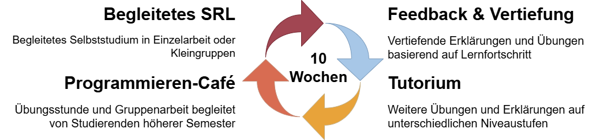
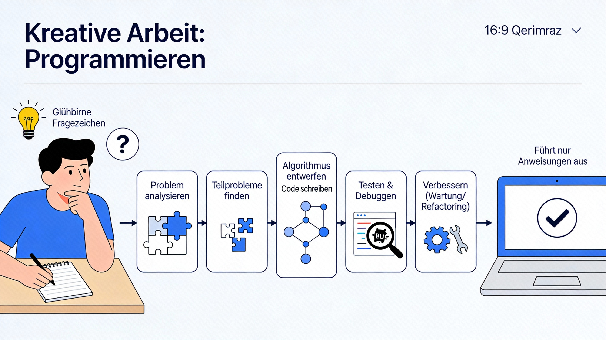
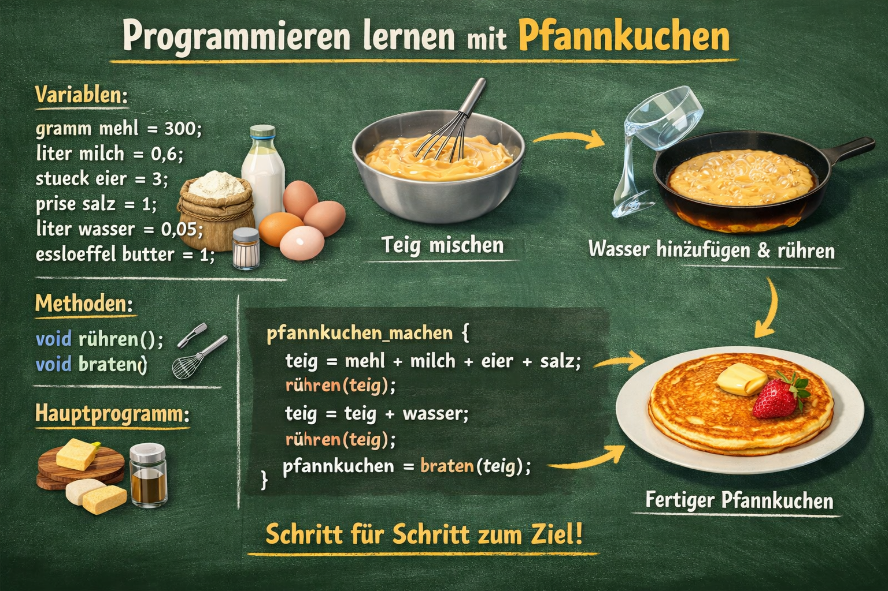

<!--
language: de
version: 0.1
narrator: Deutsch Female
mode: Textbook

comment: Vorlesung Programmieren 1 und 2 an der HFT Stuttgart des Bachelor Studiengangs Informatik im flexibilisierten Studienmodell

import: ./coderunner.md

link:   styles/style.css
        styles/liascript.css

-->

# Einführung in die Java-Programmierung

<article>
Dieses Online-Buch wird entwickelt an der Hochschule für Technik Stuttgart und dient der Einführung in die Programmierung mit Java zunächst im Studiengang Informatik für die Vorlesungen Programmieren 1 und 2. Es werden somit keine Vorkenntnisse im Programmieren vorausgesetzt. Das Buch befindet sich noch im Aufbau und wird laufend ergänzt und verbessert. Melden Sie somit gerne Ihre Kommentare zurück an die Dozenten des Kurses.

Die Präsenzzeit für die Vorlesung Programmieren 1 bzw. 2 in der Hochschule beträgt je **6 SWS**; zusätzlich ist regelmäßige Selbstlernzeit für Üben, Nacharbeiten und die Vorbereitung auf Tests erforderlich. Begleitend gibt es ein **Tutorium** und ein **Programmieren-Café** mit je 2 SWS. 


## Flexibilisiertes Studienmodell

Im Sommersemester 2026 starten wir mit dem Pilotprojekt "flexibilisiertes Studienmodell" für die Vorlesungen Programmieren 1 und 2 im Bachelorstudiengang Informatik. Sie arbeiten hier mit einer Lernplattform (TODO: ergänzen), auf der Sie verschiedene Lernmaterialien finden.

Als **Hauptlernmaterial** verwenden wir ein **LiaScript**-basiertes Online-Skript (dieses Online-Buch, genannt **Workbook**). Ergänzend stehen in **Moodle** (TODO: ggf. abändern) weitere Materialien wie 
**Links**, **Videos** und organisatorische Hinweise zur Verfügung. 

### Vorgehen

Die Vorlesung besteht aus 6 SWS. 

- 4 SWS dienen dem **begleiteten Selbststudium**. Hier arbeiten Sie selbständig, in Ihrem eigenen Tempo, basierend auf Ihren Vorkenntnissen an den Inhalten der Vorlesung. Ein Dozent steht Ihnen als Lernbegleiter zur Verfügung. Mit diesem klären Sie nicht nur inhaltliche Fragen, sondern erarbeiten auch einen Lernplan und reflektieren Ihren persönlichen Lernprozess. Wenn Sie in den Kurs in Regelzeit absolvieren möchten, wird empfohlen, jede Woche ein Kapitel inklusive der bereitgestellten Programmieraufgaben zu bearbeiten. Sollten Sie schneller sein als 1 Kapitel pro Woche, arbeiten Sie schneller. Sind Sie langsamer, arbeiten Sie langsamer. Es gibt jedoch eine Mindestgeschwindigkeit, mit der Sie vorgehen sollten, damit Sie innerhalb der Fristen, den Kurs absolviert haben. Weiteres hierzu finden Sie unten.
- 2 SWS dienen **Feedback und vertieften Übungen**. Hier arbeiten wir an den schwierigen Themen und Übungen.

Begleitend gibt es folgende Veranstaltungen:
- 2 SWS **Tutorium**: Ein Tutor übt mit Ihnen weitere Aufgaben und erklärt Ihnen alles, was Sie noch nicht verstanden haben.
- 2 SWS **Programmieren-Café**: Hier können Sie zusammen mit Ihrer Lerngruppe alles aufholen, was Sie in der Woche noch nicht geschafft haben. Auch hier steht ein Mentor für alle Ihre Fragen bereit.

Nutzen Sie die Angebote, die wir Ihnen machen! Anwesenheit korrreliert stark mit dem erfolgreichen Abschließen des Kurses. 

<br>


Basierend auf 7 Credit Points, die Sie für ein Modul erhalten, ergibt sich ein Gesamtaufwand von 210 Stunden. Etwa die Hälfte ist abgedeckt, wenn Sie alle Angebote besuchen. 

<br>

## Organisation Kompetenznachweise

Um Programmieren 1 zu bestehen, müssen Sie 3 Kompetenznachweise erfüllen. Für Programmieren 2 gibt es ebenso 3 Kompetenznachweise. Einen Kompetenznachweis haben Sie bestanden, wenn Sie mind. 50% der Gesamtpunktzahl erreicht haben. 

Im Verlauf der Vorlesung gibt es **pro Semester 6 feste Testtermine**. Diese Termine sind für alle Studierenden gleich und zeitlich im Semester festgelegt.

Die **Grundidee** dieses Konzepts ist, Sie entscheiden **selbst**, ob und an welchen Testterminen Sie teilnehmen möchten. Je nach Vorkenntnissen, können Sie die Vorlesungen Programmieren 1 und 2 in **1 bis 3 Semestern** absolvieren:

| Modell      | Dauer  | Idee |
|-------------|--------|------|
| **Sprint**  | 1 Semester | Für sehr gute Vorkenntnisse |
| **Normal**  | 2 Semester | Regeltempo |
| **Marathon**| 3 Semester | Für langsameres, nachhaltiges Lernen |


Vorteile des Konzepts:

- Was Sie in diesem Semester nicht geschafft haben, machen Sie im nächsten Semester ohne das ganze Modul wiederholen zu müssen. 
- Sind Sie krank, schreiben Sie den Kompetenznachweis einfach beim nächsten Mal, ohne ein ganzes Semester zu verlieren. 
- Haben Sie Vorkenntnisse aus dem Semester 1+ oder aus der Schule, können Sie die entsprechenden Kompetenznachweise früher schreiben und sind ggf. früher mit dem Modul oder gar Ihrem ganzen Studium fertig.

Dieses Konzept gilt für **Programmieren 1 und Programmieren 2 gemeinsam** und ermöglicht es, beide Module zusammen über **bis zu drei Semester** zu absolvieren. So können Sie Ihr individuelles Lerntempo berücksichtigen und Ihren Fortschritt bei Bedarf über einen längeren Zeitraum verteilen.


### Wichtige organisatorische Regeln

- Die Teilnahme an Testterminen ist **frei wählbar**, es ist jedoch mindestens **eine Testteilnahme pro Semesterhälfte** erforderlich. 
- Lerneinheiten können bei Bedarf **zu einem späteren Termin erneut geprüft** werden.
- Ein **Drittversuch** für eine Teststufe ist nur nach **Beratung** und mit **vier Wochen Anwesenheitspflicht** möglich.
- Die konkreten Kalendertage der Testtermine sowie weitere organisatorische Details werden **zu Semesterbeginn bekanntgegeben** (z.B. über Moodle).
- Zögern Sie nicht, in die Sprechstunde Ihrer Studiengangsleitung zu gehen, sofern Sie Probleme haben.

<br>

## Einführung LiaScript

Da dieses Workbook das Hauptmaterial ist, gibt es hier zunächst eine kleine Einführung

Im folgenden Abschnitt sehen Sie dasselbe **Programm** in mehreren Programmiersprachen:

<link rel="stylesheet" href="styles/style.css">

<div class="tab-container">
  <input type="radio" id="tab-java" name="tabs" checked>
  <input type="radio" id="tab-python" name="tabs">
  <input type="radio" id="tab-javascript" name="tabs">


  <div class="tab-header">
    <label for="tab-java">Java</label>
    <label for="tab-python">Python</label>
    <label for="tab-javascript">JavaScript</label>
  </div>

<div id="java" class="tab-content">

```java
class HalloWelt{
    public static void main(String args[]){
        System.out.println("Hallo Welt von Java");
    }
}
```
@LIA.java(HalloWelt)

</div>
<div id="python" class="tab-content">

```python
print("Hello Welt von Python")
```
@LIA.python
</div>

<div id="javascript" class="tab-content">

```javascript
console.log("Hallo Welt von JavaScript");
```
@LIA.nodejs

</div>

</div>
Überlegen Sie sich als erstes, wie die Ausgabe des Codes aussehen könnten. 

Klicken Sie nun auf </> im kleinen Kreis unter dem Code-Block, so wird der Code ausgeführt und Sie sehen im schwarzen Kästchen, das dann erscheint, das Ergebnis. 

Klicken Sie oben auf eine andere Programmiersprache, hier Python oder JavaScript, so sehen Sie das gleiche Programm in einer anderen Sprache. 

Führen Sie auch diese beiden anderen Programme aus, indem Sie zunächst auf die Sprache klicken, dann wieder auf </> im kleinen Kreis unter dem Code-Block.

</article>

Natürlich sollen Sie nicht nur Code lesen, sondern insbesondere auch viel selbst machen. Hier kommt die erste Aufgabe.

> **Aufgabe**

Geben Sie nun statt "Hallo Welt" einen anderen Text zwischen den Anführungszeichen ein. Führen Sie den Code erneut aus. Was fällt Ihnen auf?

Auf der rechten Seiten unterhalb des Codes, können Sie nun mit den Pfeilen zwischen den verschiedenen Codes hin- und herwechseln. Gehen Sie mit dem Pfeil nach links zurück auf den ursprünglichen Code und dann mit dem Pfeil nach rechts wieder zu Ihrem neuen Code.

> **Übungen**

Um viel zu üben, denn das ist das wichtigste beim Programmieren, werden [hier](https://speiser.hft-pages.io/programmieraufgaben/2026-ss-pro-1/) (TODO: anpassen) zu jedem Kapitel Übungen bereit gestellt. Sie werden im Laufe des Workbooks immer wieder zu diesen Übungen aufgefordert. Führen Sie die Aufgaben gewissenhaft aus. Bei Problemen fragen Sie einfach in der nächsten Stunde nach.

<br>

Klicken Sie nun unten auf den Pfeil, um zur nächsten Seite zu gelangen.

<br>

## Einführung


Eine Programmiersprache zu lernen, ist eine zentrale Voraussetzung für viele Tätigkeiten in der Informatik, zum Beispiel als Entwickler, Projektleiter oder Softwarearchitekt. Computer führen exakt den Code aus, den sie vorgesetzt bekommen; Übersetzerprogramme (Compiler) wandeln diesen Programmtext präzise in Maschinencode um, ohne „mitzudenken“.

Programmieren ist der Prozess, einem Computer mit Hilfe spezieller Programmiersprachen (wie Java, Python oder JavaScript) Anweisungen zu geben, damit er Aufgaben erfüllt oder bestimmte Probleme löst. Diese Anweisungen müssen so klar formuliert sein, dass sie von der Maschine eindeutig verstanden und Schritt für Schritt abgearbeitet werden können.

Programmieren bedeutet dabei weit mehr, als nur Code zu tippen. Es geht darum, Probleme systematisch zu analysieren, sie in kleinere, überschaubare Teilprobleme zu zerlegen und für jedes Teilproblem einen klaren Lösungsweg zu entwerfen. Ein solcher Lösungsweg wird **Algorithmus** genannt, also eine endliche, wohldefinierte Folge von Schritten, die von einem Computer ausgeführt werden kann, um ein bestimmtes Ziel zu erreichen.


<br>


Bildquelle: generiert mit Perplexity
<br>

Der Computer ist nicht kreativ und findet keine Lösungen – er führt nur das aus, was Sie ihm vorgeben. Die eigentliche, kreative Arbeit liegt im Programmieren. Typischerweise umfasst das Programmieren mehrere Tätigkeiten:

- Probleme analysieren und in kleinere Teilprobleme zerlegen
- Lösungswege als Algorithmen entwerfen
- diese Algorithmen in einer Programmiersprache als Quellcode formulieren
- den Code testen, Fehler finden (Debugging) und den Code verbessern oder umstrukturieren (Wartung/Refactoring)

<br>

Programmieren ist außerdem ein iterativer Prozess: Selten funktioniert ein Programm beim ersten Versuch perfekt. Stattdessen werden Programme schrittweise entwickelt, getestet, korrigiert und erweitert – Fehler sind ein normaler und wichtiger Bestandteil des Lern- und Entwicklungsprozesses.

Um all das zu lernen, reicht Theorie nicht aus – Sie müssen viel üben:

- Kennen Sie einen Trainer der Bundesliga, der nicht zuvor selbst Fußball gespielt hat?
- Haben Sie Schwimmen oder Radfahren nur aus Büchern erlernt?
- Sind Sie zur praktischen Fahrprüfung zum ersten Mal Auto gefahren?
- Wie viele Jahre hat ein Musiker vor dem ersten Klavierkonzert geübt?

<br>
Genauso funktioniert Programmieren: Durch häufiges Schreiben, Testen und Verbessern von Code entsteht nach und nach Routine.
Schon sehr kleine Programme sind nützlich, zum Beispiel:

- Zwei Zahlen addieren
- Eine Zahl speichern und später wieder laden
- Zwei Zahlen miteinander vergleichen

<br>
Das können Sie als Mensch sicher auch, aber Computer können das:

- Sehr schnell: Milliarden von Operationen pro Sekunde
- Sehr genau: Milliarden von Zahlen speichern und exakt so wieder abrufen

<br>


Bildquelle: generiert mit NoteGPT

<br>

Programmierung ist die Grundlage fast aller digitalen Systeme, mit denen wir täglich zu tun haben. Sie steckt in:

- **Webseiten und Web‑Anwendungen**: Online‑Shops, Lernplattformen, Social‑Media‑Seiten, Buchungs‑ und Banking‑Portale werden durch server‑ und clientseitige Programme gesteuert.
- **Apps auf Smartphone und Tablet**: Messenger, Navigations‑Apps, Spiele, Fitness‑Tracker oder Banking‑Apps beruhen auf Programmen, die speziell für mobile Betriebssysteme entwickelt wurden.

- **Geschäftsanwendungen und Backend‑Systemen**: Warenwirtschaft, Buchhaltung, ERP‑Systeme, Logistik‑ und Produktionssteuerung bestehen aus umfangreichen Softwaresystemen, die Daten verarbeiten und Geschäftsprozesse abbilden.
- **Datenanalyse und Künstlicher Intelligenz**: Programme werten große Datenmengen aus, erstellen Vorhersagen (z.B. Nachfrageprognosen, Empfehlungen) oder erkennen Muster in Bildern und Texten.
- **Eingebetteten Systemen und IoT**: In Autos, Haushaltsgeräten, Produktionsanlagen, Robotern und Sensoren laufen Programme, die messen, regeln und steuern.

- **Spielen und interaktiven Medien**: 2D‑/3D‑Spiele, Simulationen und Virtual‑Reality‑Anwendungen entstehen durch komplexe Programmlogik, Physik‑Simulationen und Grafik‑Programmierung.

<br>
In diesem Kapitel lernen Sie zunächst, was Code ist und was ein Programm ausmacht. Am Ende des Kapitels werden Sie Ihr erstes eigenes Programm in der Programmiersprache Java schreiben und ausführen und so den gesamten Weg von der Problemidee bis zum laufenden Programm einmal vollständig durchlaufen.

### Was ist Code?

- Code, auch **Quellcode** genannt,  ist eine Reihe von Anweisungen für den Computer.
- Jede Anweisung beschreibt, welche Operation (z.B. Addition) der Computer mit welchen Operanden (z.B. 5 und 3) ausführen soll. 
- Der Computer führt dann eine Anweisung nach der anderen aus.

Programme bestehen aus sehr vielen einzelnen Anweisungen. Diese Anweisungen liegen letztlich als Zahlen vor – zum Beispiel als hexadezimal dargestellter x86‑Maschinencode (erstellt mit [godbolt.org](https://godbolt.org/z/WYorj7EG5)), also Code in einer **Low‑Level‑Programmiersprache** bzw. direkt auf Maschinenebene:

```
55 48 89 e5
89 7d fc 8b
45 fc 0f c0
5d c3
```
​
So zu entwickeln ist sehr kompliziert und fehleranfällig, also gibt es ein Abstraktionsniveau höher **Assembler** – menschenlesbare Abkürzungen für die Befehle und Hilfe bei der Berechnung von Speicheradressen, wo Daten abgespeichert sind, z.B.:
​

```
push   rbp
 mov    rbp,rsp
 mov    DWORD PTR [rbp-0x4],edi
 mov    eax,DWORD PTR [rbp-0x4]
 imul   eax,eax
 pop    rbp
 ret
main:
 push   rbp
 mov    rbp,rsp
 mov    eax,0x0
 pop    rbp
 ret
```

Auch dies ist noch recht aufwändig - und zudem noch an eine konkrete Prozessorarchitektur gebunden. Als nächstes Abstraktionsniveau kann man dann eine höhere Programmiersprache (**High-Level-Programming Language**) nehmen, z.B.:

```java
int square(int num) {
   return num * num;
}
```

> **Java**

Wir nutzen in unserer Vorlesung **Java** als Programmiersprache. Java ist eine höhere Programmiersprache, die viele Programmierparadigment unterstützt. Java wird laufend weiter entwickelt. Es gibt viele vordefinierte Klassen, die verwendet werden können. 

Im Hintergrund gibt es einen Compiler, der Java in Maschinensprache übersetzt. Die Maschinensprache wird auf unseren Wunsch hin vom Betriebssystem geladen und dann zur Ausführung gebracht.
Bei Java gibt es noch die Besonderheit, dass es eine Art virtuelle Maschinensprache nutzt, die unabhängig von der genutzten Prozessorarchitektur ist und erst zur Laufzeit von einer weiteren Programmkomponente in die konkrete Maschinensprache übersetzt wird.
Aber hierzu später mehr. 

> **Randnotiz: Unterschiede Low-Level-Programming Language und High-Level-Programming Language**
| **Aspekt**        | **Low-Level-Programming Language**                       | **High-Level-Programming Language**                                 |
|-------------------|------------------------------------------|-----------------------------------------------------|
| Nähe zur Hardware | Sehr nah (Register, Speicheradressen).   | Weit entfernt, abstrahiert von der Hardware.        |
| Lesbarkeit        | Schwer lesbar, viele technische Details. | Meist gut lesbar, an menschliche Sprache angelehnt. |
| Portabilität      | Stark architekturabhängig.               | Oft auf viele Plattformen portierbar.               |
| Kontrolle         | Sehr hohe Kontrolle über Ressourcen.     | Weniger direkte Kontrolle, mehr Komfort.            |


> **Welcher Code wird ausgeführt?**

Das Betriebssystem (z.B. Windows, Linux, maxOS) startet den binären Code bei der ersten auszuführenden Anweisung. Aber wo ist das in unserem Code der höheren Programmiersprache? 
In allgemeinen Java-Programmen ist dies immer die **main-Methode** der Hauptklasse. Diese sieht folgendermaßen aus:

```java
public static void main(String[] args) {

}
```

Sie darf in einem Java-Programm nie fehlen. Die main-Methode ist also der Einstiegspunkt in das Programm. Alles, was in dem Programm passieren soll, muss von der main-Methode aus aufgerufen werden. 

<br>

### Was ist Programmieren?

Unter Programmieren versteht man das Erstellen von Anweisungen für eine Maschine. Der Begriff „Maschine“ bezieht sich heute meist auf Computer, historisch jedoch auch auf mechanische oder elektromechanische Geräte. Tatsächlich existiert das Prinzip des Programmierens schon lange vor den ersten elektronischen Computern: Bereits frühere Maschinen wurden durch feste Anweisungen gesteuert, etwa mithilfe von Lochkarten. Moderne Programmiersprachen wie in unserem Fall Java setzen dieses Grundprinzip fort, nur in deutlich abstrakterer und für Menschen besser lesbarer Form.

Das Erlernen des Programmierens ähnelt in vielerlei Hinsicht dem Lernen einer Fremdsprache. Auch hier reicht es nicht aus, nur Regeln oder Begriffe zu kennen. Entscheidend ist die regelmäßige Anwendung. Programmieren lernt man vor allem durch die wiederholte Ausführung bestimmter Tätigkeiten. Dazu gehört zunächst das **Lesen und Verstehen** fremder Programme, um typische Strukturen, Schreibweisen und Lösungsansätze kennenzulernen. Ebenso wichtig ist das **Schreiben** eigener Programme, bei dem theoretisches Wissen praktisch umgesetzt wird. Ein weiterer zentraler Bestandteil ist das **Testen** der eigenen Programme sowie die **systematische Fehlersuche** (Debugging), da Fehler ein normaler und unvermeidlicher Teil des Programmierens sind. Schließlich ist auch die Beherrschung geeigneter **Werkzeuge**, wie Entwicklungsumgebungen, Compiler und Debugger, ein unverzichtbarer Bestandteil der Programmierausbildung.

Ein Programm ist vergleichbar mit einem Kochrezept: 

Ziel ist es, einen bzw. mehrere fertige Pfannkuchen aus verschiedenen einzelnen Zutaten zu kochen.

Kochrezepte sind also wie „imperative“ Programmierung (von lat. imperare: anordnen, befehlen).

```
\\ Variablen
gramm mehl        = 300;
liter milch       = 0,6;
stueck eier       = 3;
prise salz        = 1;
liter wasser      = 0,05;
essloeffel butter = 1;

\\ Methoden
void rühren();
void braten();

\\Hauptprogramm
pfannkuchen_machen {
    teig = mehl + milch + eier + salz;
    rühren(teig);
    teig = teig + wasser;
    rühren(teig);
    pfannkuchen = braten(teig);
}
```

<br>


Bildquelle: generiert mit ChatGPT

### Aufbau eines Programms


Noch ein paar Worte zum Aufbau von Java-Programmen. 

- Ein Java-Programm ist in Klassen, Methoden und Blöcke aufgeteilt, die ineinander verschachtelt sind. Später kommen noch Pakete und Module hinzu.
- Blöcke werden durch die {}-Klammern geschachtelt.
- In untem stehenden Beispiel: der äußere Block umfasst die Klasse `Uebung`, der innere Block bildet den Methodenrumpf von `main` mit dem Aufruf der Methode `tueWas`.

```java
public class Uebung{ //Uebung ist der Name der Klasse
   public static void main(String args[]){ //main() ist die Hauptmethode
      tueWas(0815); //tueWas() ist eine weitere Methode, die nicht genauer spezifiziert ist
   }
}
```

Genauer:

- **Hauptklasse** oder Startklasse: Oberste Struktureinheit in Java (hier: Uebung). Klassen werden immer groß geschrieben.
- Hauptmethode oder **main-Methode** genannt: Hier läuft das eigentliche Programm ab, ohne die main-Methode läuft das Programm nicht. Diese muss immer genau so aussehen: public static void main(String args[])
- **Weitere Methoden**: Es können für Teilberechnungen weitere Methoden definiert werden, die dann von der main-Methode aufgerufen werden. D.h. Methoden sind gespeicherte Anweisungen innerhalb eines Programms. Sie werden für einen bestimmten Zweck geschrieben und aufgerufen. Weiterhin kann man Methoden auch als Werkzeug betrachten. Man kann ein Werkzeug besitzen, aber es gar nicht einsetzen. In diesem Beispiel gibt es noch die Methode tueWas(), die aber nicht näher beschrieben ist. Methoden werden immer klein geschrieben. 

Betrachten Sie nun dieses Programm: 

```java
class MeinErstesProgramm{
    public static void main(String args[]){
        System.out.println("Ich bin dein erstes Programm.");
    }
}
```
@LIA.java(MeinErstesProgramm)


**Quiz**

**Frage 1**

Wie heißt die Klasse?

[(x)] MeinErstesProgramm
[( )] class
[( )] main

---

**Frage 2**

Wo steht die main-Methode?

[( )] In der 1. Zeile
[(x)] In der 2. Zeile
[( )] In der 3. Zeile

---

**Frage 3**

Gibt es noch eine weitere Methode?

[( )] Nein, nur die main-Methode
[(x)] Ja, die Methode println
[( )] Ja, die Methode MeinErstesProgramm

---

**Frage 4**

Was ist die Ausgabe dieses Programms?

[( )] Das Program ist unvollständig und läuft nicht.
[( )] "Ich bin dein erstes Programm."
[(x)] Ich bin dein erstes Programm.

Führen Sie das Programm aus und verifzieren Sie die Ausgabe.

---

>**Hinweis für Fortgeschrittene:**

 println(...) ist eine Methode, die den übergebenen Text oder Wert ausgibt und danach automatisch einen Zeilenumbruch (\n) einfügt. println steht für print line. Die Methode ist von Java vordefiniert und befindet sich in der Klasse System im Paket java.lang, das beim Start der Java Virtual Machine (JVM) immer initialisiert wird. 

