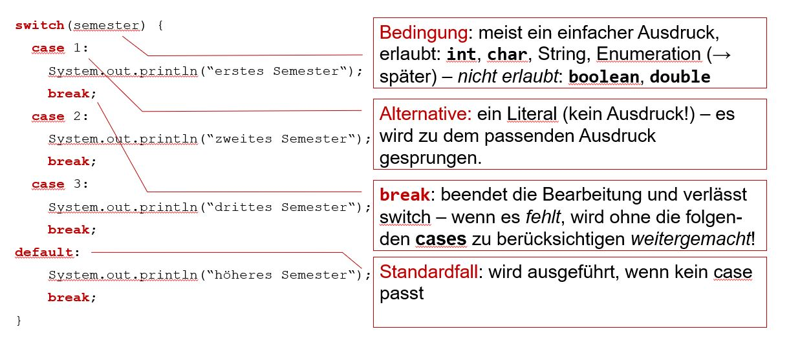
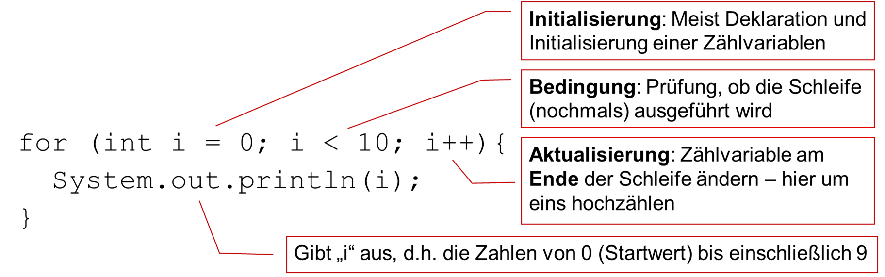
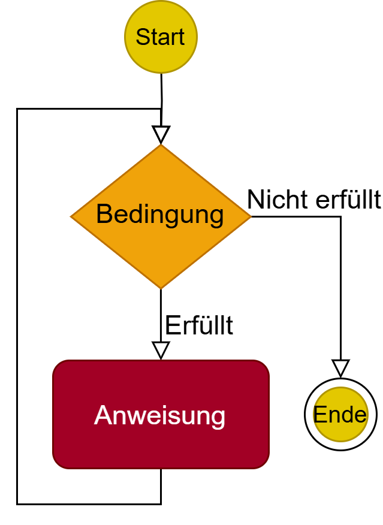
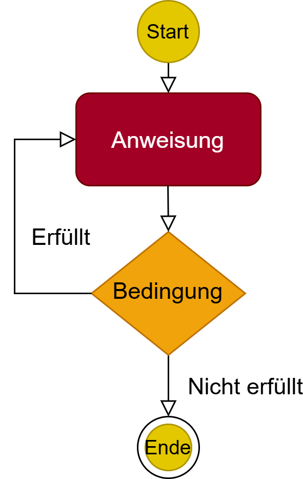
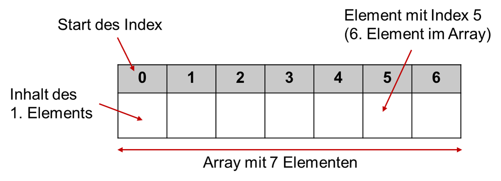
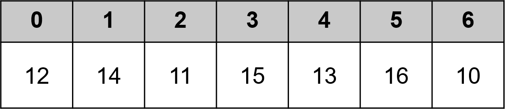

<!--
language: de
version: 0.1
narrator: Deutsch Female
mode: Textbook

comment: Vorlesung Programmieren 1 und 2 an der HFT Stuttgart des Bachelor Studiengangs Informatik im flexibilisierten Studienmodell

import: https://raw.githubusercontent.com/LiaScript/CodeRunner/master/README.md

link: styles/liascript.css
link: styles/style.css
-->


# Array und Kontrollfluss

Mit Arrays gibt es eine Datenstruktur, mit der wir mehrere zusammengehörige Werte strukturiert speichern können. Statt viele einzelne Variablen zu verwenden, fassen wir Werte in Arrays zusammen.

Um diese Werte effizient zu verarbeiten, benötigen wir Kontrollflussstrukturen. Der Kontrollfluss in Java ermöglicht es uns, den Ablauf unseres Codes zu steuern, indem wir Entscheidungen treffen, Verzweigungen und Schleifen verwenden. Kontrollflussstrukturen wie bedingte Anweisungen und Schleifen ermöglichen es uns, unseren Code dynamisch zu gestalten und verschiedene Pfade je nach Bedingungen oder Anforderungen auszuführen.

Für sich wiederholende Berechnungen nutzen wir Schleifen, mit deren Hilfe z.B. ein Zähler schrittweise verändert werden kann.

Im Folgenden betrachten wir zunächst die Kontrollflussstrukturen, mit denen diese Daten verarbeitet werden und  anschließend Arrays als grundlegende Datenstruktur.


## Kontrollfluss

Der Kontrollfluss in Java ermöglicht es uns, den Ablauf unseres Codes zu steuern, indem wir Entscheidungen treffen, Verzweigungen und Schleifen verwenden. Kontrollflussstrukturen wie bedingte Anweisungen und Schleifen ermöglichen es uns, unseren Code dynamisch zu gestalten und verschiedene Pfade je nach Bedingungen oder Anforderungen auszuführen.

Schauen Sie sich folgendes Beispiel an und überlegen Sie sich für jede Zeile, was das Programm tun könnte und welche Ausgabe der Code Ihrer Meinung nach erzeugt.

```java
class DemoKontrollfluss {
    public static void main(String args[]) {
        int zahl = 10;

        if (zahl % 2 == 0) {
            System.out.println(zahl + " ist eine gerade Zahl.");
        } else {
            System.out.println(zahl + " ist eine ungerade Zahl.");
        }
        
        System.out.println("Zahlen von 1 bis 5:");
        for (int i = 1; i <= 5; i++) {
            System.out.println(i);
        }
    }
}
```
@LIA.java(DemoKontrollfluss)

Führen Sie nun den Code aus und überprüfen Sie Ihre Vermutung. Hatten Sie recht mit Ihrer Annahme?

Modifizieren Sie den Code so, dass als Ausgabe "11 ist eine ungerade Zahl" erscheint, sowie die Zahlen von 0 bis 3 ausgegeben werden.

Im Laufe dieses Kapitels schauen wir uns folgende Strukturen, die im obigen Code schon vorkommen, genauer an, so dass Sie alle verstehen und einsetzen können:

* **if**-Verzweigungen
* **if/else**-Anweisungen
* **switch/case**-Statement
* **for**-Schleife (Zählschleife)
* **for-each**-Schleife (Mengenschleife)
* **while**-Schleife
* **do-while**-Schleife

<br>
Damit Sie diese Strukturen sicher anwenden können, sollten Sie am Ende dieser Einheit folgende Fragen beantworten können:

- Was ist der Unterschied zwischen **Verzweigungen** und **Schleifen**?
- Können Sie eine Verzweigung mit **if**, **if/else** erklären und programmieren?
- Können Sie eine **while-Schleife** erklären und programmieren?
- Können Sie eine **Fallunterscheidung** übersichtlich mit **switch / case** programmieren?
- Sie kennen die kopfgesteuerte while-Schleife. Was zeichnet die **fußgesteuerte Schleife** aus?
- Können Sie die **Zählschleife** und die **Mengenschleife** erklären?

<br>


### If-Verzweigung

Die if-Anweisung ist die einfachste Kontrollstruktur. Man kann sich diese wie folgt vorstellen:

<p align="center">

</p>


Sie wird wie folgt dargestellt:

```java
if (Bedingung) {
    //Wenn die Bedingung `true` ist
    Anweisung;
}
```

Ist die Bedingung wahr also true, werden die Anweisungen der nächsten Zeile, bzw. des Blockes ausgeführt, ansonsten passiert nichts! Beim Auswerten der Bedingung muss immer ein boolescher Wert entstehen.

> **Wie können diese Bedingungen aussehen?**

In Programmiersprachen werden häufig Vergleiche zwischen Werten mittels Operatoren durchgeführt, um Bedingungen zu überprüfen. Hier sind einige gängige Vergleiche:

- `a > 0`: Überprüft, ob der Wert von "a" größer als 0 ist.
- `c == d`: Überprüft, ob der Wert von "c" gleich dem Wert von "d" ist, zum Beispiel, ob zwei Ganzzahlen gleich sind.
- `e != 1`: Überprüft, ob der Wert von "e" ungleich 1 ist.
- `"Müller".equals("Meier")`: Überprüft die Gleichheit von zwei Strings, in diesem Fall, ob der String "Müller" gleich dem String "Meier" ist.

Diese Bedingungen können in `if`-Verzweigungen verwendet werden, um Entscheidungen im Code zu treffen. Ändern und ergänzen Sie folgendes Programm so, dass in der if-Verzweigung `"Der if-Block wurde ausgeführt"` ausgegeben wird.

```java
class IfAnweisung{
    public static void main(String args[]){
    int f = 3;
    if (f > 5) {
        // Führe diesen Codeblock aus, wenn "f" größer als 5 ist
        }
    }
}
```
@LIA.java(IfAnweisung)

> **Logische Operatoren**

Logische Operatoren können wie folgt aussehen:

| Operator | Beschreibung                                                                                                        |
| -------- | ------------------------------------------------------------------------------------------------------------------- |
| !        | Negation: Dreht den Wahrheitswert um (aus `true` wird `false` und aus `false` wird `true`)                          |
| &        | Und mit vollständiger Auswertung: Liefert `true`, wenn beide Ausdrücke `true` sind                                  |
| \|       | Oder mit vollständiger Auswertung: Liefert `true`, wenn einer oder beide Ausdrücke `true` sind                      |
| &&       | Und mit verkürzter Auswertung: Wie &, jedoch wird sofort `false` zurückgegeben, wenn der erste Ausdruck `false` ist |
| \|\|     | Oder mit verkürzter Auswertung: Wie \|, jedoch wird sofort `true` zurückgegeben, wenn der erste Ausdruck `true` ist |
| \^       | Exklusives Oder: Liefert nur `true`, wenn genau einer der beiden Ausdrücke `true` ist                               |

Welche Anweisungen eignen sich für Bedingungen? 

Hinweis: Die Bedingung muss nicht true sein, sie muss sich nur als Bedingung eignen, d.h. das Ergebnise kann auch false sein.

1. 2 < 5

   [(x)] wahr
   [( )] falsch

2. int i = 1;

   [( )] wahr
   [(x)] falsch

3. 2 == 2 && 5 == 5

   [(x)] wahr
   [( )] falsch

4. true || 2 > 5

   [(x)] wahr
   [( )] falsch

Ändern und ergänzen Sie folgendes Programm nun so, dass der if-Block dann ausgeführt wird, wenn f < 5 und gleichzeitig t = 7 ist.

```java
class If{
    public static void main(String args[]){
    int f = 3;
    if (f > 5) {
        System.out.println("Der if-Block wird gerade ausgeführt.");
        }
    }
}
```
@LIA.java(If)

### if/else-Anweisungen

Die `else`-Anweisung erweitert die Kontrollstruktur von `if`, um einen Zweig hinzuzufügen, der ausgeführt wird, wenn die Bedingung der `if`-Anweisung nicht erfüllt ist.

<p align="center">

</p>

Die `if/else`-Anweisung hat die folgende Syntax:

```java
if (Bedingung) {
    // Wenn die Bedingung `true` ist
    Anweisung;
} else {
    // Wenn die Bedingung `false` ist
    Alternative_Anweisung;
}
```

Wenn die Bedingung der `if`-Anweisung wahr ist, werden die Anweisungen innerhalb des `if`-Blocks ausgeführt. Andernfalls werden die Anweisungen innerhalb des `else`-Blocks ausgeführt.

Die `else`-Anweisung ist optional und kann allein oder in Kombination mit einer `if`-Anweisung verwendet werden, um alternative Aktionen basierend auf Bedingungen auszuführen.

Beispiel:

```java
class Semester{
    public static void main(String args[]){
        int semester = 2;
        if ( semester == 1 ) {
        System.out.println("Ihr Fach ist PRO1");
        } else {
        System.out.println("Ihr Fach ist PRO2");
        }
    }
}
```
@LIA.java(Semester)

Was müssen Sie abändern, wenn Ihr Fach dieses Semester PRO1 ist?

Die `else`-Anweisung kann auch mit verschachtelten `if`-Anweisungen verwendet werden, um komplexere Entscheidungsstrukturen zu erstellen.

```java
if ( Bedingung 1 ){
    Anweisung1;
} else {
    if ( Bedingung 2 ){
        Anweisung2;
    } else {
        Anweisung3;
    }
}
```

Enthält der `else`-Zweig lediglich ein weiteres if (ggf. mit else), können die Anweisungen auch fortgesetzt werden:

```java
if ( Bedingung 1 ) {
        Anweisung1;
    } else if ( Bedingung 2 ){
        Anweisung2;
    } else if ( Bedingung 3 ){
        Anweisung3;
    } else {
        Anweisung4;
    }
```

Schreiben Sie eine if/else-Verzweigung für den folgenden Fall:

- Wenn die Temperatur unter 20°C liegt, geben Sie „Jacke!“ aus,
- Wenn sie zwischen 20°C und 28°C liegt, geben Sie „T-Shirt!“ aus,
- wenn sie über 28°C liegt, „Badeanzug!“

```java
class Temperatur2{
    public static void main(String args[]){
    }
}
```
@LIA.java(Temperatur2)

> **Der bedingte Ausdruck: (Bedingung) ? Ausdruck1 : Ausdruck2**

- Der bedingte Ausdruck, auch ternärer Operator genannt, ist keine Anweisung sondern ein Operatorausdruck, also etwas, das in einem Ausdruck (z.B. einer Formel) eingesetzt werden kann
- Der Aufbau ist wie folgt: `(Bedingung) ? Ausdruck1 : Ausdruck2`
- Wenn die Bedingung wahr ist, so ist der Wert des Ausdrucks identisch mit Ausdruck1, sonst mit Ausdruck2
- Beide Ausdrücke müssen vom selben Werttyp (int, char, String, etc.) sein

Beispiel:

```java
int urlaubstage = (alter > 28 ? 30 : 25);
```

D.h. wenn das Alter größer als 28 ist, dann `urlaubstage = 30`, sonst `urlaubstage = 25`

Erstellen Sie ein Programm, dass Ihnen Ihre Anzahl an Urlaubstagen ausgibt. Wenn Sie älter als 30 Jahre sind, haben Sie 32 Urlaubstage, wenn Sie jünger sind, nur 28 Tage.


```java
class Urlaubstage{
    public static void main(String args[]){

    }
}
```
@LIA.java(Urlaubstage)

### switch/case-Statement

Die switch-Anweisung bietet eine alternative Methode zur Kontrollstruktur `if`, insbesondere wenn eine Variable auf verschiedene Werte geprüft werden soll und abhängig vom Wert unterschiedliche Aktionen ausgeführt werden sollen.

Die Syntax einer `switch`-Anweisung sieht folgendermaßen aus:


- Der switch-Ausdruck muss Ergebnisse vom Typ **byte**, **short**, **int**, **char**, **String** oder **Enumeration** zurückliefern
- Im case-Teil müssen Konstanten stehen (keine Variablen, Funktionsaufrufe o.ä.)
- Die Konstanten im case-Teil müssen vom gleichen Typ wie der switch-Ausdruck sein (also auch byte, short, int, char oder String)
- Kein Wert der Konstanten dieser case-Zweige darf doppelt auftreten. Die Reihenfolge ist egal.
- Nach dem case kommt eine Folge von Anweisungen; üblicherweise abgeschlossen durch ein return oder break
- break ist optional – wenn es fehlt, wird die Bearbeitung mit dem nächsten case (ohne Prüfung!) fortgesetzt – aber Vorsicht: Fehler durch vergessene break sind schwierig zu finden.
- der default-Zweig ist optional; es ist höchstens einer zulässig

Testen Sie Ihr Wissen nun, indem Sie ein Programm schreiben das den heutigen Wochentag als Variable initalisiert und dann Ihre Vorlesungen für den jeweiligen Wochentag auf der Konsole ausgibt. 


```java
class Stundenplan{
    public static void main(String args[]){

    }
}
```
@LIA.java(Stundenplan)

### Die for-Schleife

Schleifen werden genutzt um einen Java-Block öfters zu wiederholen. Die erste Schleife, die wir hier erklären, ist die `for`-Schleife. In dieser Schleife wird der auszuführende Code im Schleifenkörper von einer Anfangszahl bis zu einer Endzahl mit einer vorgegebenen Schrittweite wiederholt. Schauen Sie hierzu folgendes Bild an.


<p align="center">

</p>


Die allgemeine Syntax für die `for`-Schleife lautet:

```java
for (Initialisierung; Bedingung; Aktualisierung) {
  // Hier passiert dann irgendetwas 
  // Diesen Block nennt man Schleifenkörper
} 
```

Im Code sieht dies dann so aus: Was ist das Ergebnis?

```java
class ForSyntax {
    public static void main(String args[]) {
        for (int i = 0; i < 10; i++){
          System.out.println(i);
        }
    }
}
```
@LIA.java(ForSyntax)


Was müssen Sie abändern, um auch die Zahl 10 ausgeben zu lassen?

Betrachten Sie nun folgendes Beispiel:

```java
class ForBeispiel {
    public static void main(String args[]) {
        int n = 4;
        int fakultaet = 1;
        for(int i = 1; i<=n; i++) {
            fakultaet *= i;
        }
        System.out.println(n + "! = " + fakultaet);
    }
}
```
@LIA.java(ForBeispiel)

Wie sieht hier die Ausgabe aus?

Können Sie obiges Programm so abändern, dass die Zahlensumme von 1 bis 5 berechnet wird? Die Lösung finden Sie untenstehend.

```java
class ForZahlensumme{
    public static void main(String args[]){
        int n = 5;
        int summe = 0; // Bei 0 starten!
        for(int i = 1; i<=n; i++) {
            summe += i; // Aufsummieren statt multiplizieren
        }
        System.out.println("Zahlensumme: " + summe);
    }
}
```
@LIA.java(ForZahlensumme)

>**Anmerkungen:**

- Eine im Schleifenkopf deklarierte Variable ist nur innerhalb der Schleife sichtbar.
- Teile des Kopfes können leer bleiben. Z.B. stellt for(;;) eine Endlosschleife dar. Es gibt keine Bedingung, die die Schleife stoppt.
- Man kann Schleifen auch schachteln.
- Das Schlüsselwort `break` verlässt die Schleife sofort.
- Das Schlüsselwort `continue` überspringt den aktuellen Schleifendurchlauf und fährt mit dem nächsten Durchlauf fort

Zähler modifizieren:

- Statt `zaehler=zaehler + 1` kann man auch `zaehler++` schreiben
- Analog gibt es auch `zaehler–-`, dies entspricht `zaehler -= 1`
- Sie können die Zähler auf jede beliebige Art und Weise modifizieren, z.B. `zaehler += 2`, `zaehler -= 5`, `zaehler *= i` etc.

>**Quiz:**

Welche der folgenden for-Schleifen zählt von 1 bis einschließlich 5?

[( )]  `for (int i = 0; i <= 5; i++)`
[(X)]  `for (int i = 1; i <= 5; i++)`
[( )]  `for (int i = 1; i < 5; i++)`

Was ist das Ergebnis dieser Schleife?

```java
for (int i = 0; i < 3; i++) {
    System.out.print(i + " ");
}
```

[( )]  1 2 3
[(X)]  0 1 2
[( )]  0 1 2 3

Welche Komponente einer for-Schleife ist nicht erforderlich, damit diese richtig kompiliert wird?

[( )] Die Initialisierung
[( )] Die Bedingung
[(X)] Keine ist zwingend, alle Teile können weggelassen werden


>**Übung:**

Schreiben Sie ein Programm, dass alle geraden Zahlen von 20 bis 40 ausgibt. Nutzen Sie hierfür eine for-Schleife. Überlegen Sie sich dazu, wie Sie überprüfen können, ob eine Zahl gerade ist.

```java
class GeradeZahlen {
    public static void main(String args[]) {


    }
}
```
@LIA.java(GeradeZahlen)


Schreiben Sie nun ein Programm, dass einen Countdown ausgibt. Dabei soll von 10 bis 1 rückwärts gezählt werden. Wenn der Countdown endet, soll die Nachricht `Start` ausgegeben werden.

```java
class Countdown {
    public static void main(String args[]) {


    }
}
```
@LIA.java(Countdown)


Hier können Sie Ihre Lösung von oben vergleichen:

```java
class LoesungGeradeZahlen {
    public static void main(String args[]) {
        for (int i = 20; i <= 40; i++) {
            if (i % 2 == 0) {
                System.out.println(i);
            }
        }
    }
}
```
@LIA.java(LoesungGeradeZahlen)

```java
class LoesungCountdown {
    public static void main(String args[]) {
        for (int i = 10; i > 0; i--) {
            System.out.println(i);
        }
        System.out.println("Start");
    }
}
```
@LIA.java(LoesungCountdown)


### Die for-each-Schleife

Die `for-each`-Schleife benötigt eine Sammlung gleichartiger Objekte. Ein Array ist ein Beispiel hierfür, welches etwas später in diesem Kapitel behandelt wird. Auch im Kapitel `Collections` werden wir in einigen Wochen diese Art von Schleife ausgiebig nutzen.

Die `for-each`-Schleife führt den Rumpf für jedes Element der angegebenen Menge aus. Es ist somit nicht erforderlich einen Index oder die Größe des Arrays zu berücksichtigen. Dies hilft, Fehler zu vermeiden.

Die `for-each`-Schleife hat folgende Syntax:

```java
for (Datentyp element : sammlung) {
  // Hier passiert dann irgendetwas mit den Elementen der Sammlung 
} 
```

Schauen Sie sich folgendes Beispiel für die `for-each`-Schleife an und überlegen Sie sich folgende Fragen:

* Welchen Datentyp haben die Elemente, über die iteriert wird?
* Wie sieht die "Sammlung" der Elemente aus?
* Was könnte der Output dieses Codes sein?

```java
class ForEachSyntax {
    public static void main(String args[]) {
        String[] array = {"eins", "zwei", "drei"}; 
        for (String wort : array) {
            System.out.println(wort);
        }
    }
}
```
@LIA.java(ForEachSyntax)

Führen Sie nun den Code aus.

In der "Sammlung" befinden sich die drei Strings "eins", "zwei", "drei". Alle Elemente der Sammlung werden ausgegeben.

Modifizieren Sie obigen Code so, dass auch die Wörter "null" und "vier" ausgegeben werden.

Erstellen Sie nun ein eigenes Beispiel, das die Zahlen 1, 2, 3 ausgibt, jeweils in einer neuen Zeile. Nutzen Sie hierfür ein integer-Array und die for-each-Schleife.
Wenn Sie die Nutzung von Arrays noch nicht aus obigem Beispiel ableiten können, kommen Sie zu diesem Kapitel zurück, sobald Sie das Kapitel Arrays durchgearbeitet haben. 


```java
class ForEachUebung {
    public static void main(String args[]) {
        // Legen Sie zunächst ein integer-Array an: int[] ...

        // Iterieren Sie dann mit Hilfe der for-each-Schleife über das Array
        
    }
}
```
@LIA.java(ForEachUebung)

Hat alles geklappt? Dann finden Sie hier die Lösung:

```java
class LoesungForEachUebung {
    public static void main(String args[]) {
        int[] zahlen = {1,2,3}; 
        for (int zahl : zahlen) {
            System.out.println(zahl);
        }
    }
}
```
@LIA.java(LoesungForEachUebung)


>**Nutzung der for-each-Schleife:**

Die for-each-Schleife kann genutzt werden, wenn:

* Über alle Elemente einer Sammlung iteriert werden soll
* Der Index des jeweiligen Elements nicht benötigt wird
* Die Sammlung sich während der Iteration nicht verändert


>**Erklärung für Fortgeschrittene, die bereits Collections kennen:**

Intern wird bei der for-each-Schleife ein Iterator benutzt, welcher automatisch durch die Sammlung der gleichartigen Objekte zählt und die Schleife beendet, wenn alle Elemente durchlaufen sind. Somit kann eine for-each-Schleife nicht nur für Arrays, sondern für alle Klassen benutzt werden, die das Interface java.lang.Iterable implementieren. In der Java API Specification finden Sie hierzu weitere Details: [Java API](https://docs.oracle.com/en/java/javase/21/docs/api/java.base/java/lang/Iterable.html)

>**Quiz:**

Welche der folgenden Schleifen ist eine gültige for-each-Schleife?

[( )] `for (int i = 0; i < array.length; i++)`
[(X)] `for (int element : array)`
[( )] `for (array : int element)`


Was ist eine typische Einschränkung der for-each-Schleife?

[( )] Sie kann keine Arrays durchlaufen.
[( )] Sie kann nur über Listen iterieren.
[(X)] Sie erlaubt keinen Zugriff auf den Index des Elements.

Was berechnet die folgende Schleife?

```java
int[] zahlen = {1, 2, 3};
for (int zahl : zahlen) {
    System.out.print(zahl + " ");
}
```

[( )] Es wird „123“ ohne Leerzeichen ausgegeben.
[(X)] Es wird „1 2 3 “ mit Leerzeichen ausgegeben.
[( )] Es wird ein Fehler angezeigt, da for-each keine Arrays unterstützt.


>**Übung:**

Gegeben ist folgender Programmcode. Schauen Sie sich zuerst an, welche Datenstruktur vorgegeben ist.


```java
class Lieblingsessen {
    public static void main(String args[]) {
    String[][] lieblingsgerichte = {
            {"Ada Lovelace", "Fish", "Mash", "Cawl"},
            {"Joseph Weizenbaum", "Hühnchen", "Kartoffeln", "Karotten"},
            {"Edsger Dijkstra", "Stamppot", "Kaasstengels", "Erwtensoep"}
        };
    }
}
```
@LIA.java(Lieblingsessen)

Bei den drei Personen handelt es sich um berühmte Informatiker. Versuchen Sie herauszufinden, für was diese berühmt geworden sind.

Ergänzen Sie den Code nun mit einer äußeren for-each-Schleife und einer inneren for-Schleife so, dass für jeden Informatiker die Lieblingsgerichte ausgegeben werden in der Form:

```
Ada Lovelace: 
- Fisch
- Mash
- Cawl
```

Untenstehend kommt die Lösung:

```java
class LoesungLieblingsessen {
    public static void main(String args[]) {
    String[][] lieblingsgerichte = {
            {"Ada Lovelace", "Fish", "Mash", "Cawl"},
            {"Joseph Weizenbaum", "Hühnchen", "Kartoffeln", "Karotten"},
            {"Edsger Dijkstra", "Stamppot", "Kaasstengels", "Erwtensoep"}
        };

        for (String[] person : lieblingsgerichte) {
            System.out.println(person[0] + ": ");
            for (int i = 1; i < person.length; i++) {
                System.out.println("- " + person[i]);
            }
            System.out.println();
        }   
    }
}
```
@LIA.java(LoesungLieblingsessen)


### Die while-Schleife

Die `while`-Schleife wird verwendet, um einen Codeblock wiederholt auszuführen, solange eine bestimmte Bedingung erfüllt ist. Die Bedingung wird vor jeder Ausführung des Codeblocks überprüft und muss ein boolescher Ausdruck sein. Der Ablauf ist in folgendem Bild dargestellt.

<p align="center">

</p>


Die while-Schleife hat folgende Syntax:

```java
while (Bedingung) {
  Anweisung;
} 
```

Schauen Sie sich nun folgendes Codebeispiel an. Was passiert hier?

```java
class WhileSyntax {
    public static void main(String args[]){
        int zaehler = 15;
        while (zaehler < 20) {
            System.out.println(zaehler);
            zaehler++;
        }
    }
}
```
@LIA.java(WhileSyntax)

Überprüfen Sie Ihre Vermutung, indem Sie das Programm ausführen.

Können Sie es so modifizieren, dass nur die geraden Zahlen im relevanten Bereich ausgegeben werden?


<p align="center">

</p>

Können Sie obiges Bild als Code darstellen?

```java
class WhileBildAlsCode {
    public static void main(String args[]){

       
    }
}
```
@LIA.java(WhileBildAlsCode)

Führen Sie Ihr Programm aus und vergleichen Sie es mit der Grafik. Haben Sie alles korrekt umgesetzt? Welches Ergebnis erhalten Sie?

>**Anmerkungen:**

- Die Bedingung der `while`-Schleife wird vor der Ausführung des Codeblocks überprüft. Wenn die Bedingung falsch ist, wird der Codeblock nicht ausgeführt und die Schleife wird beendet.
- Es ist wichtig, sicherzustellen, dass sich die Bedingung im Verlauf der Schleife ändert, um eine Endlosschleife zu vermeiden.
- `break` kann verwendet werden, um die Schleife vorzeitig zu beenden, und `continue` springt zum nächsten Schleifendurchlauf.

Die `while`-Schleife ist besonders nützlich, wenn die Anzahl der Iterationen im Voraus nicht bekannt ist, sondern von einer Bedingung abhängt.


>**Quiz:**

Was ist die Hauptfunktion einer while-Schleife in Java?

[(x)] Sie führt eine Codeblock aus, solange eine Bedingung wahr ist.
[( )] Sie führt immer mindestens eine Iteration aus, auch wenn die Bedingung falsch ist.
[( )] Sie iteriert durch ein Array ohne zusätzliche Bedingungen.

Was passiert, wenn die Bedingung einer while-Schleife niemals falsch wird?

[( )] Der Compiler wirft einen Fehler und die Schleife wird nicht kompiliert.
[( )] Der Programmcode springt automatisch zur nächsten Schleife.
[(x)] Die Schleife läuft unendlich lange weiter (Endlosschleife).

Welche der folgenden Deklarationen ist eine gültige while-Schleife in Java?

[( )] `while i < 10 { System.out.println(i); i++; }`
[(x)] `while (i < 10) { System.out.println(i); i++; }`
[( )] `while (i < 10) System.out.println(i); i++; end;`


>**Übung:**

Gegeben sei eine Startzahl. Schreiben Sie ein Programm, das diese Zahl so lange durch 2 teilt, bis das Ergebnis kleiner 1 ist. Nutzen Sie hierfür eine while-Schleife und überlegen Sie sich, welchen Datentyp Sie für die Startzahl brauchen. Geben Sie den aktuellen Wert Ihrer Zahl bei jedem Schleifendurchlauf aus. Geben Sie ebenso aus, wie groß die Zahl am Ende ist.

Testen Sie dann Ihre Lösung mit verschiedenen Startzahlen.

```java
class Zahlenteilen {
    public static void main(String args[]){

       
    }
}
```
@LIA.java(Zahlenteilen)

Ergänzen Sie dann Ihr obiges Programm so, dass die Anzahl der Schleifen-Durchläufe, also wie oft die Zahl geteilt wurde, auf der Konsole ausgegeben wird.


```java
class LoesungZahlenteilen {
    public static void main(String args[]){
        double startzahl = 100.0;
        int anzahlDurchlauefe = 0;

        while (startzahl >= 1.0) {
            System.out.println("Aktueller Wert: " + startzahl);
            startzahl = startzahl / 2;
            anzahlDurchlauefe++;
        }
        System.out.println("Zahl am Schluss: " + startzahl);
        System.out.println("Anzahl der Durchlauefe: " + anzahlDurchlauefe);      
    }
}
```
@LIA.java(LoesungZahlenteilen)

### Die do-while-Schleife
Die `do-while`-Schleife ist eine Schleife mit Test der Bedingung am Ende des Schleifenkörpers. Das bedeutet, die Schleife wird mindestens einmal durchlaufen. Der Ablauf ist in folgendem Bild dargestellt.

<p align="center">

</p>


Die Schleife wird solange durchlaufen, solange die Bedingung wahr ist. Wie immer muss die Bedingung ein boolescher Ausdruck sein. Weiterhin muss die Anweisung die Bedingung ändern, sonst erhält man eine Endlosschleife.

Die do-while-Schleife hat folgende Syntax:

```java
do {
  Anweisung;
} while (Bedingung);
```

Schauen wir uns ein längeres Beispiel an. Welche Ausgabe erzeugt folgendes Beispiel?

```java
class DoWhileSyntax {
    public static void main(String args[]){
        int z = 0;
        do {
            System.out.println("Ausgabe ist: " + z);
            z = z+1;
        } while (z<5);

        System.out.println("-------------------");
        System.out.println("Zu Ende ist bei: " + z);     
    }
}
```
@LIA.java(DoWhileSyntax)

Führen Sie das Beispiel aus. Lagen Sie mit Ihrer Vermutung richtig?

Modifizieren Sie das Beispiel nun so, dass die Ausgabe wie folgt ist:

```
Ausgabe ist: 1
Ausgabe ist: 3
-------------------
Zu Ende ist bei: 5
```

>**Quiz**

Was unterscheidet eine `do-while`-Schleife von einer `while`-Schleife?

[(x)] Die Bedingung wird nach dem Schleifenblock überprüft.
[( )] Die Schleife wird immer nur einmal ausgeführt.
[( )] Sie benötigt keine Bedingung, um ausgeführt zu werden.


Welcher Codebaustein führt immer zu einer Endlosschleife bei Verwendung einer `do-while`-Schleife?

[( )] `while (i > 0);`
[( )] `while (i < 10);`
[(x)] `while (true);`


>**Übung:**

Schreiben Sie mit Hilfe einer `do-while`-Schleife ein Programm, dass die Quadratzahlen bis zu einer vorgegeben Quadratzahl ausgibt. Testen Sie Ihr Programm mit verschiedenen Eingaben.

```java
class Quadratzahlen {
	public static void main(String[] args) {

	}
}
```
@LIA.java(Quadratzahlen)


```java
class LoesungQuadratzahlen {
	public static void main(String[] args) {
        int hoechsteQuadratzahl = 25;
        int startzahl = 1;
        int quadrat = 0;
        do {
            quadrat = startzahl * startzahl;
            System.out.println(quadrat); 
            startzahl++;
        } while (quadrat < hoechsteQuadratzahl);
         // Durch das zusätzliche Einfügen folgender beiden Zeilen, 
         // können Sie das Programm etwas besser nachvollziehen
         System.out.println("Quadrat am Ende: " + quadrat); 
         System.out.println("Startzahl am Ende: " + startzahl); 
	}
}
```
@LIA.java(LoesungQuadratzahlen)


### Beispiele

In diesem Abschnitt finden Sie nun weitere Beispiele und kleine Übungen für die bisher eingeführten Schleifen.

Machen Sie sich mit folgendem Programmcode vertraut und überlegen Sie, was die Ausgabe ist.

```java
class ForBeispiel {
	public static void main(String[] args) {
		for (int i = 1 ; i < 4 ; i = i + 1) {
			System.out.println("i = " + i);
		}
	}
}
```
@LIA.java(ForBeispiel)

Überprüfen Sie Ihre Vermutung, indem Sie das Programm ausführen.

Überlegen Sie danach, wie Sie obigen Code in eine äquivalente `while`-Schleife umbauen können.

```java
class ForAlsWhileSchleife {
	public static void main(String[] args) {
    // hier können Sie die while-Schleife ausprobieren
    
	}
}
```
@LIA.java(ForAlsWhileSchleife)

Die Lösungen für die `while`-Schleife finden Sie hier:

```java
class LoesungForAlsWhileSchleife {
	public static void main(String[] args) {
		int i = 1;	
		while (i < 4) {
			System.out.println("i = " + i);
			i = i + 1; // oder kurz: i++
		}
	}
}
```
@LIA.java(LoesungForAlsWhileSchleife)

Wie können Sie dieses Coding nun in eine `do-while`-Schleife umbauen?

```java
class ForAlsDoWhileSchleife {
	public static void main(String[] args) {
    // hier können Sie die do-while Schleife ausprobieren

  }	
}
```
@LIA.java(ForAlsDoWhileSchleife)

Funktioniert alles wie gedacht? Dann können Sie im Folgenden eine mögliche Lösung für die `do-while`-Schleife sehen.

```java
class LoesungForAlsDoWhileSchleife {
	public static void main(String[] args) {
        int i = 1;
		boolean mindestensEinmal = true;

		do {
			if (mindestensEinmal == true) {
				System.out.println("i = " + i);
			}
			i = i + 1;
		} while (i < 4);
  }
}
```
@LIA.java(LoesungForAlsDoWhileSchleife)

Nun schauen wir den Ersatz einer `if`-Bedingung durch eine `while`-Schleife an:

```java
class IfOhneWhileSchleife {
	public static void main(String[] args) {
		int i = 3;
		if (i < 18) {
			System.out.println("noch nicht volljährig");
		}
	}
}
```
@LIA.java(IfOhneWhileSchleife)

Was macht dieses Programm?

Bauen Sie obiges Programm so um, dass dasselbe Ergebnis herauskommt. Verwenden Sie nun ausschließlich eine `while`-Schleife.

```java
class IfAlsWhileSchleife {
	public static void main(String[] args) {
    // hier können Sie die while-Schleife ausprobieren

    }	
}
```
@LIA.java(IfAlsWhileSchleife)

Überprüfen Sie Ihr Programm. Stimmt es auch für verschiedene Eingaben von `i`?

Hier finden Sie die Lösung:

```java
class LoesungIfAlsWhileSchleife {
	public static void main(String[] args) {
		int i = 3;
		boolean nurEinmal = true;

		while (i < 18 && nurEinmal == true) {
			System.out.println("noch nicht volljährig");
			nurEinmal = false;
		}
	}
}
```
@LIA.java(LoesungIfAlsWhileSchleife)

Wenn Sie diese Beispiele verstanden haben, können Sie zu den Übungen weiter gehen.


### Übungen

Die Übungen in diesem Kapitel erledigen Sie bitte mit Ihrer IDE. Zunächst finden Sie hier drei einfachere Übungen, die Sie auf jeden Fall beherrschen sollten. Die Lösungen hierzu finden Sie in der Aufgaben-Datenbank.
Erledigen Sie danach alle weiteren Aufgaben aus der Aufgaben-Datenbank aus Kapitel 3. Die Aufgaben sind in der Datenbank nach Schwierigkeitsgrad sortiert.


**Aufgabe 1: Zahlensumme**

Berechnen Sie die Summe aller Zahlen von 0 bis zu einer vorgegebenen größten Zahl. Für das Beispiel 5 wäre das also 0+1+2+3+4+5 = 15.

Lösen Sie das Problem auf mindestens drei verschiedene Arten.

```java
class ZahlensummeUebung {
	public static void main(String[] args) {

    }
}
```
@LIA.java(ZahlensummeUebung)

**Aufgabe 2: Euklid**

Gegeben ist die folgende Berechnungsvorschrift für den größten gemeinsamen Teiler (ggT) zweier nichtnegativer ganzer Zahlen:

```
wenn a = 0
    dann ist das Ergebnis b
sonst 
    solange b ≠ 0
        wenn a > b
            dann a = a – b
        sonst b = b – a
    das Ergebnis ist a
```
Schreiben Sie diese nach Euklid benannte Vorschrift in ein Programm um, das (nach Eingabe zweier nichtnegativer ganzer Zahlen) zählt, wie viele Runden das Verfahren benötigt, um den ggT zu berechnen.

```java
class EuklidUebung {
	public static void main(String[] args) {


    }
}
```
@LIA.java(EuklidUebung)

**Aufgabe 3: Pincodes**

In dieser Aufgabe sollen alle vierstelligen PINs einer Bankkarte erzeugt und in der Konsole ausgegeben werden.

Schreiben Sie dazu ein Programm, das diese Aufgabe umsetzt.

Tipp:

* Prüfen Sie zunächst, ob die Zahl ein-, zwei-, oder dreistellig ist, und fügen Sie ggf. voranstehende Nullen hinzu.

Die Ausgabe sollte wie folgt aussehen:

```
0000
0001
0002
0003
0004
...
9997
9998
9999
```

```java
class PinCodesUebung {
	public static void main(String[] args) {


    }
}
```
@LIA.java(PinCodesUebung)

Hinweis: Da diese Aufgabe etwas länger ist, merken Sie, dass das Programmieren im Workbook langsam mühselig wird. Wir werden demnächst auf eine IDE umsteigen. 

### Lösungen

**Aufgabe 1: Zahlensumme**

```java
public class ZahlensummeLoesung {

	public static void main(String[] args) {

		int summe = 0;
		for (int i = 1; i <= 5; i++) {
			summe += i;
		}
		System.out.println(summe);

		int summe2 = 0;
		int z = 0;
		while (z < 6) {
			summe2 += z;
			z++;
		}
		System.out.println(summe2);

		int summe3 = 0;
		int x = 0;
		do {
			summe3 += x;
			x++;
		} while (x < 6);
		System.out.println(summe3);

	}

}
```
@LIA.java(ZahlensummeLoesung)

**Aufgabe 2: Euklid**

```java
class EuklidLoesung {

	public static void main(String[] args) {
		int a = 24;
		int ergebnis;
		int b = 6;
		int runden = 0;
		
		if (a==0) {
			ergebnis = b;
		} else {
			while (b != 0) {
				runden++;
				if (a>b) {
					a = a-b;
				} 
				else {
					b = b-a;
				}
			}
			ergebnis = a;			
		}
		System.out.println("Das Ergebnis ist: " + ergebnis + " nach " + runden + " Runden.");
	}
}
```
@LIA.java(EuklidLoesung)

**Aufgabe 3:**

Die Lösung zu Aufgabe 3 finden Sie in der Aufgabendatenbank.

### Ablage

Wann wird welche Schleife verwendet?

* **for** -> Anzahl Durchläufe ist zu Beginn bekannt
* **for** each -> Iteration über alle Elemente einer Sammlung, die sich während der Iteration nicht ändert und der Index des aktuellen Elements wird nicht benötigt
* **while** -> Anzahl Durchläufe ist zu Beginn unbekannt
* **do-while** -> Anzahl Durchläufe ist zu Beginn unbekannt, aber ein Durchlauf ist mindestens notwendig


## Arrays

Schauen Sie sich folgenden Code an und überlegen Sie sich folgende Fragen, bevor Sie weiterlesen:

- Was passiert hier? Gehen Sie den Code durch und versuchen Sie diesen nachzuvollziehen!
- Welches Anwendungsszenario könnte hier wiedergegeben sein?
- Worin bestehen die Vor- und Nachteile in diesem Code?

```java
class ArraysBeispiel{
    public static void main(String args[]){
        int montag = 12;
        int dienstag = 14;
        int mittwoch = 11;
        int donnerstag = 15;
        int freitag = 13;
        int samstag = 16;
        int sonntag = 10;

        int sum = 0;
        sum += montag;
        sum += dienstag;
        sum += mittwoch;
        sum += donnerstag;
        sum += freitag;
        sum += samstag;
        sum += sonntag;

        int avg = sum / 7;
        System.out.println(avg);
    }
}
```
@LIA.java(ArraysBeispiel)

Ein mögliches Anwendungsszenario könnte sein:

Sie haben gemessen, wie sich die Temperatur an Ihrem Wohnort im Tagesverlauf verändert und sind dabei wie folgt vorgegangen:

- Täglich zu einer festen Uhrzeit die Temperatur messen
- Wert in einer Variable für diesen Tag eintragen
- Summe über alle Tages-Variablen bilden
- Durchschnittstemperatur berechnen

Sie können dies selbst ausprobieren. Schauen Sie z.B. mehrmals am Tag auf eine Wetter-App und notieren Sie die Temperaturwerte. Wiederholen Sie diese Übung über mehrere Tage, um Änderungen im Temperaturverlauf zu beobachten.

Doch nun zurück zum Code: Das ist ziemlich repetitiv, denn neben der vielen Tipparbeit ist das auch noch:

- Fehleranfällig: einen Tag vergessen, einen Tag doppelt nehmen
- Unflexibel: was ist, wenn wir länger als exakt eine Woche üben?

Für sich wiederholende Berechnungen haben wir bereits die Schleife kennengelernt. Dabei konnten wir z.B. einen Zähler hochzählen. Wiederholen Sie: Was passiert hier?

```java
class SchleifeWiederholung{
    public static void main(String args[]){
        int zaehler = 0;
        while(zaehler < 7) {
            System.out.println(zaehler);
            zaehler++;
        }
    }
}
```
@LIA.java(SchleifeWiederholung)

Arrays sind eine Art **Liste** in Java, in der mehrere Werte nebeneinander gespeichert werden. Statt für jeden Tag eine eigene Variable zu haben, legen wir alle Temperatur‑Werte in einem Array ab – also in einer gemeinsamen Sammlung von Werten mit dem gleichen Typ.

```java
int[] temperaturen = {12, 14, 11, 15, 13, 16, 10};
```

Im Speicher wird Platz für 7 direkt hintereinanderliegende `int`-Werte reserviert und befüllt:

<!-- data-type="None" -->

| Index | 0   | 1   | 2   | 3   | 4   | 5   | 6   |
| :---- | --- | --- | --- | --- | --- | --- | --- |
| Wert  | 12  | 14  | 11  | 15  | 13   | 16  | 10  |

Ein Array mit 7 Elementen, kann man sich in etwa so vorstellen:

<p align="center">

</p>

Unser konkretes Array sieht dann so aus:

<p align="center">

</p>

Mit Hilfe des Index können wir auf die Werte zugreifen:

```java
// Der Wert für Montag ist der erste Wert - wir fangen immer bei 0 an zu zählen
temperaturen[0];
```

Variablen vom Array-Typ haben eine `.length`-Eigenschaft, die angibt, wie viele Werte vorhanden sind:

```java
temperaturen.length
```

Nun können wir eine Schleife verwenden, um den Mittelwert zu bilden:

```java
class Mittelwert{
    public static void main(String args[]){
        int i = 0;
        int sum = 0;
        int[] temperaturen = {12, 14, 11, 15, 13, 16, 10};
            while(i < temperaturen.length) { // < statt <= weil wir bei 0 anfangen zu zählen
                sum += temperaturen[i];
                i++;
            }
        int avg = sum / temperaturen.length; // Durch Verwendung von .length statt 7 sind wir flexibel
        System.out.println("Der Durchschnitt ist: " + avg);
    }
}
```
@LIA.java(Mittelwert)

- Versuchen Sie diesen Code nachzuvollziehen.

- Erstellen Sie nun ein eigenes Programm, in welchem Sie ein Array der Länge 10 mit beliebigen Werten befüllen und die Werte des Array dann aufsummieren. Nutzen Sie hierfür eine geeignete Schleife. Geben Sie die Summe anschließend auf der Konsole aus.


>**Lernziele**
Ziel dieser Einheit ist es, folgende Fragen beantworten zu können:

- Was ist ein **Array**?
- Können Sie ein Array in einem Programm **verwenden**?
- Was ist ein **mehrdimensionales Array**?

<br>

### Grundlagen

> **Datentyp und Initalisierung von Arrays**

Der Datentyp eines Arrays ergibt sich aus dem Basisdatentyp (der Datentyp jedes einzelnen Elements) mit angehängten eckigen Klammern `[]`, also z.B.
`int[], double[], boolean[], char[]`.

```java
class ArrayDatentyp{
    public static void main(String args[]){
         int[] intArray = {12, 14, 11, 15, 13, 16, 10};
         boolean[] booleanArray = {true, false, false};
         char[] charArray = {'A', 'c', '7'};
    }
}
```


Arrays müssen immer initialisiert werden, sonst passiert sowas:

```java
class ArrayKaputt{
    public static void main(String args[]){
        int[] meinArray;
        System.out.println(meinArray);
    }
}
```
@LIA.java(ArrayKaputt)

Initialisieren können wir entweder mit Werten/Literalen, wie oben bei `temperaturen` oder z.B.:

```java
char message[] = {'H', 'a', 'l', 'l', 'o'};
```

Oder per Schlüsselwort `new` - hier wird Speicher reserviert aber keine Werte hinterlegt:

```java
double[] tagesTemperaturen2022 = new double[365];
```

Die Größe lässt sich nachträglich nicht mehr ändern (hier 365).

<br>

Auf einzelne Werte wird per Zahl zugegriffen:

```java
message[1] //wäre in dem Fall der Buchstabe a
```

Eine einzelne Position im Array verhält sich wie eine Variable - letztendlich lässt sich über die Adresse des Arrays, den Index und die Größe jedes Elements ja auch die Speicheradresse ermitteln. Somit kann ein Arrayzugriff auch links vom Zuweisungsoperator `=` stehen:

```java
tagesTemperaturen2022[30] = 8.5;
```

Die Anzahl der Elemente im Array `a` ergibt sich mit `a.length`. Niemals nehmen wir ein Literal mit der aktuellen Länge! Das erste Element befindet sich immer an Position 0. Somit ist das letzte Element an Position `length - 1`:

```java
message[message.length - 1]
```

> **Ausgabe von Arrays**

Es gibt verschiedene Möglichkeiten, Arrays auszugeben. Eine davon, die Ihnen bereits bekannt ist, ist diese:

```java
int [] liste = {0, 1, 2};
System.out.println(liste[0]);
System.out.println(liste[1]);
System.out.println(liste[2]);
```

Diese Methode ist jedoch nicht besonders effizient. Daher verwenden wir Schleifen, um die Effizienz zu verbessern:

```java
int zaehler = 0;
while (zaehler < 3) {
    zaehler++;
}
```

Durch die Kombination des Arrays mit einer Schleife erhalten wir dann folgende Ausgabe:

```java
int [] liste = {0, 1, 2};
int zaehler = 0;
while (zaehler < 3) {
    System.out.println(liste[zaehler]);
    zaehler++;
}
```

Und hier als ausführbares, vollständiges Beispiel:

```java
class ArrayBeispielMitSchleife{
    public static void main(String[] args) {
        int [] liste = {0, 1, 2};
        int zaehler = 0;
            while (zaehler < 3) {
                System.out.println(liste[zaehler]);
                zaehler++;
            }
    }
}
```
@LIA.java(ArrayBeispielMitSchleife)


> **Übung**

Versuchen Sie nun selbst die obigen Erkenntnisse in ein lauffähiges Programm umzuwandeln. Probieren Sie an dieser Stelle auch explizit die Verwendung einer for-each-Schleife aus. Wiederholen Sie bei Bedarf das entsprechende Kapitel.

```java
class MeinArray{
    public static void main(String args[]){


    }
}
```
@LIA.java(MeinArray)

### Wachsende Arrays

Arrays werden bei der Erzeugung mit fester, nicht mehr änderbarer Größe erzeugt. Möchte man die Größe eines Array-Objektes nachträglich ändern, so muss ein neues Array-Objekt erzeugt werden und das
bisherige Array in das neue Array umkopiert werden. Diese Aktionen werden von der Standardfunktion `copyOf` effizient erledigt. Die Klasse `java.util.Arrays` enthält zahlreiche Funktionen zur Manipulation von Arrays wie z.B. das eben erwähnte `copyOf`.

> **Hintergrund**
> In Java gibt es bereits sehr, sehr viele vorgefertigte Methoden, die wir nutzen können. Erklärungen hierzu finden Sie unter: [Java API](https://docs.oracle.com/en/java/javase/25/docs/api/index.html). Mit diesem Link werden wir das kommende Jahr sehr viel arbeiten.


Öffnen Sie die Dokumentation der API. In `java.base` finden Sie unter `java.util` die Klasse `Arrays`, die Methoden zum Manipulieren von Arrays enthält. Suchen Sie diese Klasse und schauen Sie sich explizit ein paar Methoden an, auch wenn Sie hier noch nicht alles verstehen. 

Gehen wir nun zu einem konkreten Beispiel.

- Welche Länge hat in folgendem Code welches Array?
- Was ist die Ausgabe der Schleife?

```java
import java.util.Arrays; // durch die Importanweisung wird die genutzte Methode gefunden
                        // die Importanweisung steht vor der Definition der Klasse
class ArrayKopie{
    public static void main(String args[]){
        int[] meinArray = {0,1,2,3,4,5};
        int[] neuesArray = Arrays.copyOf(meinArray,meinArray.length*2);

        System.out.println("Länge Array: " + meinArray.length);
        System.out.println("Länge neues Array: " + neuesArray.length);

        for(int i:neuesArray) {
        	System.out.println(i);
        }
    }
}
```
@LIA.java(ArrayKopie)

Sie sehen also, dass ein neues Array mit doppelter Länge erzeugt wurde. Die noch nicht initalisierten Felder wurden hier mit dem Standardwert 0 belegt. Dieser Standardwert gilt nur für int-Arrays. Probieren Sie dasselbe mit einem boolean Array aus. 

- Welche Änderungen müssen Sie im obigen Code hierfür vornehmen?
- Mit welchem Standardwert werden hier die nicht initalisierten Felder belegt?

Mit der Methode `arraycopy` der Klasse `System` in `java.lang.Object` können Sie die Kopie noch genauer steuern:

```java
class ArrayKopie2{
    public static void main(String args[]){
        int[] meinArray = {0,1,2,3,4,5};
        int[] neuesArray = new int[meinArray.length*2];
        System.arraycopy(meinArray, 0,neuesArray, 0,meinArray.length);
        for(int i : neuesArray) {
        	System.out.println(i);
        }
    }
}
```
@LIA.java(ArrayKopie2)

- Suchen Sie die Methode `arraycopy` in der Java API und finden Sie heraus, was die Argumente in der Methode bedeuten.
- Ändern Sie die Argumente ab und schauen Sie sich das Ergebnis an.

Hinweis: Die Argumente einer Methode sind die Parameter, die in den Klammern der Methode stehen. Methoden lernen wir bald genauer kennen.

Lösungshinweis: Sie finden die Methode im Module `java.base`, im Paket `java.lang` und im Klassensystem in der Klasse `System`, welche sich unterhalb von `java.lang.Object` befindet. Die Parameter sind der Reihe nach: ursprüngliches Array (=Quelle), Start der Position (=Quellposition), Ziel-Array, Zielposition und die Anzahl der Elemente, die kopiert werden sollen (im Beispiel das gesamte Array).

### Mehrdimensionale Arrays

Arrays können auch mit mehrdimensionalen Indizes gebaut werden - in Java sind das technisch gesehen Arrays mit einem weiteren Array als Basisdatentyp. Beispiele für Anwendungen:

- Tabellen, z.B. Stundenplan mit Tagen als Spalten und Vorlesungsblöcken als Zeilen und Vorlesungsbezeichnung
- Bilder - 2-dimensionale Anordnungen von Pixel (Farbwerten)
- Welten in Computerspielen: zwei- oder dreidimensionale Anordnungen von Feldern

Durchwandern können wir diese Arrays mit geschachtelten Schleifen.

Ein zweidimensionales Array kann auch wieder per Literalen oder per `new` konstruiert werden.

Machen Sie sich mit folgendem Coding vertraut:

```java
class Tabelle{
   public static void main(String args[]){
      int[][] tabelle = 	{{11, 12, 13},
              {21, 22, 23},
              {31, 32, 33}};

      System.out.println(tabelle[1][2]);
   }
}
```
@LIA.java(Tabelle)

- Welches Element wird hier ausgegeben?
- Schreiben Sie eine doppelte Schleife, so dass alle Elemente ausgegeben werden.

Hier finden Sie zwei weitere Beispiele:

```java
// 5x5 Array mit true (Schwarz) / false (Weiss) Werten
boolean[][] schwarzweissBild = {{false, false, true, false, false},
                {false, true, false, true, false},
                {true, true, true, true, true},
                {true, false, false, false, true},
                {true, true, true, true, true}};

// Array für Klausurpunkte
int nStudierende = 30;
int nAufgaben = 10;
int[][] punkte = new int[nStudierende][nAufgaben];
```

### Übungen

**Aufgabe 1:** zweidimensionale Array

Erstellen Sie folgendes zweidimensionale Array:

```
11 12 13 
21 22 23 
31 32 33 
41 42 43 
```

Erstellen Sie dann einen doppelte Schleife, so dass die Ausgabe des Arrays genau wie oben aussieht.


```java
public class ZweiDimArray {
    public static void main(String[] args) {
        // TODO: Aufgabe umsetzen
       
    }
}
```
@LIA.java(ZweiDimArray)

**Aufgabe 2:** Array und Schleife

Erstelle eine Klasse `ArrayUebung`. Deklariere in der `main()`-Methode ein `int`-Array der Laenge 15.

- Durchlaufe das Array mit einer Schleife und setze jeden Wert auf `Index * 2`.
- Durchlaufe das Array erneut und pruefe fuer jeden Wert, ob er durch 3 teilbar ist.
- Gib den Rest aus, der beim Teilen durch 3 bleibt (0, 1 oder 2).

```java
public class ArrayUebung {
    public static void main(String[] args) {
        // TODO: Aufgabe umsetzen
       
    }
}
```
@LIA.java(ArrayUebung)

**Aufgabe 3:** Array mit Wochentagen

Lege ein `String`-Array mit den sieben Wochentagen an (Montag bis Sonntag).

- Durchlaufe das Array mit einer Schleife.
- Gib jeden Wochentag zusammen mit seiner Position innerhalb der Woche aus.

```java
public class Wochentagen {
    public static void main(String[] args) {
        // TODO: Aufgabe umsetzen
       
    }
}
```
@LIA.java(Wochentagen)

**Weitere Aufgaben: ** Machen Sie die Aufgaben aus der [Aufgaben-Datenbank](https://speiser.hft-pages.io/programmieraufgaben/2024-ss-pro-1/) aus Kapitel 03.

### Lösungen

**Lösung - Aufgabe 1:**

``` java
public class ZweiDimArray {

	public static void main(String args[]) {
		int[][] tabelle = { { 11, 12, 13 }, { 21, 22, 23 }, { 31, 32, 33 }, { 41, 42, 43 } };

		for (int i = 0; i < tabelle.length; i++) {
			for (int k = 0; k < tabelle[i].length; k++) {
				System.out.print(tabelle[i][k] + " ");
			}
			System.out.println();
		}
	}
}
```
@LIA.java(ZweiDimArray)

**Lösung - Aufgabe 2:** Array und Schleife

```java
public class ArrayUebung {
    public static void main(String[] args) {
        int[] zahlen = new int[15];

        // Array mit Index * 2 befuellen
        int i = 0;
        while (i < zahlen.length) {
            zahlen[i] = i * 2;
            i++;
        }

        // Rest beim Teilen durch 3 ausgeben
        i = 0;
        while (i < zahlen.length) {
            int rest = zahlen[i] % 3;
            System.out.println("Index " + i + ": Wert = " + zahlen[i] + ", Rest bei /3 = " + rest);
            i++;
        }
    }
}
```
@LIA.java(ArrayUebung)

**Aufgabe 3:** Array mit Wochentagen

```java
public class Wochentagen {
    public static void main(String[] args) {
        String[] tage = {"Montag", "Dienstag", "Mittwoch", "Donnerstag", "Freitag", "Samstag", "Sonntag"};

        int i = 0;
        while (i < tage.length) {
            System.out.println("Tag " + (i + 1) + ": " + tage[i]);
            i++;
        }
    }
}
```
@LIA.java(Wochentagen)

### Ablage

Wann wird welche Schleife verwendet?

* **for** -> Anzahl Durchläufe ist zu Beginn bekannt
* **for** each -> Iteration über alle Elemente einer Sammlung, die sich während der Iteration nicht ändert und der Index des aktuellen Elements wird nicht benötigt
* **while** -> Anzahl Durchläufe ist zu Beginn unbekannt
* **do-while** -> Anzahl Durchläufe ist zu Beginn unbekannt, aber ein Durchlauf ist mindestens notwendig


