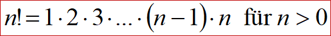
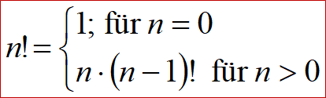
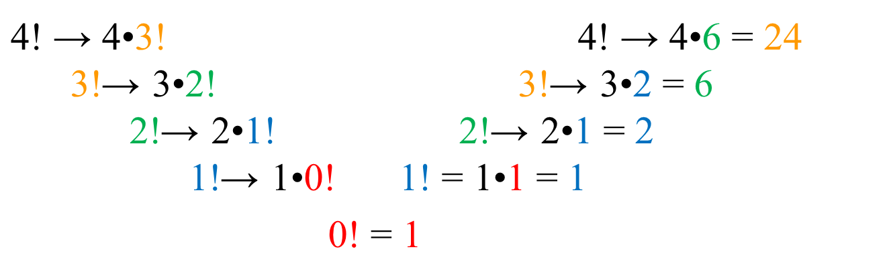
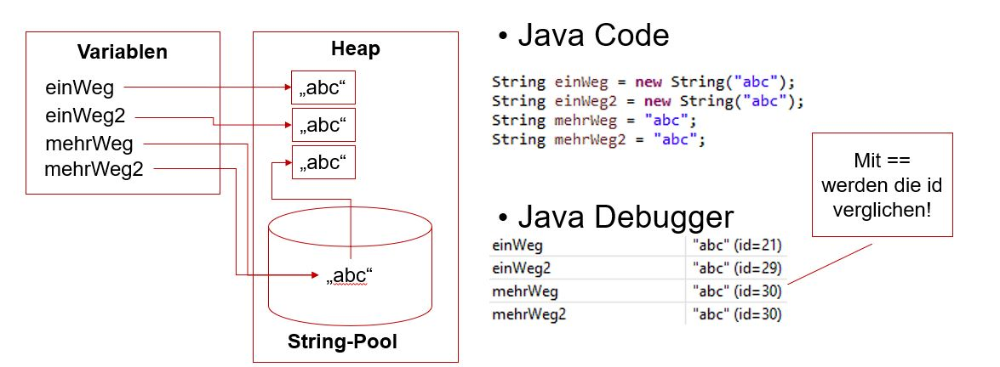

<!--
author: Melanie Baur, Sebastian Speiser, Serkan Kabak, Maja Linke, and further professors and students of HFT Stuttgart, contact: melanie.baur@hft-stuttgart.de, sebastian.speiser@hft-stuttgart.de
language: de
version: 0.1
narrator: Deutsch Female
mode: Textbook

comment: Vorlesung Programmieren 1 und 2 an der HFT Stuttgart des Bachelor Studiengangs Informatik im flexibilisierten Studienmodell

import: https://raw.githubusercontent.com/LiaScript/CodeRunner/master/README.md

link:   ../styles/style.css
        ../styles/liascript.css
-->

# Kapitel 3: Methoden und Strings
In diesem Kapitel lernen wir Methoden kennen und wie diese aufgebaut sind. Bisher haben wir nur die Main-Methode genutzt. Nun lernen Sie eigene Methoden zu schreiben. 


Danach betrachten wir den Datentyp String, der zur Verarbeitung von Texten verwendet wird. Strings spielen in Java eine besondere Rolle, da sie sehr häufig eingesetzt werden und über viele eingebaute Methoden verfügen. Anhand von Strings lernen wir, wie mit Objekten gearbeitet wird, ohne selbst eigene Klassen definieren zu müssen. Dies kommt dann in Kapitel 5.


## Methoden

Wir haben bisher in der main-Methode gearbeitet, bzw. Methoden genutzt, die im Sprachumfang von Java bereits enthalten sind. In diesem Kapitel möchten wir nun eigene Methoden schreiben, die dann von der main-Methode aufgerufen werden.

Betrachten Sie hierzu folgendes Beispiel:

```java
public class KreisBerechnungen {

	public static final double PI = 3.14159265;

	public static void main(String[] args) {
		double radius = 3.0;
		System.out.println("Der Umfang bei einem Radius von " + radius + " ist: " + berechneUmfang(radius));
		System.out.println("Die Fläche bei einem Radius von " + radius + " ist: " + berechneFlaeche(radius));
	}

	private static double berechneUmfang(double radius) {
		double umfang = 2.0 * radius * PI;
		return umfang;
	}

	private static double berechneFlaeche(double radius) {
		double flaeche = radius * radius * PI;
		return flaeche;
	}

}
```
@LIA.java(KreisBerechnungen)

- Erkennen Sie im Beispiel die Methoden?
- Was passiert in diesen Methoden?
- Wo werden diese aufgerufen und mit welchen Parametern?


Der Klassenkörper-Block besteht aus Variablendeklarationen und Methoden. Die in der Klasse deklarierten und gegebenenfalls initialisierten Variablen sind in allen Methoden der Klasse sichtbar, wie im Beispiel PI. Die Methoden der Klasse bestehen aus der Methodendeklaration und dem Methodenkörper/Methodenrumpf ( Block, eingegrenzt mit { } ). Allgemein besteht eine Methodendeklaration aus:

1. Modifikatoren public oder private, evtl. static
2. Rückgabetyp
3. Methodennamen
4. Parameterliste
5. Methodenrumpf


Wir betrachten beispielhaft folgende Methode:


Diese Methode besteht aus folgenden 5 Teilen:

1. **Modifkator**: public static, sie ist also öffentlich und der Klasse zugeordnet
2. **Rückgabetyp**: double, sie gibt eine Zahl vom Typ double zurück
3. **Methodenname**: berechneUmfang, am Namen erkennt man bereits, dass die Methode einen Umfang berechnet
4. **Parameterliste**: double radius, sie bekommt als Eingabe eine Zahl vom Typ double, nämlich den Radius übergeben
5. **Methodenrumpf**:     double umfang = 2.0 * radius * PI;     return umfang; die Methode führt eine Berechnung durch und gibt den Umfang vom Typ double zurück

Nun folgt eine genauere Erklärung der 5 Teile: 

**1. Modifikatoren**

Es gibt folgende Sichtbarkeitsmodifikatoren, welche angeben, von wo aus die Methode aufgerufen werden kann:

- **public**: von überall aufrufbar
- **protected**: innerhalb des Pakets oder Unterklassen in einem anderen Paket (→ später: Vererbung)
- ohne („package private“): innerhalb des Pakets
- **private**: innerhalb der Klasse

Weiterhin gibt es auch statische und nicht-statische Methoden:

- **static**: Die Methode ist der Klasse zugeordnet und kann ohne Erzeugung eines Objekts aufgerufen werden.
- ohne Modifier („**non-static**“): Die Methode ist einem Objekt (einer Instanz) zugeordnet und kann nur über ein Objekt aufgerufen werden (→ später: Objektorientierung).

<br>

**2. Rückgabetyp**

Der Rückgabetyp gibt an, welchen Typ das Ergebnis haben wird. Rückgabetypen können sein:

- die primitiven Typen
- Referenztypen
- der spezielle „Nichttyp“ **void** (= kein Rückgabewert)

Hat eine Methode einen Rückgabetyp (nicht void), so muss der zurückzugebende Wert durch `return ergebnis;` definiert werden, im Beispiel `return flaeche;`

<br>

**3. Methodennamen**

Beachten Sie bei der Wahl eines Methodennamen folgende Konventionen:

- Methoden beginnen mit einem kleinen Buchstaben
- Längere Namen werden in CamelCase geschrieben
- Der Name beschreibt, was die Methode tut
- Typischerweise enthalten Namen ein Verb, zum Beispiel: public String getName();

<br>

**4. Parameter / Aufruf der Methode**

Methodendefinition:

- „Formale“ Parameter (hier a und b) beschreiben die Eingabewerte einer Methode, die beim Aufruf übergeben und in der Methode weiterverarbeitet werden.

```java
public static double mittelwert(double a, double b){
    return (a + b)/2;
    }
```

Methodenaufruf:

- „Aktuelle“ Parameter sind die für einen bestimmten Aufruf eingesetzten Werte, wie z.B. (10.5 → a, 5.3 → b):

```java
double mw = mittelwert(10.5, 5.3);
```

Formale und aktuelle Parameter müssen vom gleichen Typ und der gleichen Reihenfolge sein!

<br>

**5. Methodenrumpf**

Der Methodenrumpf enthält die auszuführenden Anweisungen, die jeweils durch ein Semikolon (`;`) abgeschlossen werden.
Grundsätzlich kann der Methodenrumpf beliebig lang sein, aus Gründen der Lesbarkeit sollte er jedoch maximal eine Bildschirmseite umfassen.
Leerzeichen und Leerzeilen werden vom Compiler ignoriert, verbessern jedoch die Struktur und Verständlichkeit des Codes.
Die Ausführung einer Methode beginnt mit der ersten Anweisung des Methodenrumpfs und endet bei einem return-Befehl oder nach der letzten Anweisung.

<br>

---

<br>

### Methoden überladen

Namensgleiche Methoden mit unterschiedlichen Parametern nennt man überladen.

Beispiel:

`double mittelwert(double a, double b)`
und
`double mittelwert(double[] a)`

Der Compiler erkennt anhand der Anzahl und der Datentypen der Parameter, welche Methode gemeint ist. Methoden mit gleichem Namen und gleichen Parametern (d.h. mit gleicher Signatur) innerhalb einer Klasse sind nicht erlaubt (auch nicht mit unterschiedlichen Rückgabetypen).

Schauen Sie sich geneau folgendes Beispiel und spielen Sie damit herum:


```java
public class UeberladeneMethoden {

    public static void main(String[] args){

        double zahl1 = 10.5;
        double zahl2 = 7.3;
        double zahl3= 14.1;
        double zahl4= 1.1;

        double mittelwert1;
        double mittelwert2;

        mittelwert1 = berechneMittelwert(zahl1, zahl2);
        System.out.println("Der Mittelwert von zwei Zahlen ist: " + mittelwert1);

        mittelwert2 = berechneMittelwert(zahl1, zahl2, zahl3);
        System.out.println("Der Mittelwert von drei Zahlen ist: " + mittelwert2);
        
        double mittelwert3=berechneMittelwert(zahl2, zahl3, zahl4, zahl1);
        System.out.println(mittelwert3);
        
        double mittelwert4=berechneMittelwert(zahl4);
        System.out.println(mittelwert4);
        
    }

    private static double berechneMittelwert(double zahl1, double zahl2, double zahl3) {
    	double mw = (zahl1 + zahl2 + zahl3)/3;
    	System.out.println("Methode drei Zahlen aufgerufen");
		return mw;
	}

    // Was fällt Ihnen hier bei den Namen der übergebenen Parametern auf?
	public static double berechneMittelwert(double m1, double m2){
        double mw = (m1+m2)/2;
        System.out.println("Methode zwei Zahlen aufgerufen");
        return mw;
    }
	
	// Methode mit variabler Anzahl an Parametern
	public static double berechneMittelwert(double ... zahlen){
        double summe=0;
        for(double zahl : zahlen) {
        	summe+=zahl;
        }
        double mw = summe/zahlen.length;   
        System.out.println("Methode variable Anzahl aufgerufen");
        return mw;
    }
	
}
```
@LIA.java(UeberladeneMethoden)


### Übungen

**Aufgabe 1: Mittelwert**

Berechnen Sie den Mittelwert zweier Zahlen. Ergänzen Sie hierfür folgendes Programm mit einer Methode `berechneMittelwert`.


```java
class Mittelwert{
    public static void main(String[] args) {
        double zahl1 = 3.5;
        double zahl2 = 5.0;

        // Rufen Sie hier Ihre Methode auf

    }

// Fügen Sie hier Ihre eigene Methode ein

}

```
@LIA.java(Mittelwert)


**Aufgabe 2: BMI**

Berechnen Sie Ihren BMI mit der Formel Gewicht/(Größe*Größe). Erstellen Sie hierzu eine eigene Methode. Überprüfen Sie dann, ob Sie Untergewicht (BMI < 18.5), Normalgewicht (BMI zwischen 18.5 und 25) oder Übergewicht (BMI > 25) haben. 


```java
public class BMI {

	public static void main(String[] args) {
		
	}

	// Hier steht Ihre Methode
	
}
```
@LIA.java(BMI)

Probieren Sie hier auch aus, was passiert, wenn Sie die Parameter Gewicht und Größe vertauschen.

<br>

**Aufgabe 3: Quadrat berechnen**

Schreiben Sie eine Methode `berechneQuadrat`,  
die eine Zahl als Parameter erhält und das Quadrat zurückgibt.

- Rufen Sie die Methode in `main()` auf.
- Geben Sie das Ergebnis aus.

```java
import java.util.Scanner;

public class Quadrat {

  public static void main(String[] args) {

    Scanner scanner = new Scanner(System.in);

    System.out.print("Bitte eine Zahl eingeben: ");
    int zahl = scanner.nextInt();

    // Rufen Sie hier Ihre Methode auf

    scanner.close();
  }

  // Hier steht Ihre Methode

}
```
@LIA.java(Quadrat)

- Was genau macht der `Scanner`?
- Warum benötigen wir `import java.util.Scanner;`?
- Was passiert, wenn Sie `nextInt()` verwenden und eine Kommazahl eingeben?
- Warum sollte man `scanner.close()` aufrufen?

<br>

**Aufgabe 4: Maximum**

Das Maximum bestimmt die größte Zahl aus einer Auswahl von vorliegenden Zahlen.

Schreiben Sie ein Programm, welches das Maximum von drei Integer-Variablen bestimmt und diese in der Kommandozeile ausgibt.

- Rufen Sie die Methode in `main()` auf.
- Geben Sie das Ergebnis aus.

```java
public class Maximum {

    public static void main(String[] args) {
        int a = 7;
        int b = 12;

        // Rufen Sie hier Ihre Methode auf
        
    }

    // Hier steht Ihre Methode
    
}
```
@LIA.java(Maximum)


### Lösung

**Aufgabe 1: Mittelwert**

```java
public class MittelwertLoesung {

	public static void main(String[] args) {
		double zahl1 = 3.5;
		double zahl2 = 5.0;

		// Hier rufen Sie Ihre Methode auf
		double mittelwert = berechneMittelwert(zahl1, zahl2);
		System.out.println(mittelwert);

	}

	// Hier steht Ihre Methode
	private static double berechneMittelwert(double zahl1, double zahl2) {
		return (zahl1 + zahl2) / 2;
	}
}
```
@LIA.java(MittelwertLoesung)


**Aufgabe 2: BMI**

```java
public class BMILoesung {

	public static void main(String[] args) {

		int gewicht = 75;
		double groesse = 1.78;

		double bmi = berechneBMI(gewicht, groesse);

		System.out.println("Ihr BMI ist: " + bmi);

		if (bmi < 18.5) {
			System.out.println("Sie haben Untergewicht.");
		} else if (bmi < 25) {
			System.out.println("Sie haben Normalgewicht.");
		} else
			System.out.println("Sie haben Übergewicht.");
	}

	public static double berechneBMI(double gewicht, double groesse) {
		return gewicht / (groesse * groesse);
	}
	
}
```
@LIA.java(BMILoesung)


**Lösung Aufgabe 3: Quadrat berechnen**

```java
import java.util.Scanner;

public class Quadrat {

  public static void main(String[] args) {

    Scanner scanner = new Scanner(System.in);

    System.out.print("Bitte eine Zahl eingeben: ");
    int zahl = scanner.nextInt();

    // Rufen Sie hier Ihre Methode auf
    int ergebnis = berechneQuadrat(zahl);
    System.out.println("Quadrat: " + ergebnis);

    scanner.close();
  }

  // Hier steht Ihre Methode
  public static int berechneQuadrat(int zahl) {
    return zahl * zahl;
  }

}
```
@LIA.java(Quadrat)


**Lösung Aufgabe 4: Größere Zahl bestimmen**

```java
public class Maximum {

    public static void main(String[] args) {
        int a = 7;
        int b = 12;

        // Rufen Sie hier Ihre Methode auf
        int groesser = max(a, b);
        System.out.println("Größere Zahl: " + groesser);
        
    }

    // Hier steht Ihre Methode
    public static int max(int a, int b) {
        if (a > b) {
            return a;
        } else {
            return b;
        }
    }
    
}
```
@LIA.java(Maximum)


## Exkurs: Rekursion

Eine Rekursion ist ein Vorgang, der sich selbst als Teil enthält oder mithilfe von sich selbst definierbar ist. Eine rekursive Funktion ist somit eine Funktion, die sich selbst aufruft. Rekursion kann zum Beispiel anstelle von Schleifen genutzt werden.

> **Beispiel: Fakultät**

- Wie wird die Fakultät berechnet? Recherchieren Sie zwei verschiedene Berechnungsmöglichkeiten.
- Sind Ihre gefundenen Berechnungsmöglichkeiten rekursiv oder iterativ?

Bei der Rekursion muss aufgepasst werden, dass keine unendliche Rekursion entsteht. D.h. man braucht immer eine Abbruchbedingung, ansonsten führt dies zu einem Laufzeitfehler. Der rekursive Funktionsaufruf erfolgt nur, wenn die Abbruchbedingung nicht erfüllt ist.

Hier finden Sie einen Mustercode für die Rekursion:

```java
public static typ funktion(typ parameter){
  if (bedingung){
    return ergebnis; //Rekursionsabbruch
  } else {
    return funktion(neuerParameter); //Rekursionsaufruf
  }
}
```

- Rekursion führt für bestimmte Problemstellungen zu prägnanten, knappen und eleganten Algorithmen.
- Rekursionen verbrauchen meist mehr Arbeitsspeicher. Deshalb kann durch zu große Rekursionstiefe auch ein Stack Overflow entstehen.

### Fakultät

Schauen wir uns die Iteration am Beispiel der Fakultät genauer an. Evtl. haben Sie diese beiden Berechnungsmöglichkeiten bereits recherchiert.

Eine iterative Berechnungsmöglichkeit der Fakultät:



Versus eine rekursive Berechnungsmöglichkeit der Fakultät:



So kann man sich die rekursive Berechnung vorstellen.



> **Aufgabe**

Vervollständigen Sie die beiden Programme mit Hilfe der obigen Definitionen, so dass jeweils die Fakultät berechnet wird:

```java
class FakultaetIterativ{
    public static void main(String args[]){
        int n = 4;
        System.out.println(n + "! = " + fakultaet(n));
    }

    public static int fakultaet(int n ){
        int fakultaet = 1;

        // Fügen Sie hier den passenden Code ein

        return fakultaet;
    }

}
```
@LIA.java(FakultaetIterativ)

```java
class FakultaetRekursiv{
    public static void main(String args[]){
        int n = 4;
        System.out.println(n + "! = " + fakultaet(n));
    }

    public static int fakultaet(int n ){
        if ( // Bedingung? ){
            return // was wird zurück gegeben bei Abbruchbedingungen?
        } else {
            // was wird zurück gegeben? rekursiver Aufruf
    }
}
```
@LIA.java(FakultaetRekursiv)

### Lösung

```java
public class FakultaetIterativLoesung {

    public static void main(String args[]){
        int n = 4;
        System.out.println(n + "! = " + fakultaet(n));
    }

    public static int fakultaet(int n ){
        int fakultaet = 1;

        for(int i = 1; i<=n;i++) {
        	fakultaet*=i;
        }
        return fakultaet;
    }
	
}
```
@LIA.java(FakultaetIterativLoesung)


```java
public class FakkultaetRekursivLoesung {

	public static void main(String args[]) {
		int n = 4;
		System.out.println(n + "! = " + fakultaet(n));
	}

	public static int fakultaet(int n) {
		if (n == 0) {
			return 1;
		} else {
			return n * fakultaet(n - 1);
		}
	}
}
```
@LIA.java(FakkultaetRekursivLoesung)


## Strings

Bisher haben wir uns mit primitiven Datentypen befasst, wie z.B. int, double und char, um einfache Werte zu speichern. Mit dem primitiven Datentyp char können wir einzelne Zeichen speichern, während ein char-Array Zeichenfolgen einer festen Länge speichern kann.

Für die Arbeit mit Zeichenketten bietet Java die Klasse `String` an. Im Gegensatz zu primitiven Datentypen stellt die Klasse `String` einen Referenztyp dar. Das bedeutet, dass eine Variable vom Typ `String` nicht den tatsächlichen String selbst speichert, sondern eine Referenz auf das `String`-Objekt in der Speicherstruktur.

Objekte eines Referenztyps, wie z.B. String-Objekte, können Methoden bereitstellen, die auf sie angewendet werden können. Die `String`-Klasse stellt eine Vielzahl von Methoden zur Verfügung, um Zeichenketten zu manipulieren, zu vergleichen, zu durchsuchen und mehr.

Was passiert in folgendem Programm?

- Versuchen Sie das Programm nachzuvollziehen.
- Welche Ausgaben erscheinen auf der Konsole?
- Wie wurden die einzelnen Strings gebaut?

```java
class StringBeispiel{
    public static void main(String args[]){
        String string1 = new String("Ein String");
        String string2 = "String im Pool";
        char[] buchstaben = { 'B', 'u', 'c', 'h', 's', 't', 'a', 'b', 'e', 'n'};
        String string3 = new String(buchstaben);
        String string4 = "Zusammen" + "gesetzt";

        System.out.println(string1);
        System.out.println(string2);
        System.out.println(string3);
        System.out.println(string4);
    }
}
```
@LIA.java(StringBeispiel)

### Nutzung von Zeichenketten

Wir schauen uns in diesem Kapitel etwas genauer an, wie Strings erzeugt werden und wo diese gespeichert werden.

- Mit dem Konstruktoraufruf `new String(…)` werden immer neue Stringobjekte angelegt.

- `String`-Literale (Zeichenketten in doppelten Anführungszeichen) werden im **String-Pool** verwaltet.

- Alle Java-Objekte werden auf dem Speicherbereich namens **Heap** angelegt

Merke: Die Objekterzeugung mit `new` umgeht den String-Pool

Beachten Sie dabei folgende Abbildung. Versuchen Sie diese nachzuvollziehen. Wo wird welcher String gespeichert?



Schauen Sie das einführende Programm erneut an. Können Sie nun die Kommentare nachvollziehen?

```java
class StringBeispiel{
    public static void main(String args[]){
        String string1 = new String("Ein String"); // mit new wird neuer Speicherplatz belegt
        String string2 = "String im Pool"; // Zeichenkettenkonstanten werden wiederverwendet
        char[] buchstaben = { 'B', 'u', 'c', 'h', 's', 't', 'a', 'b', 'e', 'n'};
        String string3 = new String(buchstaben); // new belegt neuen Speicherplatz
        String string4 = "Zusammen" + "gesetzt"; // Einzelteile werden wiederverwendet,
                                                // aber +-Operator erzeugt neues Objekt
        System.out.println(string1);
        System.out.println(string2);
        System.out.println(string3);
        System.out.println(string4);
    }
}
```
@LIA.java(StringBeispiel)

> **Unveränderbare Zeichenketten**

Objekte der Klasse `String` sind unveränderlich.

- Methoden, die einen String ändern, liefern ein **neues Objekt** zurück.
- Beispiel: Methode **replace()**
- Versuchen Sie nun auch folgenden Code nachzuvollziehen. Welche Ausgaben werden generiert?

```java
class Bank{
    public static void main(String args[]){
        String geldbank = "Bank";
        String holzbank = "Bank";
        System.out.println(geldbank == holzbank); //String wird im Stringpool wiederverwendet
        geldbank.replace("Bank", "Banc"); // Das Objekt, auf das geldbank zeigt, bleibt unverändert

        System.out.println(geldbank);
        System.out.println(holzbank);
        System.out.println(geldbank == holzbank); 
        geldbank = geldbank.replace("Bank", "Banc"); // Die Variable zeigt nun auf ein anderes Objekt
        System.out.println(geldbank);
        System.out.println(geldbank == holzbank);
    }
}
```
@LIA.java(Bank)

### Veränderbare Zeichenketten

- Objekte der Klassen `StringBuffer` und `StringBuilder` sind veränderbar. Analysieren Sie folgendes Beispiel (vgl. Schröder programmiert Java, S. 163):

```java
class StringBilder{
    public static void main(String args[]){
        StringBuilder stringBuilder = new StringBuilder();
        stringBuilder.append("String"); //append() und insert() verändern dynamisch das darunterliegende Objekt
        stringBuilder.append("-");
        stringBuilder.append("Bilder");
        stringBuilder.insert(8, "u");
        System.out.println(stringBuilder.toString());
    }
}
```
@LIA.java(StringBilder)

- Die Objekte können dynamisch ihre Größe ändern.
- Optional kann man im Konstruktor der Klassen `StringBuffer` und `StringBuilder` bereits eine Größe mitgeben. Konstruktoren lernen wir im Kapitel Konstruktoren bei den Objekten.

- Die Klassen `StringBuffer` und `StringBuilder` bieten die gleichen Methoden an.
- Die beiden Klassen unterscheiden sich in der Arbeitsweise:

    - `StringBuffer` ist synchronisiert (= Thread-sicher bei zeitgleichem Zugriff mehrerer Programmteile)

    - `StringBuilder` ist nicht synchronisiert (und etwas schneller)

- Weitere Methoden sind zum Beispiel:

    - **delete()**, **deleteCharAt()**

    - **replace()**

    - usw.

Erinnern Sie sich an die Java Documentation? Suchen Sie die Klasse `String` und gehen Sie die Methoden durch. 

### Zeichenkettenoperationen

Beispiel:

```java
String satz = "Dies ist ein Satz.";
```

Welche Methoden können auf diesem String aufgerufen werden?

Methoden: `charAt(int index)`, `length()`, `substring(int beginIndex)` etc.

- Zugriff auf ein Zeichen: `charAt()`
- Länge eines Strings: `length()`
- Zerlegen eines Strings: `substring()`, `split()`

Suchen Sie in der Java-Dokumentation nach weiteren Methoden, die Sie auf Strings aufrufen können. Überlegen Sie sich, was jeweils mit dem String passiert. Betrachten Sie auch hierzu folgendes Beispiel und versuchen Sie die einzelnen Schritte nachzuvollziehen.

```java
public class Zeichenkettenoperationen {
    public static void main(String[] args) {
        String satz = "Dies ist ein Satz.";
        String[] woerter = satz.split(" "); //Teilt den String bei allen Leerzeichen
        for(int i = 0; i < woerter.length; i++) {
            System.out.println(woerter[i]);
        }

        String teil = satz.substring(13, 17); //Beginn des Substrings an Position 13 und Ende an Position 17
        System.out.println(teil);
   }
}
```
@LIA.java(Zeichenkettenoperationen)

- Vergleichsoperationen in Java funktionieren nur für primitive Datentypen und nicht für Referenztypen wie z.B. String. Dies bedeutet, Zeichenketten vergleicht man immer mit `equals()`, nicht mit ==. Der Vergleich mit == vergleicht die Gleichheit der zugrunde liegenden Objekte, während die Methode `equals()` die Gleichheit der Strings überprüft.
- Wenn Teile von Strings verglichen werden sollen, kann man z.B. `endsWith()`, `startsWith()` oder `regionMatches()` verwenden.
- Mit Hilfe der Methoden `indexOf()`, `lastIndexOf()`, `contains()` kann man in Strings suchen.
- Veränderungen können mit `replace()`, `replaceFirst()`, `replaceAll()` erfolgen.

> **Aufgabe**

Suchen Sie sich geeignete Methoden in der Java API der Klasse [String](https://docs.oracle.com/en/java/javase/21/docs/api/java.base/java/lang/String.html)
um den String "Iss" jeweils jeweils geeignet weiterzuverarbeiten. Dabei sollte jeweils das Wort im Kommentar erscheinen.

```java
public class Iss {
    public static void main(String[] args) {
        String satz = "Iss";
        // Eis

        // Heiss

        // Heisser

        //Hosenschei**er
   }
}
```
@LIA.java(Iss)

Die Übung entstammt dem Buch Schrödinger programmiert Java von Philipp Ackermann (S. 152). Dort finden Sie auch eine Lösung.

Hinweis: Benutzen Sie u.a. die Methoden substring(), toLowerCase(), replaceAll() und konkatenieren Sie geeignet die Strings.

**Weitere Beispiele**

Versuchen Sie nun auch folgenden Code nachzuvollziehen. Die Idee hiervon entstammt ebenfalls aus dem Buch Schrödinger programmiert Java (S. 145). Welche Ausgaben werden generiert und warum?

```java
class StringWeiteresBeispiel{
    public static void main(String args[]){
        String wort = "Urinstinkt";
        boolean sindGleich = wort.equals("Ur" + "instinkt");
        System.out.println(sindGleich);

        System.out.println(wort.startsWith("Urin"));
        System.out.println(wort.endsWith("stinkt"));

        System.out.println("Autoschlüssel".regionMatches(5, "Schlüsselbund", 1,3));
        System.out.println(wort.indexOf('i'));
        System.out.println(wort.lastIndexOf('i'));
    }
}
```
@LIA.java(StringWeiteresBeispiel)

### Übungen

**Aufgabe 1**

Erstellen Sie einen Satz. Löschen Sie danach aus diesem alle Vokale, indem Sie eine geeignete Methode der Klasse String nutzen. 

```java
class VokaleLoeschen{
    public static void main(String args[]){

    }
}
```
@LIA.java(VokaleLoeschen)


**Aufgabe 2**

Geben Sie zu einem String folgende Informationen aus:

- Länge des Strings
- Erstes Zeichen
- Letztes Zeichen
- Teilstring der ersten 3 Zeichen

```java
class StringInfos{
    public static void main(String args[]){
        String text = "Programmieren";

    }
}
```
@LIA.java(StringInfos)


**Aufgabe 3**

Erstellen Sie einen veränderbaren String mit `StringBuilder`.  
Führen Sie anschließend diese Operationen aus und geben Sie das Ergebnis aus:

- Text anhängen (`append`)
- Ein Wort einfügen (`insert`)
- Ein Zeichen löschen (`deleteCharAt`)

```java
class StringBuilderUebung{
    public static void main(String args[]){
        StringBuilder sb = new StringBuilder("Java");

    }
}
```
@LIA.java(StringBuilderUebung)

Machen Sie die Aufgaben aus der [Aufgaben-Datenbank](https://speiser.hft-pages.io/programmieraufgaben/2024-ss-pro-1/) aus Kapitel 04.

### Lösungen

**Aufgabe 1**


```java
class VokaleLoeschenLoesung{
    public static void main(String args[]){

        String meinSatz = "Ein schöner Satz.";

        meinSatz = meinSatz.toLowerCase();

        meinSatz = meinSatz.replace("a","");
        meinSatz = meinSatz.replace("e","");
        meinSatz = meinSatz.replace("i","");
        meinSatz = meinSatz.replace("o","");
        meinSatz = meinSatz.replace("u","");

        System.out.println(meinSatz);
    }
}
```
@LIA.java(VokaleLoeschenLoesung)

**Aufgabe 2**

```java
class StringInfos{
    public static void main(String args[]){
        String text = "Programmieren";

        System.out.println("Länge: " + text.length());
        System.out.println("Erstes Zeichen: " + text.charAt(0));
        System.out.println("Letztes Zeichen: " + text.charAt(text.length() - 1));
        System.out.println("Erste 3 Zeichen: " + text.substring(0, 3));
    }
}
```
@LIA.java(StringInfos)


**Aufgabe 3**

```java
class StringBuilderUebung{
    public static void main(String args[]){
        StringBuilder sb = new StringBuilder("Java");

        sb.append(" ist toll");
        sb.insert(0, "Hallo ");
        sb.deleteCharAt(5);

        System.out.println(sb.toString());
    }
}
```
@LIA.java(StringBuilderUebung)


