<!--
author: Melanie Baur, Sebastian Speiser, Serkan Kabak, Maja Linke, and further professors and students of HFT Stuttgart, contact: melanie.baur@hft-stuttgart.de, sebastian.speiser@hft-stuttgart.de
language: de
version: 0.1
narrator: Deutsch Female
mode: Textbook

comment: Vorlesung Programmieren 1 und 2 an der HFT Stuttgart des Bachelor Studiengangs Informatik im flexibilisierten Studienmodell

import: https://raw.githubusercontent.com/LiaScript/CodeRunner/master/README.md

link:   ../styles/style.css
        ../styles/liascript.css
-->

## Kapitel 4: Java und Arbeit mit einer IDE

In diesem Kapitel lernen Sie nun einiges über die Programmiersprache Java. Dazu werden Sie ab jetzt mit einer integrierten Entwicklungsumgebung, kurz IDE, arbeiten. Damit machen wir viele Übungen zu den letzten Einheiten. 

Bisher haben Sie in diesem Workbook programmiert. Hier passiert sehr viel Technik im Hintergrund, welche Sie nicht sehen. Sie lernen in diesem Kapitel, dies alles zu verstehen. 

In den kommenden Abschnitten beschäftigen Sie sich damit, wie Java-Code aufgebaut ist und wie er innerhalb eines Projekts verarbeitet wird. Sie gewinnen ein besseres Verständnis dafür, was beim Starten und Ausführen eines Programms im Hintergrund passiert und wie die einzelnen Bestandteile zusammenspielen. Anschließend arbeiten Sie mit der Entwicklungsumgebung Eclipse und lernen, wie Sie Ihren Code übersichtlich strukturieren, dokumentieren, überprüfen und mithilfe von Werkzeugen wie Refactoring und Debugging gezielt weiterentwickeln.


### Ein Java-Programm
 
Java ist eine weitverbreitete Programmiersprache. Java unterstützt viele Programmierparadigmen. Java wird ständig weiter entwickelt und um moderne Konzepte ergänzt.
Mit Java stellen wir uns auf „die Schultern eines Riesen“: Hunderte Pakete und tausenden vpm vordefinierte Klassen. Wenn Sie Java gut können, wird Ihnen der Umstieg zu vielen anderen Programmiersprachen leicht fallen. Deswegen lernen wir hier Java. 


- **Java-Programme** können mit einem beliebigen Text-Editor geschrieben werden. Die Dateiendung der Quell-Dateien lautet **.java**. Hier steht der **Quellcode** (engl. source).

- Der **Java-Compiler** `javac` übersetzt die Quelldatei in sogenannten Bytecode, dieser wird in der mit der Endung **.class** gespeichert.

- Die **Java-Laufzeitumgebung** (engl. Runtime Environment) `java` führt den Bytecode aus.

- Das **Java-Programm** von der Einführung gibt den Text „Hallo Welt“ am Bildschirm aus.

  

```java
class HalloWelt{
    public static void main(String args[]){
        System.out.println("Hallo Welt");
    }
}

```
@LIA.java(HalloWelt)


Das bedeutet: In Java wird Programmcode über einen Compiler in den Bytecode übersetzt (kompiliert). Dieser kann dann von einem Interpreter ausgeführt werden.

  
<p align="center">


</p>

  

- Eine Besonderheit von Java ist, dass ein Bytecode von verschiedenen Systemen verwendet werden kann: „Write once, run anywhere“

  

<p align="center">

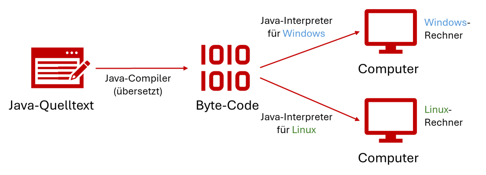

</p>

  

Wir wollen nun das Programm selbst schreiben. Hierzu benötigen Sie wie das Bild zeigt:

- Einen Java-Compiler
- Einen Java-Interpreter

  
Auf den Rechner in der Hochschule ist alles bereits installiert. Auf Ihrem eigenen Rechner können Sie auf die Schnelle einen externen Web-Editor nutzen, wie z.B. [https://www.online-ide.com/online_java_editor](https://www.online-ide.com/online_java_editor). Wir empfehlen, auch auf Ihrem Rechner eine 


---

> **Quiz** 

Führen Sie nun folgendes Quiz durch und testen Sie Ihr Wissen:


**Frage 1**

Was macht der Compiler?

[(x)] Er erstellt **.class-Dateien**
[( )] Er verarbeitet **.class-Dateien**
[( )] Er führt das Programm aus

---

**Frage 2**


Was macht der Befehl `java`?


[( )] Er macht aus Quellcode Bytecode
[(x)] Er führt das Programm aus
[( )] Er verarbeitet .java-Dateien


---

### Eclipse

Wir werden im 1. Semester mit der IDE (dies ist die Abkürzung für integrierte Entwicklungsumgebung von engl. integrated development environment) arbeiten. Eine IDE macht Ihnen das Leben sehr viel leichter. Sie sollten, wenn möglich, Eclipse auch auf Ihrem privaten Rechner installieren, um auch zu Hause üben zu können.
  

Führen Sie also diese Schritte auf Ihrem Laptop oder Rechner zu Hause durch, so dass Sie für das Semester ausgerüstet sind. Auf den Rechnern der Hochschule ist alles bereits installiert.


1. Öffnen Sie Ihren Webbrowser und besuchen Sie die offizielle Eclipse-Website unter https://www.eclipse.org/downloads/.

2. Herunterladen des Installationsprogramms („Download x86_64“)

<p align="center">

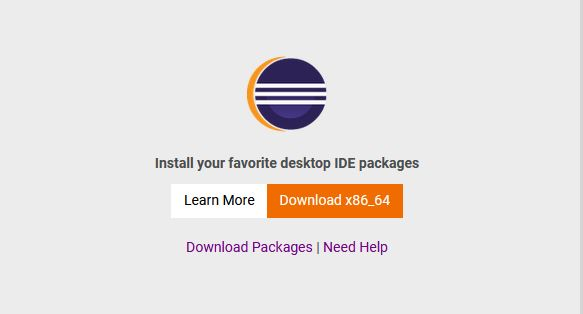

</p>

<br>

3. Bestätigung des Downloads vom ausgewählten Server

4. Wechsel in den „Downloads“-Ordner und Start des heruntergeladenen Programms

   `eclipse-inst-jre-win64.exe`  

5. Auswahl des Eintrags `Eclipse IDE for Java Developers`  

<p align="center">

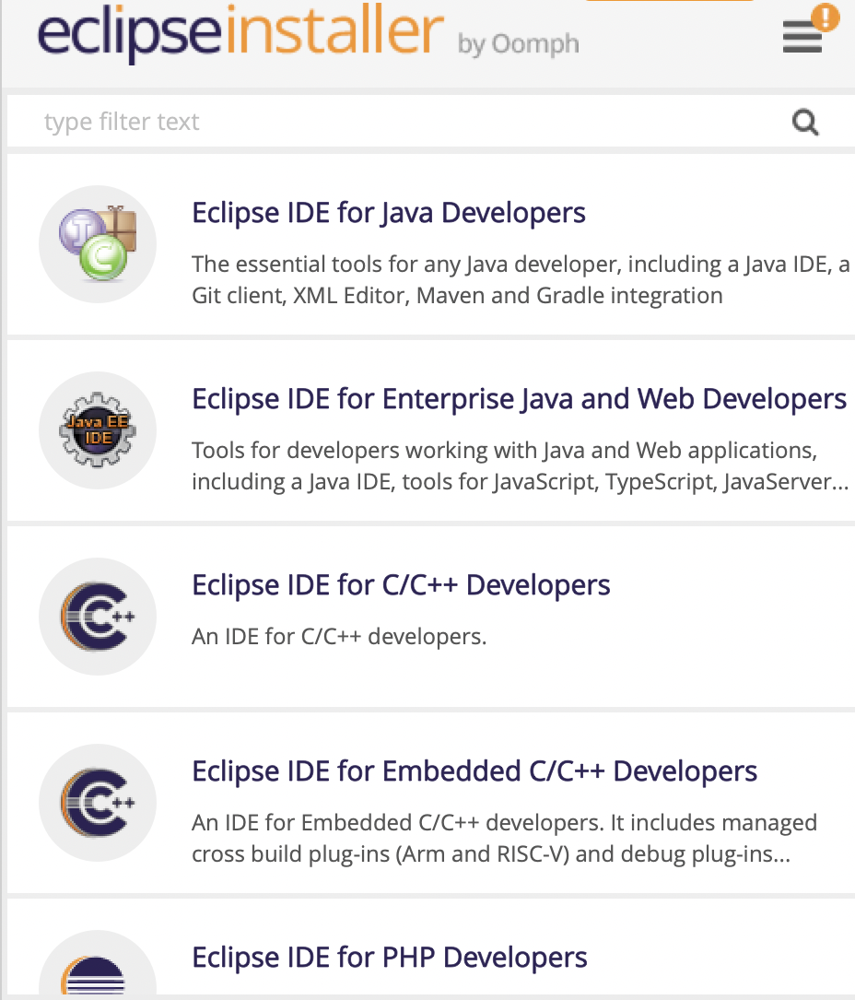

</p>


6. Bestätigen der Standardeinträge für die JVM und den Installationsordner

<p align="center">

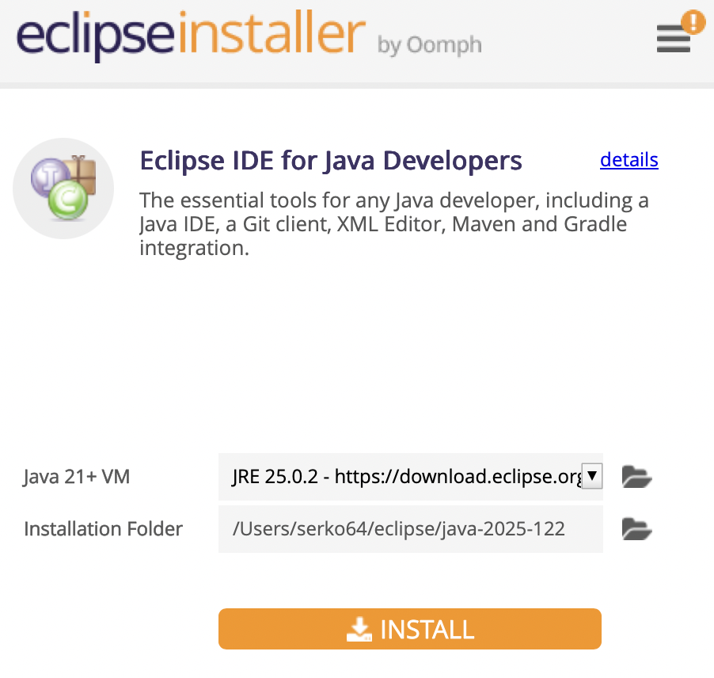

</p>  

7. Auswahl/Anlegen des Eclipse Workspace und "Launch"

<p align="center">

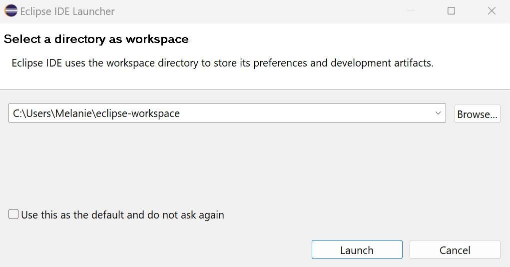

</p>

  

> **Führung durch Eclipse**

  

Absolvieren Sie dann die Anleitung zum Erstellen eines Hello World-Projekts:

  

<p align="center">

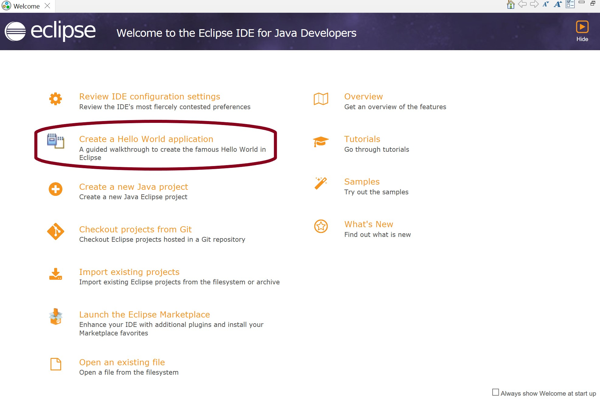

</p>

  

> **Start des ersten Projekts**

  

Ein Eclipse-Projekt starten Sie unter:

  

<p align="center">


</p>

  

Oder, wenn Sie den Start-Bildschirm nicht sehen, klicken Sie links oben auf File -> New -> Java Project -> Project name eingeben

  

<p align="center">

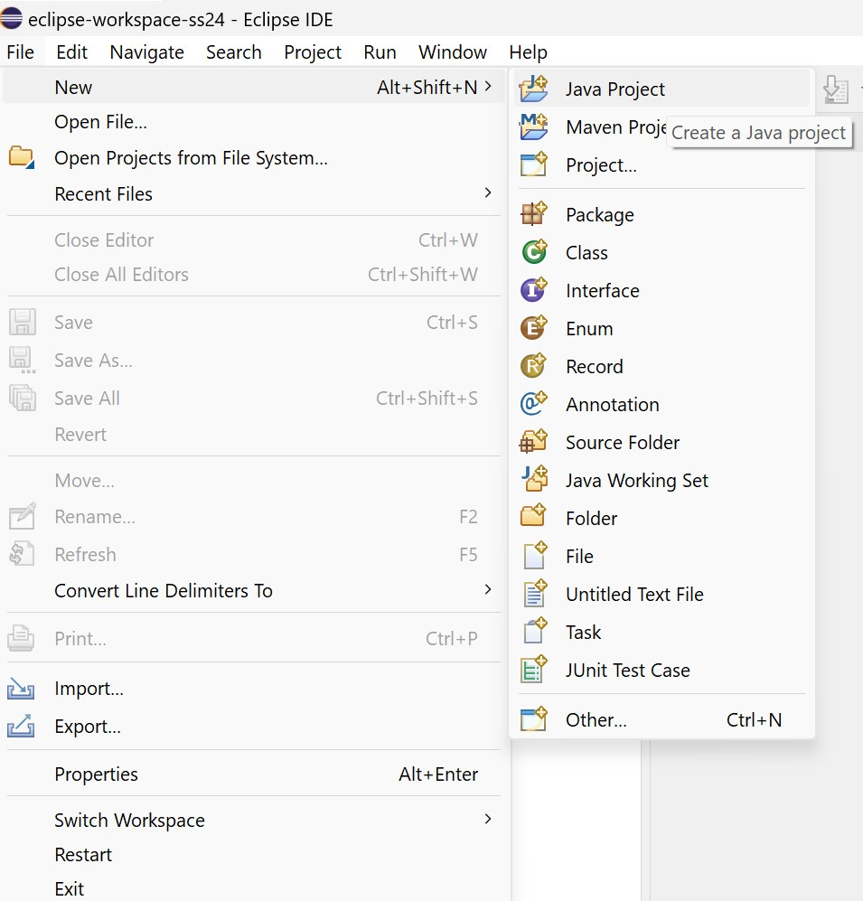

</p>

  

Geben Sie oben einen Projektnamen ein und deselektieren Sie das Häkchen der module-info.java!

Danach klicken Sie auf `Finish`.

  

<p align="center">

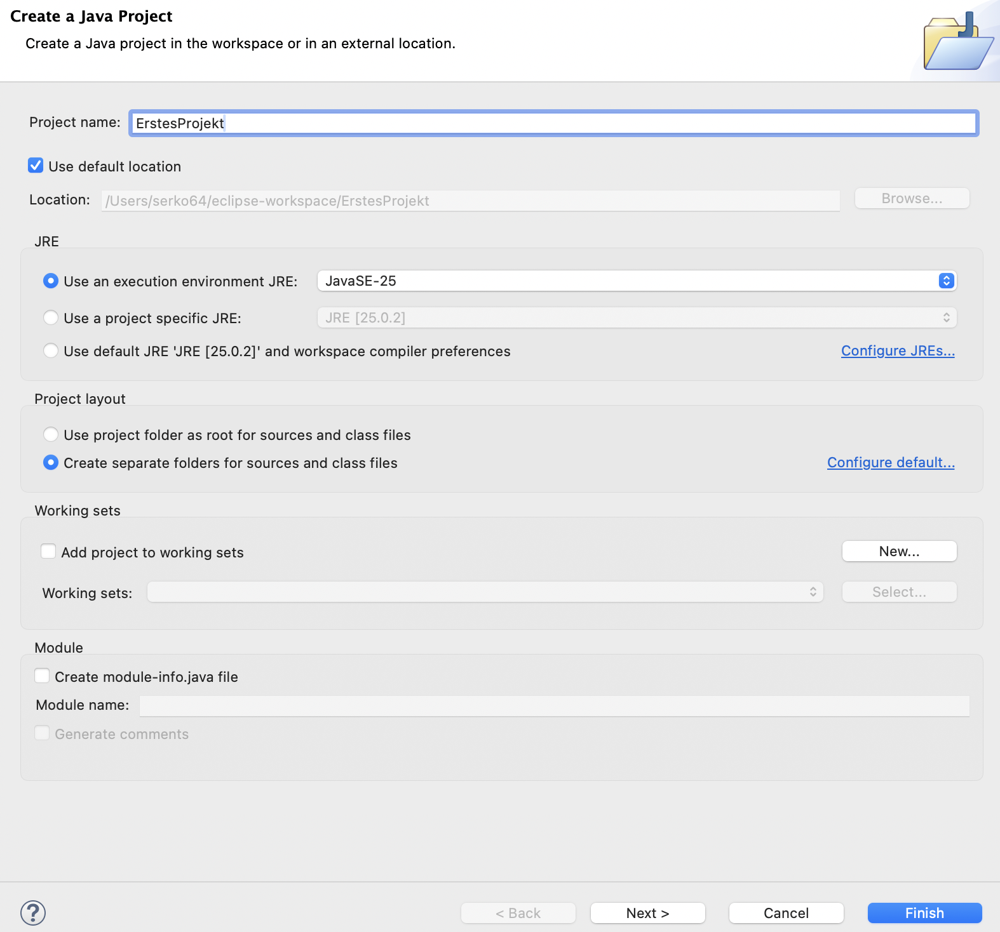

</p>

  

Wir arbeiten zunächst ohne Module und auch ohne Packages.

  

Um nun eine Klasse zu erstellen, rechtsklicken Sie auf das Projekt `ErstesProjekt`, wählen Sie `New`, dann `Class`.

  

<p align="center">

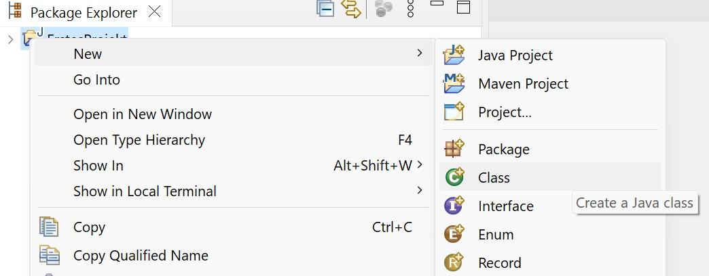

</p>

  

Geben Sie einen Namen für die Klasse ein, wählen Sie aus, dass die main-Methode erzeugt wird, und klicken Sie auf `Finish`.

  

<p align="center">

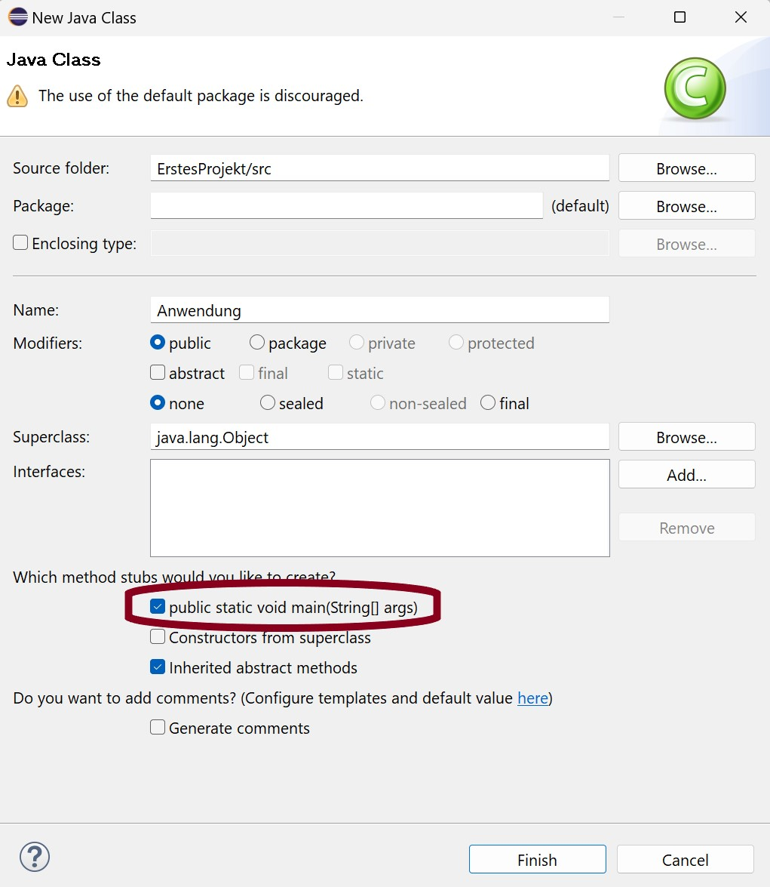

</p>

  

Erstellen Sie nun Ihr gewünschtes Programm. Zum Ausführen des Programms dann einfach den grünen `Run As` Button drücken:

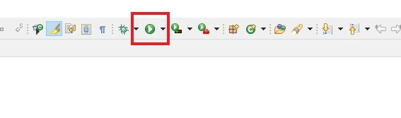

  

### Übungen

**Aufgabe 1:**

Machen Sie folgende Aufgabe am besten auf einem Hochschulrechner. Hier ist bereits alles korrekt installiert. 

Erstellen Sie mit Hilfe eines einfachen Texteditors ein Programm `HalloStudent.java`, welches Ihren Namen auf Konsole ausgibt. Achten Sie darauf, dass die Endung .java ist (und nicht .txt).
Übersetzen Sie das Programm und führen Sie es aus. 

Schritt für Schritt Anleitung:

1. **Schreiben Sie Ihren Java-Code:** Erstellen Sie eine neue Datei und geben Sie Ihren Java-Code ein.
2. **Speichern Sie die Datei:** Speichern Sie die Datei mit der Erweiterung ".java". Wichtig: Die Datei muss so heißen, wie Ihre Klasse heißt!
3. **Öffnen Sie Kommandozeile**. Um die Kommandozeile zu öffnen, drücken Sie `Windows + R` und geben Sie `cmd` in das Ausführen-Dialogfeld ein. Drücken Sie dann die Eingabetaste.
4. **Navigieren** Sie mit cd in das Verzeichnis Ihrer Java-Datei.
5. **Kompilieren Sie den Java-Code:** Verwenden Sie den Befehl `javac HalloStudent.java`, um den Java-Code zu kompilieren. 
6. **Führen Sie das Programm aus:** Verwenden Sie den Befehl `java`, um das Programm auszuführen. Verwenden Sie den Klassennamen ohne die Erweiterung ".class", also  `java HalloStudent`. 
7. **Überprüfen Sie die Ausgabe:** Das Programm sollte ausgeführt werden und die Ausgabe auf der Konsole anzeigen. 

Durch das Befolgen dieser Schritte können Sie einen Java-Code im Texteditor erstellen, kompilieren und ausführen, ohne eine integrierte Entwicklungsumgebung (IDE) zu verwenden. Dies ist auf Dauer aber sehr mühsam, wie Sie vielleicht an diesem kleinen Beispiel schon bemerkt haben.

**Aufgabe 2:**

Programmieren mit Eclipse: Machen Sie obige Aufgabe nun mit Eclipse.
  

Wenn Sie ein kleines Programm auf der Kommandozeile ausführen können, dieses auch in der IDE läuft und Sie dazu verstanden haben, welche Schritte im Hintergrund ausgeführt wurden, dann sind Sie bereit für die restlichen Übungen in diesem Kapitel. 


### Kommentare

Hier erhalten Sie ein Überblick, über verschiedene Kommentarmöglichkeiten in Java:

**Einzeilige Kommentare**

- Werden zeilenweise verwendet, sie beginnen mit einem Doppelschrägstrich // und enden mit dem Zeilenende
- Diese werden für kurze Erklärungen genutzt

**Blockkommentare**

- Werden für Erklärungen benutzt, die sich über mehrere Zeilen erstrecken
- Sie beginnen mit einem Schrägstrich und Multiplikations-Zeichen /\*_ und enden mit Multiplikations-Zeichen und Schrägstrich _\*/

**Dokumentationskommentare**

- Werden zu Dokumentationszwecken eingesetzt
- Mit javadoc kann anschließend automatisch eine umfangreiche HTML-Dokumentation generiert werden. Dies lernen Sie später.
- Dokumentationskommentare beginnen mit einem Schrägstrich und zwei Multiplikations-Zeichen /\*\*_ und enden mit Multiplikations-Zeichen und Schrägstrich _\*/
- Stehen immer vor dem Element, welches sie beschreiben sollen

**Methodenkommntare**

- Methodenkommentare beschreiben, was die Methode macht
- Beginnen mit /\*\*_ und endet mit _\*/
- Schlüsselwörter (Tags) wie
  - @param: Beschreibung der Parameter der Methode
  - @return: Rückgabewert
  - Und viele mehr

Weitere Schlüsselwörter: author, version, since, see …

Beispiel:

```java
/**
* Diese Methode berechnet das Maximum für zwei Zahlen.
*
* @param zahl1 Die erste Zahl.
* @param zahl2 Die zweite Zahl.
* @return Die größere der beiden Zahlen.
*/

public static int max(int zahl1, int zahl2) {
    return zahl1 > zahl2 ? zahl1 : zahl2;
    }
```


### Refactoring

Refactoring bezeichnet die strukturierte Überarbeitung von Quellcode, ohne dessen funktionales Verhalten zu verändern. Ziel ist es, den Code lesbarer, wartbarer und leichter erweiterbar zu machen.

Typische Refactoring-Maßnahmen sind unter anderem:

-	lange und unübersichtliche Methoden in kürzere, klar benannte Methoden aufzuteilen
-	doppelte Codeabschnitte zu vermeiden
-	Methoden mit zu vielen Parametern zu reduzieren
-	aussagekräftige Bezeichner für Variablen und Methoden zu verwenden

Durch Refactoring wird sogenannter Clean Code erzeugt, der einfacher zu verstehen, zu testen und wiederzuverwenden ist.

<br> 

> **Refactoring in Eclipse**

In Eclipse können Refactorings komfortabel unterstützt durchgeführt werden.
Markieren Sie dazu die Codezeilen, die in eine neue Methode ausgelagert werden sollen, klicken Sie mit der rechten Maustaste und wählen Sie
**Refactor → Extract Method.**

Betrachten wir zunächst folgenden Code, der noch keine extrahierte Methode enthält. Sie können sich den Code in eine neue Klasse `Rechnung` in Eclipse kopieren. 
Schauen Sie sich den Code zunächst an und überlegen Sie sich, was daran verbessert werden könnte.

```java
public class Rechnung {

    public static void main(String[] args) {
        double[] preise = {19.99, 5.50, 12.00};
        int[] anzahl = {2, 5, 1};

        double summe = 0.0;

        // Summe berechnen
        for (int i = 0; i < preise.length; i++) {
            double position = preise[i] * anzahl[i];
            System.out.println("Position " + (i + 1) + ": " + position + " EUR");
            summe += position;
        }

        // Rabatt berechnen
        double rabatt = 0.0;
        if (summe >= 100) {
            rabatt = 0.10;
        } else if (summe >= 50) {
            rabatt = 0.05;
        }

        double endpreis = summe * (1 - rabatt);

        System.out.println("Zwischensumme: " + summe + " EUR");
        System.out.println("Rabatt: " + (rabatt * 100) + " %");
        System.out.println("Endpreis: " + endpreis + " EUR");
    }
}
```
Die Rabattberechnung ist hier direkt in der main-Methode enthalten und macht den Code länger und unübersichtlicher.

Wir extrahieren die Berechnung in eine eigene Methode, indem wir den entsprechenden Codeblock markieren und mit der rechten Maustaste
Refactor → Extract Method auswählen.

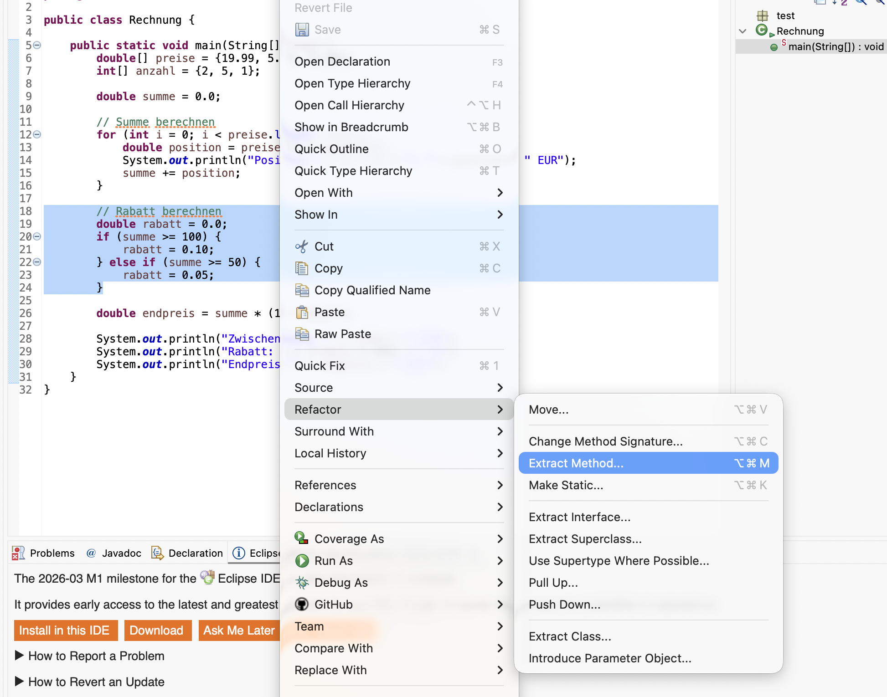

Im anschließenden Dialogfenster geben Sie einen Namen für die neue Methode an und wählen die gewünschten Modifikatoren. Notwendige Parameter und Rückgabewerte werden von Eclipse automatisch erkannt. Nach Bestätigung mit OK wird der Code entsprechend umstrukturiert.

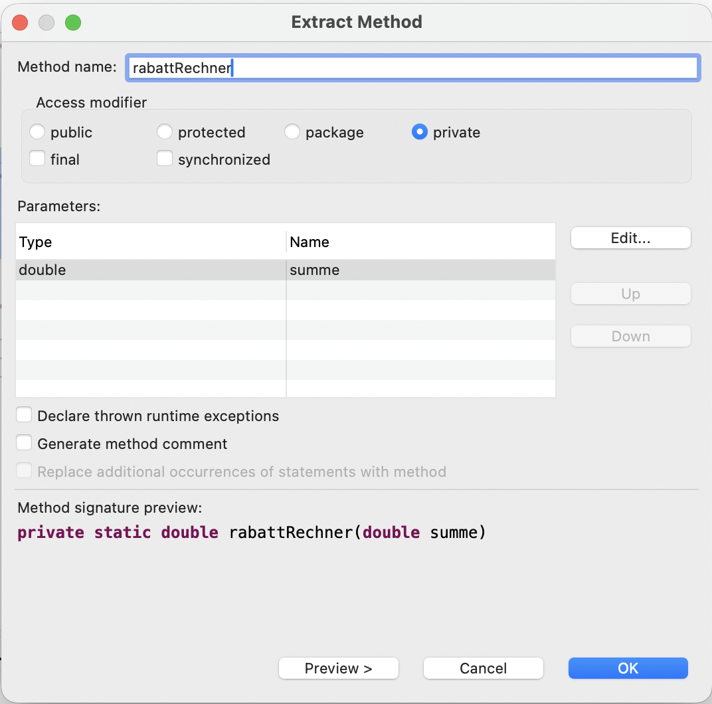

Das Refactoring führt zu klarerem und besser wartbarem Code, wie im folgenden Beispiel zu sehen ist:
```java
public class Rechnung {

    public static void main(String[] args) {
        double[] preise = {19.99, 5.50, 12.00};
        int[] anzahl = {2, 5, 1};

        double summe = 0.0;

        // Summe berechnen
        for (int i = 0; i < preise.length; i++) {
            double position = preise[i] * anzahl[i];
            System.out.println("Position " + (i + 1) + ": " + position + " EUR");
            summe += position;
        }

        double rabatt = rabattRechner(summe);

        double endpreis = summe * (1 - rabatt);

        System.out.println("Zwischensumme: " + summe + " EUR");
        System.out.println("Rabatt: " + (rabatt * 100) + " %");
        System.out.println("Endpreis: " + endpreis + " EUR");
    }

	private static double rabattRechner(double summe) {
		// Rabatt berechnen
        double rabatt = 0.0;
        if (summe >= 100) {
            rabatt = 0.10;
        } else if (summe >= 50) {
            rabatt = 0.05;
        }
		return rabatt;
	}
}
```

### Tipps und Tricks mit Eclipse

Und noch ein paar Tipps für die Arbeit in Eclipse:

- Vervollständigung: Strg + Leertaste
    
- Formatieren: Source → Format oder Strg+Shift+F
    
- Umbenennen: rechte Maustaste → Refactor → Rename

- Source -> Toggle Comment bzw. Ctrl+7

- Source -> Add block Comment
- Source -> Remove block Comment

- Source -> Generate Element Comment
- Eingabe von /\*\* und return -> generiert Kommentar


### Debugging in Eclipse

Debugging ist ein unverzichtbarer Schritt in der Softwareentwicklung, bei dem Fehler oder Bugs in einem Programm gefunden und behoben werden. Es ist von entscheidender Bedeutung, um sicherzustellen, dass die Software reibungslos funktioniert und die gewünschten Ergebnisse liefert. Durch Debugging können Entwickler Probleme erkennen, verstehen und lösen, was letztendlich zu einer verbesserten Qualität und Benutzererfahrung der Software führt.

> **Breakpoints**

- Ein Breakpoint ist wie eine Art Halt-Zeichen, das man in einen Code einfügt, um ihn an einer bestimmten Stelle anzuhalten. Wenn das Programm während der Ausführung auf diesen Breakpoint trifft, hält es an und man kann den Zustand des Codes genauer untersuchen.
- Um Breakpoints zu setzen, klicken Sie mit der rechten Maustaste in die vertikale Leiste neben dem Code und drücken `Toggle Breakpoint`, wie im Bild gezeigt.
- Alternativ können Sie auch doppelt auf die Leiste klicken, um einen Breakpoint zu setzen oder mit der Maus über die Zeile gehen und die Tastenkombination `Strg + Umschalt + B` verwenden.

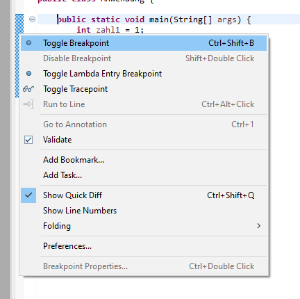

- Der blaue Punkt kennzeichnet einen Breakpoint:

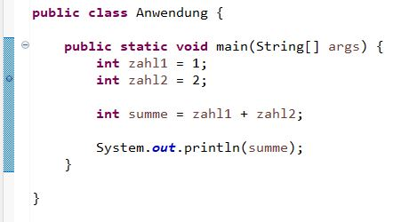

> **Debuggen**

- Starten Sie Ihr Programm im Debug-Modus, indem Sie auf den Käfer (Bug) neben dem Run-Button klicken und darauf die Debug-Perspective öffnen (Switch klicken).

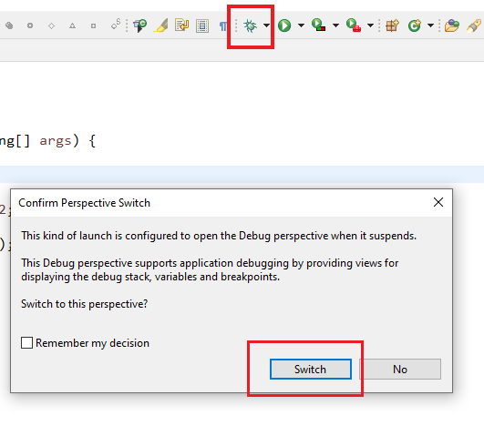

- **Step Over**: Mit dieser Funktion kann man den nächsten Befehl ausführen, ohne in die Details einer Methode oder Funktion einzutauchen. Wenn man Step Over verwendet und die nächste Anweisung eine Methodeaufruf ist, wird die Methode komplett ausgeführt, und die Ausführung springt zur nächsten Zeile im aktuellen Kontext.

- **Step Into**: Im Gegensatz zu Step Over taucht man mit Step Into in die Details einer Methode oder Funktion ein. Wenn die nächste Anweisung eine Methode oder Funktion ist, springt man in diese Methode und kann die Ausführung schrittweise innerhalb dieser Methode fortsetzen.

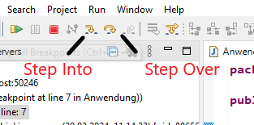

- Auf der rechten Seite des Debuggers können zusätzliche Informationen angezeigt werden, wie zum Beispiel aktuelle Werte von Variablen und Ausdrücken. Diese Informationen helfen dabei, den Zustand der Anwendung während des Debugging-Prozesses besser zu verstehen. Durch die Anzeige von Variablenwerten und anderen relevanten Informationen können Sie schnell erkennen, wie sich der Code verhält und potenzielle Probleme identifizieren.

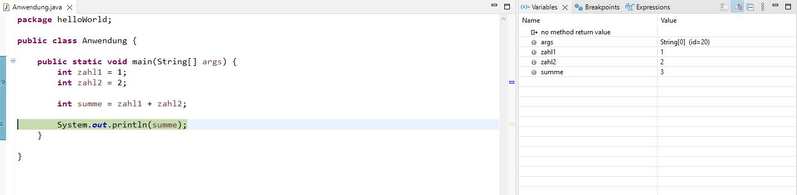


### Übungsdatenbank

Nun starten wir mit Übungen in unserer Übungsdatenbank. 
Erledigen Sie hier mit Eclipse alle Übungen, die Sie noch nicht gemacht haben zu den Kapiteln 1-3. Vergessen Sie nicht die Übungen für die Vorbereitung auf den ersten Programmiertest. 


Bearbeiten Sie in der [Aufgabendatenbank](https://speiser.hft-pages.io/programmieraufgaben/2026-ss-pro-1/) die Aufgaben 1–3 aus Kapitel 1–3. Diese dienen zur Wiederholung und Testvorbereitung.

//Arrays
programmieraufgaben/aufgaben/arrays/array-gerade-ungerade
programmieraufgaben/aufgaben/arrays/bauernmultiplikation
programmieraufgaben/aufgaben/arrays/geschachtelte-arrays-einmaleins | programmieraufgaben/aufgaben/arrays/bubblesort
programmieraufgaben/aufgaben/arrays/insertionsort

//Basic
programmieraufgaben/aufgaben/einfuehrung-mit-basicjava/operationen

//Kontrollstrukturen
programmieraufgaben/aufgaben/schleifen/pi (Auch zum nachdenken statt dem Programmieren?)
programmieraufgaben/aufgaben/schleifen/sudoku
programmieraufgaben/aufgaben/schleifen/zahlenreihe

//Strings
programmieraufgaben/aufgaben/strings/string-split
programmieraufgaben/aufgaben/strings/textAuswertung
programmieraufgaben/aufgaben/strings/vorneHintenGleich
programmieraufgaben/aufgaben/strings/groessteGemeinsameZeichenkette 

//Methoden
programmieraufgaben/aufgaben/variablen-methoden-mit-basicjava/anlagerechner
programmieraufgaben/aufgaben/variablen-methoden-mit-basicjava/mittelwert
programmieraufgaben/aufgaben/variablen-methoden-mit-basicjava/polynome
programmieraufgaben/aufgaben/variablen-methoden-mit-basicjava/kreisrechnung


TODO: Link zur Datenbank einfügen, dann bitte in der Datenbank Aufgaben raussuchen, die zum Übung geeignet sind und alles von Kapitel 1-3 enthalten, auch Testvorbereitungen

