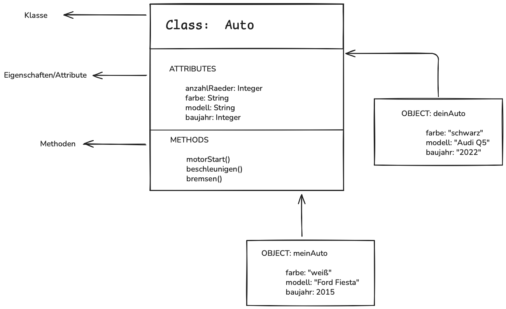
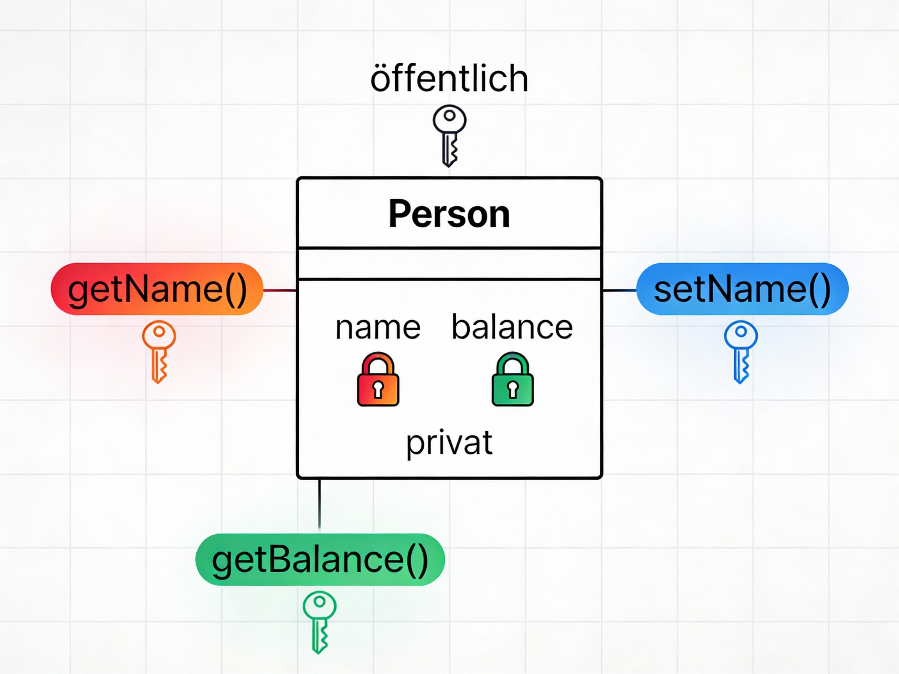
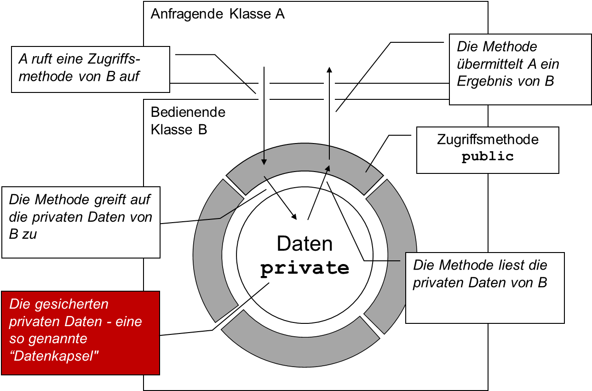

<!--
author: Melanie Baur, Sebastian Speiser, Serkan Kabak, Maja Linke, and further professors and students of HFT Stuttgart, contact: melanie.baur@hft-stuttgart.de, sebastian.speiser@hft-stuttgart.de
language: de
version: 0.1
narrator: Deutsch Female
mode: Textbook

comment: Vorlesung Programmieren 1 und 2 an der HFT Stuttgart des Bachelor Studiengangs Informatik im flexibilisierten Studienmodell

import: https://raw.githubusercontent.com/LiaScript/CodeRunner/master/README.md

link:   ../styles/style.css
        ../styles/liascript.css
-->

# Kapitel 5: Klassen und Objekte

In diesem Kapitel werden das zentrale Thema der Java-Programmierung behandeln, nämlich die Objektorientierung. Dabei wird erklärt, was Klassen und Objekte sind und wie Daten und Verhalten in Klassen zusammengefasst werden. Ziel ist es, eigene Klassen als Baupläne zu erstellen, aus denen wiederverwendbare Objekte erzeugt werden können. 


Bisher bestand unser Javaprogramm aus folgenden Einzelteilen:

- Hauptklasse oder Startklasse: Oberste Struktureinheit in Java
- Hauptmethode oder main-Methode genannt: Hier läuft das eigentliche Programm ab, ohne die main-Methode läuft das Programm nicht.
- Weitere Methoden erstellen: Es können für Teilberechnungen weitere Methoden definiert werden, die dann von der main-Methode aufgerufen werden.

In diesem Kapitel wollen wir:
- Weitere Klassen erstellen, so dass diese als Ansammlung gleichartiger Objekte genutzt werden können.

<br>
Dadurch sollten Sie folgende Konzepte verstanden haben und folgende Fragen beantworten können:

- Was bedeutet **Objektorientierung**?
- Was sind **Klassen** und was sind **Objekte**?
- Wie können Daten **gekapselt** werden?
<br>


### Objekte

Ab jetzt wollen wir objektorientiert programmieren. D.h. wir wollen Objekte formulieren, die wir wiederverwenden können. Eine Klasse dient uns hierbei als Ansammlung gleichartiger Objekte (auch **Instanzen** der Klasse genannt). In der Klasse werden dabei Komponenten festgelegt, aus denen jedes Objekt dieser Klasse bestehen soll.

Jedes Objekt gehört zu einer Klasse. Die Idee dahinter ist, dass die Klasse als Bauplan verstanden werden kann, von dem beliebig viele Objekte abgeleitet werden können. Diese Objekte sind alle gleichartig. Sie besitzen die selben Datendefinitionen und führen die selben Methoden aus. Sie verhalten sich alle gleich, sie unterscheiden sich lediglich in den Werten. Der Vorteil ist: Es muss nur eine Klasse geschrieben werden, die die Daten und Methoden der zukünftigen Objekte definiert. Von dieser Klasse können dann beliebig viele Objekte erzeugt („instanziiert“) werden.

Beispiel:

Sie wollen ein Auto bauen. Jedes Auto hat vier Räder und eine Farbe. Die Farbe unterscheidet sich jedoch von Auto zu Auto und kann weiß, rot oder blau sein. Die Klasse Auto enthält somit den Bauplan für das Auto: Jedes Auto wird mit vier Rädern gebaut und beim Bau legen Sie fest, welche Farbe das Auto haben soll.

Die Anzahl der Räder ist somit eine **statische Variable** für Ihre Klasse Auto, d.h. sie ist für alle Autos gleich. 

Die Farbe ist eine Objekteigenschaft des Autos und kann sich von Auto zu Auto unterscheiden.

Der Bauplan sähe dann wie folgt aus:

```java
public class Auto {
	// Klassenvarialbe, für alle Objekte der Klasse gleich und unveränderlich
	public static final int ANZAHL_RAEDER = 4; 

	// Objektvariable, auch Feld genannt (von englisch "field")
	public String farbe; 

	// Objektmethode (non-static)
	public void fahren(){
		System.out.println("Das Auto fährt.");
	}
}
```

Um nun ein Auto zu bauen, können Sie Objekte der Klasse `Auto` erzeugen. Dies passiert in diesem Beispiel in der Klasse `Autobauer`.

```java
public class Autobauer {
	public static void main(String[] args) {
		Auto meinAuto = new Auto();
		meinAuto.farbe = "weiß";

		Auto deinAuto = new Auto();
		deinAuto.farbe = "schwarz";

		System.out.println(meinAuto.ANZAHL_RAEDER);
		System.out.println(meinAuto.farbe);
		meinAuto.fahren();

		System.out.println(deinAuto.ANZAHL_RAEDER);
		System.out.println(deinAuto.farbe);
	}
}
```


- Mit **new Auto()** werden zwei Auto-Objekte erzeugt: **meinAuto** und **deinAuto**.
- ANZAHL_RAEDER ist eine **Klassenkonstante**: Sie ist für alle Autos gleich, daher hat jedes Auto automatisch vier Räder.
- Die Eigenschaft farbe ist dagegen eine **Objekteigenschaft** (Attribut): meinAuto.farbe ist „weiß“, deinAuto.farbe ist „schwarz“. Der Zugriff funktioniert nur in Verbindung mit einem konkreten Objekt (z.B. meinAuto.farbe oder deinAuto.farbe).
- Außerdem besitzt jedes Auto die Methode **fahren()**: Mit meinAuto.fahren() bzw. deinAuto.fahren() wird die Methode für genau dieses Objekt aufgerufen.

<br>

<br>

> **Visuelle Darstellung**



Die Abbildung zeigt oben das Zusammenspiel zwischen dem abstrakten Konzept einer Klasse und den daraus entstehenden, konkreten Objekten:

- **Die Klasse** (CLASS: Auto): Sie fungiert als Bauplan. Hier wird definiert, welche Eigenschaften (Attributes) ein Auto grundsätzlich hat (z. B. Farbe, Modell, Baujahr) und welche Aktionen (Methods) es ausführen kann (z. B. Motor starten, beschleunigen, bremsen). In der Klasse selbst stehen noch keine echten Daten, sondern nur die Struktur.

- **Die Objekte** (OBJECT: meinAuto, deinAuto): Ein Objekt ist eine konkrete Instanz der Klasse. Während der Bauplan für alle gleich ist, hat jedes Objekt eigene Werte. So ist meinAuto beispielsweise weiß und ein 2015 Ford Fiesta ist, während deinAuto ein schwarzer 2022 Audi Q5 ist. Sie existieren als eigenständige Einheiten im Speicher des Programms.


> **Übung**

Bauen Sie obiges Beispiel in Eclipse nach. Sie benötigen hierfür zwei Klassen. Legen Sie zwei Autos mit unterschiedlichen Farben an. Greifen Sie auf die Felder des Autos zu und geben Sie diese aus. Lassen Sie das Auto fahren.

### Konstruktoren

Objekte werden oft mit bestimmten Werten erzeugt. Hierbei unterstützt der Konstruktor.
Der Konstruktor ist eine Art spezielle Methode, die speziell zur Initialisierung eines Objekts verwendet wird. Dieser weist einige Besonderheiten / Eigenschaften auf:

- Wird immer mit einer Objekterzeugung verwendet (**new**-Operator)
- Kann nicht außerhalb einer Objekterzeugung verwendet werden
- Name ist immer gleich Klassenname
- Hat keinen Rückgabetyp
- Wird nicht vererbt (siehe Kapitel Vererbung)
- Java stellt immer einen Standardkonstruktor (ohne Parameter) bereit
- Wird ein eigener Konstruktor definiert, steht der Standardkonstruktor nicht mehr zur Verfügung

Konstruktoren können direkt mit Parametern initalisiert werden. Am Beispiel des Autos:

```java
public class Auto {
	public static int anzahlRaeder = 4;
	public String farbe;

    //Konstruktor
	public Auto(String farbe) {
		this.farbe = farbe; //Zugriff mit this auf das Objekt selbst
	}

    public void fahren(){
        System.out.println("Das Auto fährt.");
    }
}
```

Nutzung in der Klasse Autobauer:

```java
public class Autobauer {
	public static void main(String[] args) {
		// Direkt bei der Erzeugung meines Auto-Objekts bekommt dieses die Farbe weiß
		Auto meinAuto = new Auto("weiß");

	}
}
```

**Achtung:** 

Sobald in der Klasse Auto ein eigener Konstruktor definiert wird, wird der Standardkonstruktor, den wir zuvor genutzt haben (ohne Parameter) nicht mehr automatisch erzeugt.

Vorteile:

- Im Konstruktor können wir die Objektvariablen initialisieren.
- Wir können den Standardkonstruktor mit Standardwerten vorbelegen.
- Konstruktoren mit Parametern sind sinnvoll, wenn die Objektvariablen nicht mit Standardwerten, sondern aus den Parametern initialisiert werden sollen.

Erweitertes Beispiel:

```java
public class Auto {

	public static int anzahlRaeder = 4;
	public String farbe;

    //Wird bei der Objekterzeugung keine Farbe angegeben, so ist das Auto automatisch schwarz
	public Auto() {
		this.farbe = "schwarz";
	}

    // Ein zweiter Konstruktor, der mir erlaubt, die Farbe bei der Objekterzeugung zu definieren
	public Auto(String farbe) {
		this.farbe = farbe;
	}

	public void fahren() {
		System.out.println("Das Auto fährt." + this.farbe);
	}

}
```

> **Übung**

- Erstellen Sie eine Klasse Laptop mit den Feldern modell, benutzer und id (welche Variablentypen brauchen Sie?)
- Es gibt auch einen Konstruktor Laptop(String modell, String benutzer).
- Die Klasse hat eine statische Variable gesamtAnzahl, die bei jedem Anlegen eines neuen Laptops hochgezählt wird
- Das Feld id jeder Laptop-Instanz bekommt beim Anlegen des neuen Laptops den aktuellen Wert von gesamtAnzahl
- Erstellen Sie eine separate Klasse mit einer Main-Methode
- Legen Sie mehrere Laptops an und geben Sie die Laptop-IDs und Gesamtanzahl der Laptops aus

### Kapselung

Wir wollen nun sicherstellen, dass die Datenfelder nicht von außerhalb direkt zugänglich sind um unbefugten Zugriff zu verhindern. Datenfelder können somit `private` gemacht werden, damit niemand von außerhalb zugreifen kann.
Wenn der Zustand des Objekts nun geändert oder zurückgegeben werden soll, geschieht das mit `Getter`- bzw. `Setter`-Methoden. Hierbei können auch Validierungsregeln eingebaut werden (if-Statement).

> **Getter und Setter**

Getter und Setter sind öffentliche (=public) Methoden, mit denen man den Wert der Datenfelder zurückgeben (get) oder ändern (set) kann. Als Methodennamen wählt man `getWert()` bzw. `setWert()`.

Getter liefern den Wert einer privaten Variablen. Sie sind folgendermaßen aufgebaut:

```java
public Typ getWert(){
    return wert;
}
```

Setter setzen den Wert einer privaten Variablen. Sie sind folgendermaßen aufgebaut:

```java
public void setWert(Typ wert){
    this.wert = wert;
}
```

Der Parameter `wert` überdeckt die Instanzvariable in der Methode. Die Qualifikation mit `this` (dem Objekt selbst) erlaubt den Zugriff auf die überdeckte Variable. Das bedeutet also: Bei überdeckten Instanzvariablen bezeichnet das Schlüsselwort `this` das Objekt selbst und damit den Zugriff auf die Instanzvariablen des Objekts.

Mit passenden Modifikatoren wird die Umgehung der öffentlichen Methoden verhindert:

- public: von überall aufrufbar
- protected: innerhalb des Pakets oder Unterklassen in einem anderen Paket (siehe Kapitel Vererbung)
- ohne („package private“): innerhalb des Pakets
- private: innerhalb der Klasse

Man kann immer nur höchstens einen Sichtbarkeitsmodifikator verwenden. Weiterhin sollte man genau überlegen, welche Methoden von wo aufgerufen werden können sollte und somit welche Methoden private gemacht werden muss und welche öffentlich bleiben kann. Die Grundregel ist so viel wie möglich Daten zu verstecken – Nutzer unserer Klasse/unserer Objekte sehen nur das öffentliche Interface. Alles, was wir versteckt haben, können wir ändern, ohne etwas kaputt zu machen.

Wenn wir bei Objekten immer nur Getter/Setter haben, dann lagern wir die Logik aus. Besser sind domänenspezifische Methoden, wie zum Beispiel:

- Methode `double berechneLaenge()` für Objekte einer Klasse `Linie` statt per `getStart()` und `getEnd()` den Start und Endpunkt und von diesen dann mit `getX()` und `getY()` die Koordinaten zu bekommen und dann immer wieder von neuen die Länge zu berechnen
- Methode `double bruttoPreis()` für eine Rechnung anstatt `getNettoPreis()` und `getSteuersatz()` abzufragen und dann die Berechnung selbst durchzuführen

> **Regeln zum Information Hiding**

Zusammengehörige Daten / Methoden sollten in einer Klasse zusammengefasst werden.
Nicht zusammengehörige Daten / Funktionen sollten in verschiedene Klassen aufgeteilt werden.
Insbesondere die `main`-Methode gehört in eine separate Klasse!
Zusammengehörige Klassen werden dann in ein Paket zusammen gefasst.
Die Daten in einer Klasse sind immer `private` deklariert. Auf diese werden kann kontrolliert über über `public` / `protected` Methoden zugegriffen werden. Unterstützende Methoden sind wiederum `private`.




<!---



--->

Die Abbildung veranschaulicht das **Prinzip der Kapselung** in der objektorientierten Programmierung.
Die Klasse Person besitzt **private Attribute** (name, balance), auf die nicht direkt von außen zugegriffen werden kann.
Der Zugriff erfolgt kontrolliert über **öffentliche Methoden** wie getName(), setName() und getBalance(), die als Schnittstelle nach außen dienen.


> **Beispiel**

Mit diesen Erkenntnissen erweitern wir unser Auto:

```java
public class Auto {
	private String farbe; //die Farbe unseres Autos ist nun privat

    // Getter: gibt die Farbe des Autos zurück
    public String getFarbe() {
		return farbe;
	}

    // Setter: Methode, um die Farbe des Autos zu setzen
	public void setFarbe(String farbe) {
		this.farbe = farbe;
	}
}
```

```java
public class Autobauer {
	public static void main(String[] args) {
		Auto meinAuto = new Auto();
		meinAuto.setFarbe("weiß");
		System.out.println("Mein Auto hat die Farbe: " + meinAuto.getFarbe());
	}
}
```

Versuchen Sie dieses Beispiel nachzuvollziehen!

- Welcher Konstruktor wird benutzt?
- Funktioniert der Zugriff mit `meinAuto.farbe`? Warum, bzw. warum nicht?
- Welche Rückgabewerte und welche Parameter haben die Methoden `setFarbe()` und `getFarbe()`?


<br>


In der Praxis werden Getter und Setter nicht nur als einfache Zugriffsmethoden verwendet.
Ihr Zweck ist es nicht, alle Attribute automatisch von außen les- und schreibbar zu machen, sondern den Zugriff gezielt zu kontrollieren.

Typische Anwendungsfälle sind:
- 	**Validierung von Werten** beim Setzen eines Attributs
- 	**Einschränkung des Schreibzugriffs** (nur lesen, kein Schreiben)
- 	**Schutz vor ungültigen Objektzuständen**

Ein Setter enthält daher häufig zusätzliche Logik, zum Beispiel eine Prüfung der übergebenen Werte:

```java
public void setFarbe(String farbe) {
    if (farbe == null || farbe.isBlank()) {
        throw new IllegalArgumentException("Die Farbe darf nicht leer sein");
    }
    this.farbe = farbe;
}
```

Ebenso gibt es Attribute, die nur gelesen, aber nicht verändert werden sollen:

```java
private int id;

public int getId() {
return id;
}
// kein Setter!
```
> **Übung**

Fortführung der Übung Laptop:

- Fügen Sie nun Ihrer Laptopklasse Getter und Setter hinzu
- Ihre bereits angelegten Variablen werden nun private
- Greifen Sie nun aus der main-Methode auf die Variablen zu und geben Sie Modell, Benutzer, Laptop-ID aller Laptops aus und die Gesamtanzahl

> **Tipp für Eclipse**

Sie können sich in Eclipse Getter, Setter und Konstruktoren automatisch erstellen lassen: 

- rechte Maustaste ->Source -> Generate Getter and Setters
-  rechte Maustaste ->Source ->  Generate Constructor using Fields

Wählen Sie dann in dem Dialogfeld jeweils aus, welche Getter, Setter, Konstruktoren Sie erstellen lassen wollen, mit welchen Attributen und Modifikatoren.


### Speicherverwaltung

Wir haben schon den Heap als Speicherbereich für Objekte kennengelernt. Im Gegensatz zum Stack, der variablen Speicherplatz für Methoden und primitive Datentypen bereitstellt, kann der Heap dynamisch wachsen und schrumpfen, um Platz für die Erstellung und Freigabe von Objekten zu bieten.

Wenn ein neues Objekt mit dem new-Operator erstellt wird, wird Speicher im Heap allokiert, um das Objekt zu speichern. Der Zugriff auf den Heap erfolgt über eine Referenzvariable auf diese Objekte. Diese Referenzvariablen werden auf dem Stack gespeichert, während die tatsächlichen Objekte im Heap existieren.

`Haustier haustier = new Haustier();`

`haustier` ist eine Referenzvariable vom Typ `Haustier`. Der Operator `new` legt ein neues Objekt vom Typ `Haustier` auf dem Heap an. Der Zuweisungsoperator = verknüpft die Referenzvariable `haustier` mit dem soeben erstellen Objekt auf dem Heap. Diese Verknüpfung stellt eine Referenz (= Verweis) auf das Objekt dar. Es können auch mehrere Variablen auf das gleiche Objekt zeigen.

Java verwendet einen Garbage Collector, der automatisch nicht mehr verwendete Objekte erkennt und Speicher freigibt. Dies hat den Vorteil, dass Sie als Entwickler sich nicht um die Speicherfreigabe kümmern müssen. Wenn der Heap überläuft, stürzt das Programm mit einem `OutOfMemory` Fehler ab.

Schauen wir uns den Stack nun noch genauer an. Der Stack ist ein Speicherbereich, der für die Ausführung von Methoden und die Speicherung von lokalen Variablen verwendet wird. Jede Methode in Java wird auf einem eigenen Stackframe ausgeführt, der alle für die Ausführung der Methode erforderlichen Informationen enthält, einschließlich der Parameter und lokalen Variablen.

Wenn eine Methode aufgerufen wird, wird ein neuer Stackframe für diese Methode erstellt und auf den Stapel gelegt. Alle Variablen, die innerhalb dieser Methode deklariert werden, sowie die Methodenparameter, werden im Speicher dieses Stackframes gespeichert. Wenn die Methode abgeschlossen ist, wird ihr Stackframe entfernt und der Speicherplatz für lokale Variablen freigegeben.

Da auch der Stack eine begrenzte Größe hat, kann es zu einem `Stack Overflow` kommen, wenn zu viele Methodenaufrufe ineinander verschachtelt sind und der verfügbare Speicherplatz auf dem Stack nicht mehr ausreicht.

Die oberste Methode auf dem Stack ist immer die aktuelle Methode, die unterste Methode, die main()-Methode, da diese als erstes aufgerufen wurde. Der Stack ist somit ein LIFO-Speicher, das bedeutet last in first out.

> **Zusammengefassung**

Speicherressourcen werden über den Heap und den Stack verwaltet. Der Heap wird für die Speicherung von Objekten verwendet, während der Stack für die Ausführung von Methoden und die Speicherung von lokalen Variablen dient.

Hinweis: Bei Programmabsturz sehen Sie den Stacktrace.

> **Übung: Methoden auf dem Stack**

Gehen Sie zu Ihrem Programm zurück, in welchem Sie die Rekursion geübt haben (z.B. Fakultät). Wechseln Sie in den Debug-Modus und setzen Sie beim Aufruf der Fakultät einen Breakpoint. Beobachten Sie dann den Stack, wie dieser beim rekursiven Aufruf der Methode immer weiter anwächst.

### Übungen

Machen Sie die Aufgaben aus der [Aufgaben-Datenbank](https://speiser.hft-pages.io/programmieraufgaben/2024-ss-pro-1/) aus Kapitel 05.

Hinweise zu den Übungsaufgaben:

- Bibliothek: Fügen Sie das Überschreiben der Methoden `toString()` und `equals(Object o)` erst hinzu, wenn Sie das Kapitel Vererbung durchgearbeitet haben.

### Ablage

<!-- data-type="None" -->

|           | Klassen                       | Objekte                                 |
| :-------- | :---------------------------- | :-------------------------------------- |
| Erzeugung | automatisch bei Programmstart | explizit mit `new` während der Laufzeit |
| Anzahl    | genaue eine                   | beliebig viele                          |

<!-- data-type="None" -->

|            | Klassenvariable             | Instanzvariablen     |
| :--------- | :-------------------------- | :------------------- |
| Erzeugung  | mit der Klasse              | mit dem Objekt       |
| Anzahl     | pro Klasse                  | pro Objekt           |
| Modifier   | static                      | keiner               |
| Verwendung | von der Klasse und Objekten | nur von den Objekten |

<!-- data-type="None" -->

|            | Klassenmethode              | Instanzmethoden      |
| :--------- | :-------------------------- | :------------------- |
| Erzeugung  | mit der Klasse              | mit der Klasse       |
| Anzahl     | pro Klasse                  | pro Klasse           |
| Modifier   | static                      | keiner               |
| Verwendung | von der Klasse und Objekten | nur von den Objekten |

Hinweis: die main-Methode ist eine besondere Klassenmethode