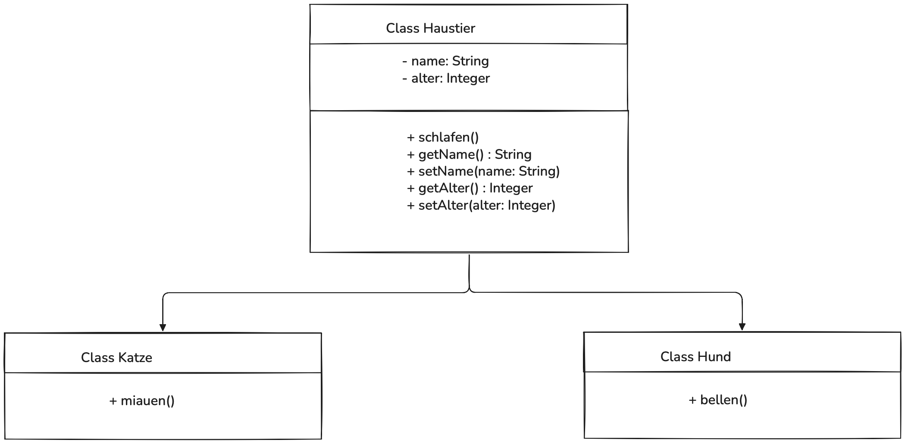
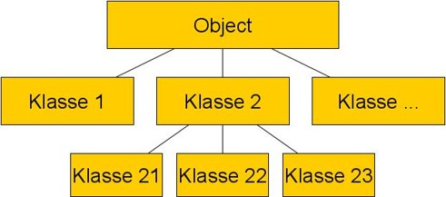
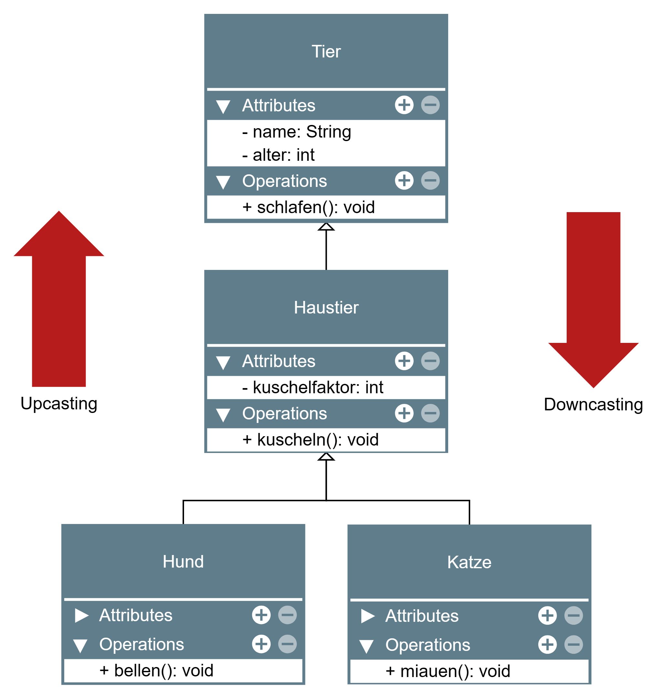
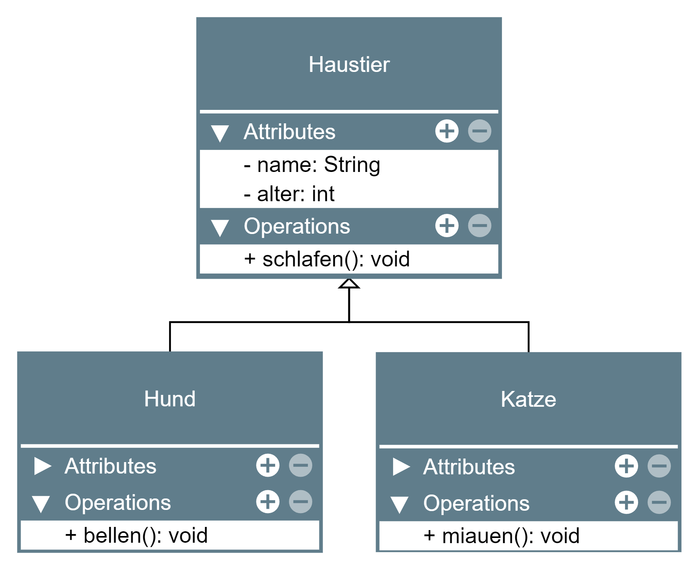

<!--
author: Melanie Baur, Sebastian Speiser, Serkan Kabak, Maja Linke, and further professors and students of HFT Stuttgart, contact: melanie.baur@hft-stuttgart.de, sebastian.speiser@hft-stuttgart.de
language: de
version: 0.1
narrator: Deutsch Female
mode: Textbook

comment: Vorlesung Programmieren 1 und 2 an der HFT Stuttgart des Bachelor Studiengangs Informatik im flexibilisierten Studienmodell

import: https://raw.githubusercontent.com/LiaScript/CodeRunner/master/README.md

<!--
author: Melanie Baur, Sebastian Speiser, Serkan Kabak, Maja Linke, and further professors and students of HFT Stuttgart, contact: melanie.baur@hft-stuttgart.de, sebastian.speiser@hft-stuttgart.de
language: de
version: 0.1
narrator: Deutsch Female
mode: Textbook

comment: Vorlesung Programmieren 1 und 2 an der HFT Stuttgart des Bachelor Studiengangs Informatik im flexibilisierten Studienmodell

import: https://raw.githubusercontent.com/LiaScript/CodeRunner/master/README.md

link:   ../styles/style.css
        ../styles/liascript.css
-->

# Kapitel 8: Vererbung

Schauen Sie sich folgende beiden Codebeispiele an und überlegen Sie sich, was Ihnen hierbei auffällt.

```java
public class Hund {

	private String name;
	private int alter;

	public void schlafen() {
		System.out.println("Ich schlafe...");
	}

	public void bellen() {
		System.out.println("wau, wau");
	}

	public String getName() {
		return name;
	}

	public void setName(String name) {
		this.name = name;
	}

	public int getAlter() {
		return alter;
	}

	public void setAlter(int alter) {
		this.alter = alter;
	}
}
```

```java
public class Katze {

	private String name;
	private int alter;

	public void schlafen() {
		System.out.println("Ich schlafe...");
	}

	public void miauen() {
		System.out.println("miau, miau");
	}

	public String getName() {
		return name;
	}

	public void setName(String name) {
		this.name = name;
	}

	public int getAlter() {
		return alter;
	}

	public void setAlter(int alter) {
		this.alter = alter;
	}
}
```

Der Großteil des Codes ist komplett gleich. Nur eine Methode unterscheidet sich vom Hund zur Katze.

Sie haben bisher gelernt, dass Klassen Objekte beschreiben, die sich gleich verhalten und gleiche Eigenschaften besitzen. Manchmal gibt es jedoch Objekte, die nicht gleich aber doch sehr ähnlich wie andere Objekt sind, wie z.B. ein Hund und eine Katze viele gemeinsame Eigenschaften und Verhaltensweisen haben (sie haben einen Namen, ein Alter, können schlafen etc.), aber doch unterschiedlich sind in anderen Dingen (sie machen andere Laute).
Weiterhin hat jede Klasse die gleichen Objektvariablen und dazugehörige Setter und Getter, plus evtl. Konstruktoren etc. Wenn wir Katze und Hund als eigenständige Klassen implementieren, haben wir viel doppelten Code. Dies ist arbeitsintensiv und fehleranfällig.

Die Lösung heißt **Vererbung**, eine Besonderheit, die es nur in der objektorientierten Programmierung gibt. Damit beschäftigen wir uns in diesem Kapitel.

Vererbung erlaubt,

- gemeinsame Teile einmal in einer Klasse zusammenzufassen
- spezielle Teile in eigenen Klassen zu beschreiben
- die gemeinsamen Teile in den speziellen Klassen zu erben

Eine Klasse kann also Eigenschaften und Methoden von einer anderen Klasse erben, indem sie von dieser Klasse ableitet. Die Erbschaftsbeziehung wird definiert über Schlüsselwort `extends` (z.B. class B extends A).

Für unser Beispiel bedeutet dies: Alle gemeinsamen Eigenschaften werden in eine **Oberklassen** (auch Superklasse, Basisklasse oder Elternklasse genannt) gepackt, hier z.B. eine Klasse Haustier.

```java
public class Haustier {

	private String name;
	private int alter;

	public void schlafen() {
		System.out.println("Ich schlafe...");
	}

	public String getName() {
		return name;
	}

	public void setName(String name) {
		this.name = name;
	}

	public int getAlter() {
		return alter;
	}

	public void setAlter(int alter) {
		this.alter = alter;
	}
}
```

Spezielles Verhalten steht in den Unterklassen (auch Subklassen oder Kindklassen genannt). Über das Schlüsselwort `extends` wird angezeigt, dass der Klasse Hund Katze die Eigenschaften und Methoden der Klasse Haustiere zur Verfügung stehen.

```java
public class Hund extends Haustier {
	public void bellen() {
		System.out.println("wau, wau");
	}
}
```

```java
public class Katze extends Haustier {
	public void miauen() {
		System.out.println("miau, miau");
	}
}
```



In der Abbildung ist zu sehen, wie die Vererbung zwischen der Basisklasse Haustier und den Unterklassen Hund und Katze funktioniert. Die gemeinsamen Eigenschaften und Methoden werden in der Oberklasse gebündelt, während die Unterklassen dieses Grundverhalten übernehmen und um ihr jeweils typisches Verhalten ergänzen.

<br>

Fehlt die Angabe einer Oberklasse wie bisher, so ist die Oberklasse die Klasse `Object`, quasi die Mutter aller Klassen.

> **Einfachvererbung**

Java ist eine Sprache mit Einfachvererbung, das bedeutet, dass Klassen immer nur eine Oberklasse haben:

- Alle Klassen sind direkt oder indirekt Unterklassen der Klasse `Object`
- Wenn keine explizite Oberklasse angegeben wird, wird implizit `Object` angenommen
- `Object` selbst hat (als einzige Klasse) keine Oberklasse

Eine Unterklasse darf man erneut erweitern, so entstehen Hierarchien von Klassen, welche einen Baum bilden, dessen Wurzel die Klasse `Object` ist.



> **Mutterklasse `Object`**

- `Object` ist in Java die Elternklasse jeder weiteren Klasse und somit die allgemeinste Klasse
- Alle anderen Klassen teilen die Eigenschaften der Klasse `Object`
- Beispiel: Die Methode `public boolean equals(Object obj)` vergleicht die Speicheradressen (nicht die semantische Gleichheit!). Die Klassen Integer, String liefern für semantischen Vergleich jeweils eigenen Code, analog müssen eigene Klassen eigenen Code liefern, wenn der Vergleich der Speicheradressen nicht das gewünschte Ergebnis ergibt

Recherchieren Sie in der Java-Dokumentation, welche Methoden die Klasse `Object` liefert.

Ein häufiges Beispiel ist das Überschreiben der toString()-Methode. Diese sieht standardmäßig folgendermaßen aus:

```java
    public String toString() {
        return getClass().getName() + "@" + Integer.toHexString(hashCode());
    }
```

Sie liefert also eine String Repräsentation des Objekts (genauer den qualifizierten Klassennamen (also den Paketnamen plus den Klassennamen) gefolgt von einem `@` und dem Hashcode). Dies ist jedoch meist nicht, was wir ausgeben wollen. Somit müssen wir die toString()-Methode mit etwas Sinnvollem überschreiben. Was eine sinnvolle Ausgabe ist, hängt von der entsprechenden Klasse ab.

```java
@Override
public String toString(){
    return "Meine Variable: " + meineVariable;
}
```

<br>
Nach Abschluss dieser Einheit sollten Sie im Stande sein folgende Fragen zu beantworten:

- Was bedeutet **Vererbung** und wie funktioniert es?
- Wie können **Methoden überladen** bzw. **überschrieben** werden?
- Wie benutzt man Konstruktoren in der Vererbung?
- Wie funktioniert die Umwandlung von einem Referenztyp in einen anderen?

<br>
> **Übung**

Sie können in der Aufgabe Typen aus der [Aufgaben-Datenbank](https://speiser.hft-pages.io/programmieraufgaben/2024-ss-pro-1/) aus Kapitel 06 sich das Codegerüst herunterladen und einen Überblick verschaffen. Legen Sie einen Elefant und eine Ente an und leiten Sie vom richtigen Tier ab. Überschreiben Sie noch keine Methoden. Legen Sie in der Anwendungsklasse einen Elefant und eine Ente an.

### Vererbung von Methoden und Variablen

Schauen wir uns nun an, was mit Instanzmethoden und Variablen bei der Vererbung passiert.

> **Was passiert mit den Instanzmethoden bei der Vererbung?**

Für `public` und `protected` Methoden gilt:

- Werden geerbt: Verwendbar, als wären sie direkt in der Unterklassen definiert
- Können überschrieben werden: eine Unterklasse kann geerbte Methoden durch Methoden mit gleicher Signatur redefinieren mit der Annotation `@Override` – - auf die ursprüngliche Methode kann mit dem `super`-Qualifier zugegriffen werden

Für `private` Methoden gilt:

- Sind in Unterklassen nicht sichtbar
- Können nicht überschrieben werden
- Gleiche Methode in Unterklasse sind möglich (gleicher Rückgabetyp, gleicher Name, gleiche Parameter)

Wenn Überschreiben verboten werden soll: Schlüsselwort `final` benutzen!

`final` für Methoden:

- Einzelne Methoden können gezielt mit final als nicht überschreibbar markiert werden
- Beispiel: public final void methode()

`final` für Klassen:

- Überschreiben der ganze Klasse verboten
- final markierte Klassen lassen sich nicht ableiten

> **Was passiert mit den Variablen bei der Vererbung?**

- Vererbt werden Variablen, die `public` oder `protected` sind (oder package-private falls Unterklasse und Oberklasse im gleichen Package liegen). Die Verwendung funktioniert dann genau wie bei Variablen, die direkt in der Unterklasse definiert sind.
- Auf `private` Variablen kann nicht zugegriffen werden – es sei denn, es gibt geerbte `public` und `protected` Methoden (z.B. Getter und Setter)
- Eine Unterklassen kann durch neue Variablen erweitert werden, die es in der Oberklasse nicht gibt

Zurück zu unserem Beispiel:

```java
public class AnwendungHaustiere {
	public static void main(String[] args) {
		Katze katze = new Katze();
		katze.setName("Maunzi");
		katze.miauen();
		katze.setAlter(7);
		System.out.println(katze.getName() + " ist " + katze.getAlter() + " Jahre alt.");
		katze.schlafen();
	}
}
```

Welche Ausgabe wird erzeugt?

Was kann folgender Hund? Wir ändern die Klasse Hund folgendermaßen ab:

```java
public class Hund extends Haustier {
	public void bellen() {
		System.out.println("wau, wau");
    }

    @Override
	public void schlafen() {
		super.schlafen();
		System.out.println("Ich bin ein Langschläfer.");
	}
}
```

Anhand der @Override Annotation erkennt der Compiler, dass die Methode schlafen überschrieben werden soll. Danach erfolgt der Methodenaufruf der Oberklasse mit `super.methode()`, in dem Fall mit super.schlafen().

Hinweis: Methodenaufrufe über `super` können an einer beliebigen Stelle in den Methoden der Kindklasse auftauchen. Aufruf des Elternkonstruktors `super()` muss immer als erstes im Kindkonstruktor stehen, siehe nächstes Teilkapitel.

Welche Ausgabe wird erzeugt, wenn Sie ein Objekt des Typs Hund erstellen und auf diesem die Methoden schalfen aufrufen? Überprüfen Sie Ihre Vermutung mit Hilfe von Eclipse.

> **Übung**

Sie können in der Aufgabe Typen aus der [Aufgaben-Datenbank](https://speiser.hft-pages.io/programmieraufgaben/2024-ss-pro-1/) aus Kapitel 06 die Methoden geraeuschErzeugen() überschreiben.

### Vererbung Konstruktoren

Java stellt immer einen Standardkonstruktor (ohne Parameter) bereit. Wird ein eigener Konstruktor definiert, steht der Standardkonstruktor nicht mehr zur Verfügung.
Folgende Hinweise zu, was nicht vererbt wird:

- Hat die Oberklasse hat einen eigenen Konstruktor definiert, muss die Unterklasse ebenfalls einen eigenen definieren
- Der Konstruktor der Oberklasse kann (im Konstruktor der Unterklasse) durch super(Parameterliste) aufgerufen werden
- Aufruf des gewünschten Konstruktors der Elternklasse muss immer am Anfang des Codings im Konstruktor stehen

> **Konstruktorkette reparieren**
> Nehmen wir an, in der Klasse Haustier, sei folgender Konstruktor definiert:

```java
public Haustier(String name, int alter){
    this.name = name;
    this.alter = alter;
}
```

In den Unterklassen Katze und Hund steht nicht mehr der Standardkonstruktor zur Verfügung. Es gibt nun verschiedene Möglichkeiten, die Konstrukorkette zu reparieren.

1. Konstruktor der Oberklasse explizit aufrufen in Standardkonstruktor der Unterklasse.

```java
public Katze(){
    super(null,0);
}
```

Damit hätten wir unserer Katze standardmäßig immer den Namen null und das Alter 0 gegeben.

2. Der Oberklasse explizit wieder Standardkonstruktor hinzufügen. Der Compiler ist zufrieden, aber
   Konstruktoren werden nicht vererbt!

```java
public Haustier(){
}
```

3. Der Unterklasse einen neuen Konstruktor hinzufügen, der die gleichen (oder mehr) Parameter hat als der Konstruktor der Oberklasse:

```java
public Katze(){
    super(name,alter);
    this.kuschelfaktor = kuschelfaktor; //wenn wir annehmen, die Katze hätte noch weitere Instanzvariablen
    }
```

Tipp: In Eclipse hilft Ihnen die rechte Maustaste, um Konstruktoren, die kaputt gegangen sind, hinzuzufügen.

Merke:
Der erste Aufruf innerhalb eines Konstruktors ist immer der Aufruf eines anderen Konstruktors. Einzige Ausnahme: Der Konstruktor der Mutter aller Klassen Object

> **Quiz**

Welche Konstruktoren sind erlaubt und welche nicht?

```java
Person(Person person) {}
```

[(x)] erlaubt
[( )] falsch

```java
Person Person() {}
```

[( )] erlaubt
[(x)] falsch

```java
private final Person() {}
```

[( )] erlaubt
[(x)] falsch

```java
void Person() {}
```

[( )] erlaubt
[(x)] falsch

```java
Person() {
    super();
}
```

[(x)] erlaubt
[( )] falsch

> **Übung**
> Zurück zu unserer Aufgabe Typen aus der [Aufgaben-Datenbank](https://speiser.hft-pages.io/programmieraufgaben/2024-ss-pro-1/) aus Kapitel 06.

- Existieren in den Klassen Konstruktoren?
- Welcher Konstruktor wird durch `Ente ente = new Ente()` aufgerufen?
- Probieren Sie aus: Fügen Sie Vögeln eine Variable Namen hinzu. Erstellen Sie dann einen Konstruktor, der dem Sie den Namen als Startwert mitgeben.
- Was passiert mit der Klasse Ente? Wie können Sie das Problem lösen?

### Typumwandlung

Wir haben Typumwandlungen schon beim Casting von primitiven Datentypen kennengelernt. Unter `Casting` versteht man das Umwandeln von einem Typ in einen anderen Typ.

Zur Erinnerung: Hier wurden verschiedene primitive Datentypen durch Typ­ Umwandlung ineinander konvertiert. Wir haben zwischen zwischen Widening (Erweitern) und Narrowing (Eingrenzen) unterschieden.
Im Fall von primitiven Datentypen bedeutet Widening, dass eine Variable von einem Typ mit einem kleinen Wertebereich in eine Variable von einem Typ mit einem größeren Wertebereich umgewandelt wird
Narrowing bedeutet genau das Gegenteil, der Wertebereich wird also kleiner. Widening ist in der Regel kein Problem, Narrowing kann aber gefährlich sein, da einzelne Werte hierbei verloren gehen können!

Ein ähnliches Vorgehen ist nun auch bei der Typumwandlung von Objekten möglich, denn nicht nur primitive Datentypen können durch Casting umgewandelt werden, sondern auch Objekte.

- Wenn ein Typ in einen anderen Typ umgewandelt werden kann, heißt dies `kompatibel`.
- `Downcasting`: Umwandlung eines in der Hierarchie höher liegenden Typs in einen tieferen
- `Upcasting`: Umwandlung eines in der Hierarchie tiefer liegenden Typs in einen höher liegenden

Beim Casting (insbesondere beim Downcasting) muss überprüft werden, ob die Umwandlung funktionieren kann. Dies geschicht mit den instanceof-Operator. Dieser gibt true oder false zurück.

Merke: Ein Objekt vom Typ der Unterklasse ist auch vom Typ der Oberklasse.

Verwendung:

```
Referenzvariable instanceof Klassenname
```

Folgende Grafik verdeutlich dies:

<p align="center">

</p>

Beispiel:

```java
Tier katze = new Katze();
```

`katze` ist eine Referenzvariable vom Typ `Tier`, die auf eine konkrete Instanz `Katze` zeigt.
`katze` kann schlafen, aber nicht miauen, da sie ein Tier ist.

```java
Katze gleicheKatze = (Katze) katze;
```

`gleicheKatze` kann miauen, da die Referenzvariable vom Typ Katze ist.

Gebrauch des `instanceof`-Operators in diesem Szenario:

```java
if (katze instanceof Katze){
    Tier gleicheKatze = (Katze) katze;
}
```

Merke: Die konkrete Objektinstanz ändert sich hierdurch nicht, d.h. es wird kein neues Objekt auf dem Heap gelegt.

> **Übung**

Erzeugen Sie den Code zu obigem UML-Diagramm. Probieren Sie folgende Szenarien aus:

- Erzeugen Sie ein Tier vom Typ Hund (Tier tier = new Hund(...)). Was kann dieses Tier?
- Wandeln Sie mit Casting das tier in einen Hund um. Was kann das Tier jetzt?
- Implementieren Sie Schlafmethoden, sowohl im Tier als auch im Hund. Überprüfen Sie, welche Methode wird jeweils aufgerufen?

Was passiert bei folgenden Aufrufen?

- Katze katze = new Tier();
- Katze katze = (Katze) new Tier();

Überlegen Sie sich, warum diese Aufrufe nicht möglich sind.

Hinweis:
Nicht jedes Tier ist eine Katze und nicht jedes Tier kann einfach in eine Katze umgewandelt werden.

> **Polymorphismus**

Eine Variable vom Typ einer Oberklasse kann ein beliebiges Objekt seiner Unterklasse aufnehmen. Alle Methoden, die in der Oberklasse definiert sind, können aufgerufen werden: Da das Unterklassenobjekt alle Methoden der Oberklasse erbt, erweitert oder implementiert, kann man sich darauf verlassen, dass alle Methoden der Oberklasse verfügbar sind. Ausgeführt wird (natürlich) der Code des aktuellen Objekts. Methoden, die nur in der Unterklasse vorliegen, können nicht aufgerufen werden (sie sind da, sind aber nicht sichtbar).

Das bedeutet nun: Objekte können spezialisiertes Verhalten hinzufügen. Man muss dabei nicht über Verhalten-Details Bescheid wissen, sondern nur wissen, dass ein Verhalten angeboten wird.

<br>

 Zur besseren Veranschaulichung:
```java 
Haustier h1 = new Hund();
Haustier h2 = new Katze();

h1.schlafen();
h2.schlafen();
```
Obwohl beide Objekte über den gleichen Referenztyp Haustier angesprochen werden, verhalten sie sich unterschiedlich.
Beim Aufruf von schlafen() wird zur Laufzeit geprüft, welches konkrete Objekt hinter der Referenz steckt:

-	h1 verweist auf ein Objekt vom Typ Hund → die Methode schlafen() aus Hund wird ausgeführt
-	h2 verweist auf ein Objekt vom Typ Katze → die Methode schlafen() aus Katze wird ausgeführt

Die Methode wird also über die Oberklasse aufgerufen, aber durch die jeweilige Unterklasse ausgeführt.
Wird die Methode in der Unterklasse nicht überschrieben, so wird automatisch die Implementierung der Oberklasse verwendet.

### UML-Klassendiagramme

Die UML (= Unified Modeling Language) ist eine graphische Modellierungssprache mit welcher Objekte, Zustände und Prozesse eines Systems dargetsellt werden können. Hierbei gibt es verschiedene Diagrammtypen, je nachdem wie das Softwaresystem betrachtet werden soll. Wir nutzen in diesem Kurs das Klassendiagramm , welches eine Übersicht über die verschiedenen Klassen gibt und wie diese in Beziehung zueinander stehen.

Im Klassendiagramm werden die Elemente, d.h. die Attribute und Methoden dargestellt, wie im folgenden Beispiel:

<p align="center">

</p>

In dem Beispiel ist die Vererbung von Haustier zu Hund und Katze eingezeichnet (mit einem nicht-ausgefüllten Pfeil)

Es gibt neben der Vererbung aber auch eine weitere Verbindung zwischen Klassen, die Delegation.

> **Delegation**

Im Gegensatz zur Vererbung, bei der eine Klasse die Eigenschaften einer anderen Klasse übernimmt, wird bei der Delegation eine Aufgabe an eine andere Klasse weitergegeben. Dies bedeutet, dass diese Klasse ein Objekt einer anderen Klasse als Instanzvariable verwendet. Die Delegation kann als eine hat-ein-Beziehung zwischen Objekten betrachtet werden, bei der ein Objekt bestimmte Methodenaufrufe an ein anderes Objekt weiterleitet. Die Vererbung dagegen kann als eine ist-ein-Beziehung betrachtet werden.

Eine Katze ist ein Haustier: Vererbung
Ein Fotoapparat hat ein Objektiv: Delegation

Ein Mitarbeiter ist ein Nutzer: Vererbung
Ein Nutzer hat eine Adresse: Delegation

Betrachten Sie nun folgendes Beispiel und versuchen Sie die Delegation nachzuvollziehen:

```java
class Professor {
    public void lehren() {
        System.out.println("Professor hält eine Vorlesung.");
    }

    public void benoten() {
        System.out.println("Professor benotet Hausaufgabe.");
    }
}
```

```java
class Student {
    private Professor professor;

    public Student(Professor professor) {
        this.professor = professor;
    }

    public void vorlesungBesuchen() {
        professor.lehren();
    }

    public void hausaufgabeEinreichen() {
        System.out.println("Student reicht Hausaufgabe ein.");
    }

    public void noteErhalten() {
        professor.benoten();
    }
}
```

```java
public class Delegation {
    public static void main(String[] args) {
        Professor professor = new Professor();
        Student student = new Student(professor);

        student.vorlesungBesuchen();
        student.hausaufgabeEinreichen();
        student.noteErhalten();
    }
}
```

Die Professor-Klasse ist für das Unterrichten und Bewerten von Arbeiten zuständig, während die Student-Klasse Vorlesungen besucht, Aufgaben einreicht und Rückmeldung vom Professor erhält. Die Student-Klasse hat eine Referenz auf ein Professor-Objekt, und wenn die Methoden der Student-Klasse aufgerufen werden, wird diese Funktionalität an die entsprechenden Methoden der Professor-Klasse delegiert.

> **Assoziationen**

Klassen stehen in Beziehungen zueinander. Eine Assoziation wird mit einer durchgezogenen Linie repräsentiert.

Es werden hier zwei besondere Fälle unterschieden:

- Aggregation: Die Teile können existieren, wenn auch das Ganze (noch) nicht existiert.
  Die Aggregation wird mit einer durchgezogenen Linie mit einer nicht ausgefüllten Raute an einem Ende dargestellt. Die Raute befindet sich immer auf der Seite des "Ganzen". Die Abbildung zeigt: Jedes Regal besitzt 1 bis beliebig viele Bücher. Jedes Buch befindet sich in 0 bis 1 Regalen.


<br>

- Komposition: Die Teile können nicht ohne das Ganze existieren.
  Die Komposition wird mit einer durchgezogenen Linie mit einer ausgefüllten Raute an einem Ende dargestellt
  Die Multiplizität auf der Seite des Ganzen muss zwangsläufig 1 sein! Die Abbildung zeigt: Jedes Buch besitzt 1 bis beliebig viele Seiten. Und jede Seite existiert in genau einem Buch.


<br>

Weitere Beziehungen in UML-Diagrammen sind z.B. Interfaces mit einer gestrichelten Linie gekennzeichnet (siehe Kapitel Interfaces).

Mit folgendem Programm können einfach Klassendiagramme erstellt werden:
[yEd](https://www.yworks.com/yed-live/)
Gehen Sie hierzu auf neues Diagramm erstellen und wählen Sie rechts UML aus. Dann stehen Ihnen (abstrakte) Klassen und Interfaces, jeweils mit verschiedenen Beziehungen zur Verfügung.

### Übungen

Machen Sie die Aufgaben aus der [Aufgaben-Datenbank](https://speiser.hft-pages.io/programmieraufgaben/2024-ss-pro-1/) aus Kapitel 06.